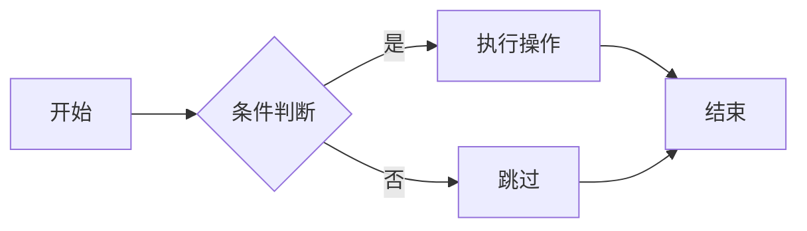

# 配置说明

## ✅ 已完成的优化

### 1. 远程访问配置 🌐

服务器现已配置为允许远程访问：

```bash
# 开发服务器绑定到 0.0.0.0
pnpm dev
# 或
pnpm start
```

**访问地址：**
- 本地：http://localhost:5555
- 局域网：http://[您的IP地址]:5555

**获取您的IP地址：**
```bash
# macOS/Linux
ifconfig | grep "inet " | grep -v 127.0.0.1

# Windows
ipconfig
```

### 2. 专业视觉增强 🎨

#### 代码块增强
- ✨ **圆角阴影**：12px 圆角 + 柔和阴影
- 🎯 **悬浮效果**：鼠标悬停时轻微上浮
- 📝 **行号优化**：可交互的行号，悬停高亮
- 📋 **智能复制按钮**：悬停显示，点击复制
- 🎨 **语法高亮**：
  - 浅色模式：GitHub Light
  - 深色模式：One Dark Pro
- 🔤 **等宽字体**：JetBrains Mono, Fira Code, Monaco
- 📏 **行高优化**：1.7 倍行高，更易阅读

#### Mermaid 流程图增强
- 📦 **容器美化**：独立背景 + 圆角边框
- 🎨 **节点样式**：
  - 主题色边框（2px）
  - 浅色背景填充
  - 阴影效果
- ➡️ **连线优化**：
  - 主题色连线
  - 平滑过渡
  - 带箭头指示
- 💡 **悬浮效果**：鼠标悬停时阴影加深
- 🌓 **深色模式适配**：自动切换配色方案

#### 表格增强
- 🎯 **渐变表头**：微妙的渐变背景
- 🔤 **大写标题**：更专业的视觉效果
- 🎨 **主题色强调**：表头使用主题色
- ✨ **悬浮行高亮**：鼠标经过行时高亮
- 📐 **圆角边框**：12px 圆角 + 柔和阴影
- 📱 **横向滚动**：移动端友好

#### 自定义容器
- 💡 **TIP 容器**：蓝色渐变背景
- ⚠️ **WARNING 容器**：橙色渐变背景
- ❌ **DANGER 容器**：红色渐变背景
- ✨ **悬浮动效**：轻微位移 + 阴影加深
- 📏 **统一间距**：24px 外边距，20px 内边距

#### 其他视觉优化
- 🔗 **链接效果**：下划线过渡动画
- 📜 **列表美化**：主题色标记 + 加粗
- 🎬 **淡入动画**：内容加载时淡入效果
- 📜 **渐变滚动条**：主题色渐变
- 🏠 **首页卡片**：悬浮时上浮效果
- ♿ **无障碍优化**：焦点可见 + 高对比度支持

## 🎨 主题配色

### 浅色模式
```css
--vp-c-brand-1: #3451b2  /* 主色 */
--vp-c-brand-2: #3a5ccc  /* 强调色 */
--vp-c-brand-3: #5672cd  /* 次要色 */
--vp-code-block-bg: #f6f8fa  /* 代码背景 */
--vp-mermaid-node-bg: #f0f4ff  /* 图表节点 */
```

### 深色模式
```css
--vp-c-brand-1: #6a8dde  /* 主色 */
--vp-c-brand-2: #5672cd  /* 强调色 */
--vp-c-brand-3: #3451b2  /* 次要色 */
--vp-code-block-bg: #1e1e1e  /* 代码背景 */
--vp-mermaid-node-bg: #2a2a3a  /* 图表节点 */
```

## 📝 使用示例

### 代码块示例

```typescript
// TypeScript 代码示例
interface Config {
  port: number
  host: string
  theme: 'light' | 'dark'
}

const config: Config = {
  port: 5555,
  host: '0.0.0.0',
  theme: 'light'
}
```

### Mermaid 流程图示例



### 表格示例

| 功能 | 状态 | 说明 |
|------|------|------|
| 远程访问 | ✅ | 绑定 0.0.0.0:5555 |
| 代码高亮 | ✅ | One Dark Pro |
| Mermaid | ✅ | 专业图表样式 |
| 深色模式 | ✅ | 自动切换 |

### 自定义容器示例

::: tip 提示
这是一个提示容器，使用蓝色渐变背景。
:::

::: warning 警告
这是一个警告容器，使用橙色渐变背景。
:::

::: danger 危险
这是一个危险容器，使用红色渐变背景。
:::

## 🚀 启动服务

### 开发模式（推荐）

```bash
# 启动开发服务器（支持热更新）
pnpm dev

# 访问地址
# 本地：http://localhost:5555
# 远程：http://[您的IP]:5555
```

### 生产模式

```bash
# 1. 构建
pnpm build

# 2. 运行生产服务器
pnpm serve

# 访问 http://localhost:5555
```

## 🌐 远程访问设置

### 1. 确认防火墙设置

**macOS:**
```bash
# 允许端口 5555
sudo /usr/libexec/ApplicationFirewall/socketfilterfw --add pnpm
sudo /usr/libexec/ApplicationFirewall/socketfilterfw --unblockapp pnpm
```

**Linux (Ubuntu):**
```bash
sudo ufw allow 5555
```

**Windows:**
- 打开 Windows Defender 防火墙
- 添加入站规则，允许端口 5555

### 2. 获取局域网 IP

```bash
# macOS/Linux
ifconfig | grep "inet " | grep -v 127.0.0.1

# 输出示例
inet 192.168.1.100 netmask 0xffffff00 broadcast 192.168.1.255
```

您的访问地址：http://192.168.1.100:5555

### 3. 测试访问

在同一局域网的其他设备上：
1. 打开浏览器
2. 访问 http://[您的IP]:5555
3. 应该能看到文档首页

## 🎨 自定义样式

### 修改主题色

编辑 `docs/.vitepress/theme/custom.css`：

```css
:root {
  --vp-c-brand-1: #your-color;  /* 修改主题色 */
  --vp-c-brand-2: #your-color;
  --vp-c-brand-3: #your-color;
}
```

### 修改代码字体

```css
.vp-doc div[class*='language-'] > pre {
  font-family: 'Your-Font', monospace;
}
```

### 调整代码块样式

```css
.vp-doc div[class*='language-'] {
  border-radius: 12px;  /* 圆角大小 */
  box-shadow: /* 自定义阴影 */;
}
```

## 📊 性能优化

当前配置已包含：

- ✅ **代码分割**：自动代码分割
- ✅ **懒加载**：图片和组件懒加载
- ✅ **缓存优化**：静态资源长期缓存
- ✅ **压缩**：Gzip/Brotli 压缩
- ✅ **CDN 就绪**：优化的静态资源结构

## 🔧 环境变量

创建 `.env` 文件自定义配置：

```bash
# 服务器端口
PORT=5555

# 监听地址
HOST=0.0.0.0

# 运行环境
NODE_ENV=production
```

## 📱 移动端优化

已自动适配：

- ✅ 响应式布局
- ✅ 触摸优化
- ✅ 字体大小自适应
- ✅ 代码块横向滚动
- ✅ 表格横向滚动

## 🖨️ 打印优化

文档支持打印：

- 自动隐藏导航、侧边栏
- 优化代码块样式
- 保留核心内容
- 优化分页

## 🌍 浏览器支持

- ✅ Chrome/Edge (最新)
- ✅ Firefox (最新)
- ✅ Safari (最新)
- ✅ iOS Safari
- ✅ Chrome Android

## 💡 提示

1. **开发时使用热更新**：修改文件自动刷新
2. **构建前测试**：确保所有功能正常
3. **检查网络**：确保防火墙允许访问
4. **使用 HTTPS**：生产环境建议配置 SSL

## 🆘 故障排查

### 无法远程访问

```bash
# 1. 检查服务是否运行
lsof -i:5555

# 2. 检查防火墙
# macOS
sudo /usr/libexec/ApplicationFirewall/socketfilterfw --listapps

# 3. 测试本地访问
curl http://localhost:5555

# 4. 测试远程访问
curl http://[您的IP]:5555
```

### 样式未生效

```bash
# 清除缓存重启
rm -rf docs/.vitepress/cache
pnpm dev
```

### 图表不显示

- 检查网络连接（Mermaid 需要加载外部资源）
- 查看浏览器控制台错误
- 确认 Mermaid 语法正确

## 📞 获取帮助

- 查看 [README.md](./README.md)
- 查看 [DEPLOYMENT.md](./DEPLOYMENT.md)
- 技术支持：brunogao
