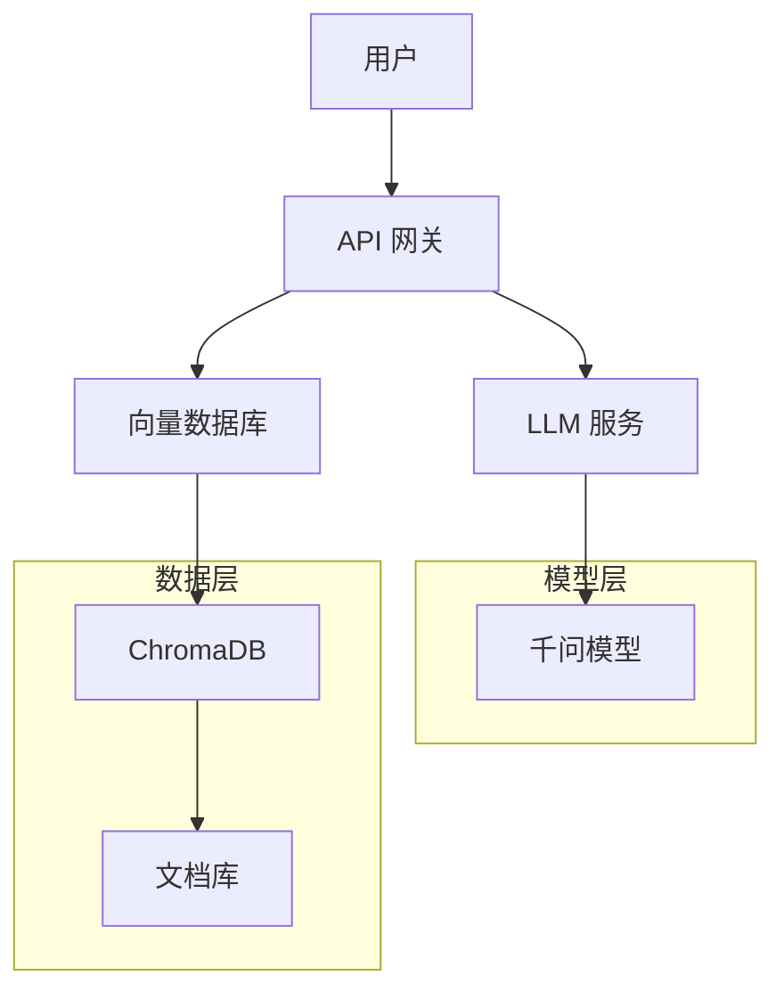

# AI 与机器学习

探索 AI 和机器学习的实践应用，包括大语言模型部署、模型服务和 AI 应用开发。

## 📚 系列文章

### 大语言模型系列

私有化部署和应用大语言模型。

- [千问大模型私有化部署指南](./llm/qwen-deployment)
- [千问解读健康测试报告实战](./llm/qwen-health-report)
- [LLM 提示词工程最佳实践](./llm/prompt-engineering)
- [RAG 系统构建指南](./llm/rag-implementation)

### 模型服务系列

模型部署和服务化的最佳实践。

- Ollama 本地模型部署
- vLLM 高性能推理服务
- TensorRT 模型优化

### AI 应用系列

构建实用的 AI 应用。

- 智能客服机器人开发
- 文档问答系统实现
- 代码助手构建指南

## 🎯 快速导航

  

    <h3>🤖 大语言模型</h3>
    
私有化部署千问、Llama 等开源模型

    <a href="./llm/">查看文章 →</a>
  

  

    <h3>⚡ 模型服务</h3>
    
高性能模型推理和服务化部署

    <a href="./model-serving/">查看文章 →</a>
  

  

    <h3>💡 AI 应用</h3>
    
构建实用的 AI 驱动应用

    <a href="./applications/">查看文章 →</a>
  

## 🛠️ 核心技术

- **千问（Qwen）** - 阿里云开源大语言模型
- **Ollama** - 本地 LLM 运行工具
- **LangChain** - LLM 应用开发框架
- **ChromaDB** - 向量数据库
- **FastAPI** - 高性能 API 框架

## 💡 应用场景

::: tip 健康报告解读
使用千问模型自动解读医疗健康测试报告，提供专业建议。
:::

::: tip 智能客服
构建基于 LLM 的智能客服系统，提升用户体验。
:::

::: tip 文档问答
实现 RAG 系统，对企业文档进行智能问答。
:::

## 🏗️ 典型架构

