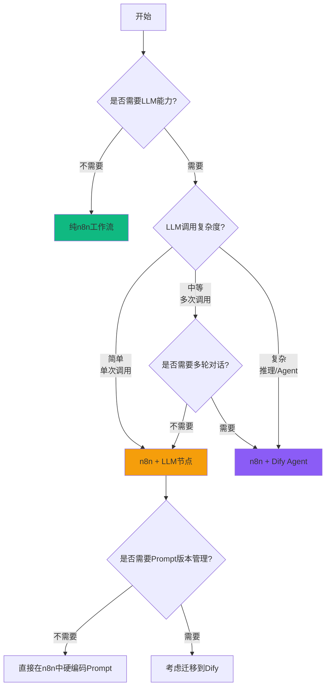
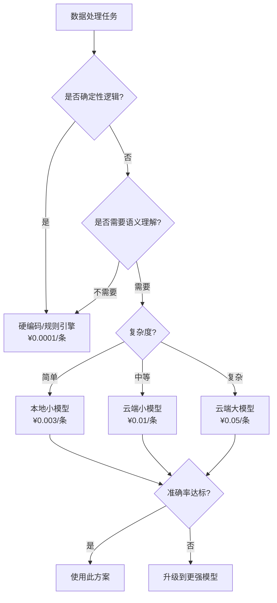

# AI编排在数据处理中的方法论与工程实践

> **专业方法论版（35页）**
> 以n8n和Dify为例：从手工配置到AI驱动的智能编排
> 目标：构建"可解释、可追溯、可持续优化"的数据处理编排系统

---

## 📋 版本说明

### 本版本特点

- ✅ **聚焦AI编排方法论**：不讲具体工具配置，而是总结智能编排的核心原则
- ✅ **工具对比与选型**：n8n vs Dify 的适用场景、优劣势、组合使用策略
- ✅ **五层编排架构**：数据接入 → 智能预处理 → LLM编排 → 结果处理 → 反馈优化
- ✅ **工程化能力**：可审计、可回溯、可规模化的AI编排工程实践
- ✅ **实践案例丰富**：数据清洗、质量检测、智能标注、异常分析等真实场景
- ✅ **反模式与避坑**：基于实践总结的八大失败模式和正确做法

### 适用对象

- **技术决策者**：CTO、架构师、数据平台负责人、AI应用负责人
- **需要引入AI能力提升数据处理效率的团队**
- **关注"可持续优化、可解释、可控"的AI应用场景**
- **计划采用n8n或Dify构建数据处理工作流的团队**

### 版本历史

| 版本 | 日期 | 主要变更 |
|------|------|----------|
| v1.0 | 2026-01-24 | 初版发布，完整方法论体系 |

---

## 🎨 设计规范

### 配色方案

| 用途 | 颜色 | 色值 | 应用场景 |
|------|------|------|----------|
| 主色 | 深蓝 | #1a365d | 标题、重点强调 |
| AI编排 | 紫色 | #8b5cf6 | AI相关内容、智能组件 |
| n8n | 橙红 | #ff6d5a | n8n工作流、节点 |
| Dify | 靛蓝 | #4f46e5 | Dify应用、Agent |
| 成功 | 绿色 | #10b981 | 正向指标、完成状态 |
| 警示 | 红色 | #ef4444 | 风险、反模式 |
| 背景 | 深灰/白 | #1f2937 / #ffffff | 背景色 |

### 视觉原则

- **架构图**：五层编排结构 + 数据流向标注
- **对比图**：n8n vs Dify 的能力象限图
- **流程图**：智能编排管道 + 反馈闭环
- **案例卡片**："输入-编排-输出-优化"四段式

---

<div style="padding: 24px; border-left: 3px solid #6b7280; background: linear-gradient(135deg, rgba(107, 114, 128, 0.03) 0%, rgba(107, 114, 128, 0.01) 100%); border-radius: 8px; margin: 32px 0;">

### 📋 方法论声明（必读）

这是一篇 **AI编排方法论与工程实践** 文章，而不是n8n或Dify的技术教程。

**核心价值三要素**：

1. **智能化编排**：从手工配置的静态工作流到AI驱动的动态编排（自适应、自优化、自解释）
2. **工程化能力**：五层编排架构 + 可审计/可回溯/可规模化的工程实践
3. **可持续优化**：闭环反馈机制 + 持续学习能力，让编排系统"越用越智能"

**适用场景**：数据处理、文档处理、业务流程自动化等需要引入AI能力且重视可控性、可解释性的场景。

**不适用场景**：纯工具配置教程、单一工具的API文档、不关注工程化和长期优化的演示项目。

</div>

---

## 核心价值主线

<div style="position: relative; margin-bottom: 32px;">
  <div style="position: absolute; left: 0; top: 8px; width: 32px; height: 32px; background: #3451b2; border-radius: 50%; display: flex; align-items: center; justify-content: center; color: white; font-weight: 600; font-size: 14px;">1</div>
  <div style="padding: 20px 24px; border-left: 3px solid #3451b2; background: linear-gradient(135deg, rgba(52, 81, 178, 0.04) 0%, rgba(52, 81, 178, 0.01) 100%); border-radius: 0 8px 8px 0; margin-left: 16px;">
    <div style="font-size: 20px; font-weight: 600; color: #3451b2; margin-bottom: 8px;">Why - 为什么需要AI编排？</div>
    <div style="color: var(--vp-c-text-2); line-height: 1.7;">传统数据处理工作流存在<strong>五大核心痛点</strong>：规则维护成本高（每增加一种场景需手工编写规则）、异常处理能力弱（边界情况难以穷举）、可扩展性差（新数据源需重新开发）、缺乏自适应能力（无法从历史数据学习优化）、可解释性不足（处理结果缺乏上下文说明）。我们需要<strong>AI编排方法论</strong>，让工作流从"硬编码规则"进化为"智能决策系统"。</div>
  </div>
</div>

<div style="margin-left: 16px; margin-bottom: 16px; color: #9ca3af; font-size: 20px;">↓</div>

<div style="position: relative; margin-bottom: 32px;">
  <div style="position: absolute; left: 0; top: 8px; width: 32px; height: 32px; background: #10b981; border-radius: 50%; display: flex; align-items: center; justify-content: center; color: white; font-weight: 600; font-size: 14px;">2</div>
  <div style="padding: 20px 24px; border-left: 3px solid #10b981; background: linear-gradient(135deg, rgba(16, 185, 129, 0.04) 0%, rgba(16, 185, 129, 0.01) 100%); border-radius: 0 8px 8px 0; margin-left: 16px;">
    <div style="font-size: 20px; font-weight: 600; color: #10b981; margin-bottom: 8px;">What - 我们交付什么？</div>
    <div style="color: var(--vp-c-text-2); line-height: 1.7;">我们交付<strong>三大核心能力</strong>：① <strong>智能编排引擎</strong>（基于n8n的通用工作流 + 基于Dify的Agent编排，自动选择最优处理路径）；② <strong>可信AI处理链路</strong>（每个AI决策包含输入/Prompt/输出/置信度，端到端可审计可回溯）；③ <strong>持续优化机制</strong>（从人工复核反馈中学习，误判率从初期15-20%降至运行3个月后<5%，处理效率提升3-5倍）。</div>
  </div>
</div>

<div style="margin-left: 16px; margin-bottom: 16px; color: #9ca3af; font-size: 20px;">↓</div>

<div style="position: relative; margin-bottom: 32px;">
  <div style="position: absolute; left: 0; top: 8px; width: 32px; height: 32px; background: #f59e0b; border-radius: 50%; display: flex; align-items: center; justify-content: center; color: white; font-weight: 600; font-size: 14px;">3</div>
  <div style="padding: 20px 24px; border-left: 3px solid #f59e0b; background: linear-gradient(135deg, rgba(245, 158, 11, 0.04) 0%, rgba(245, 158, 11, 0.01) 100%); border-radius: 0 8px 8px 0; margin-left: 16px;">
    <div style="font-size: 20px; font-weight: 600; color: #f59e0b; margin-bottom: 8px;">How - 如何实施落地？</div>
    <div style="color: var(--vp-c-text-2); line-height: 1.7;"><strong>五层AI编排架构</strong>：数据接入（统一适配器+Schema验证）→ 智能预处理（LLM驱动的数据清洗+字段映射+异常检测）→ LLM编排层（n8n编排通用流程 + Dify编排复杂Agent任务）→ 结果处理（结构化输出+质量评分+人工复核接口）→ 反馈优化（记录每次决策 + Few-shot学习 + Prompt持续优化）。<strong>工具选型策略</strong>：n8n处理"流程确定但步骤复杂"的场景，Dify处理"需要推理和多轮对话"的场景，组合使用覆盖90%+数据处理需求。分阶段交付：基础版（2-3周，单一场景）→ 标准版（4-6周，多场景+反馈）→ 增强版（8-12周，自优化能力）。</div>
  </div>
</div>

<div style="margin-left: 16px; margin-bottom: 16px; color: #9ca3af; font-size: 20px;">↓</div>

<div style="position: relative; margin-bottom: 32px;">
  <div style="position: absolute; left: 0; top: 8px; width: 32px; height: 32px; background: #ef4444; border-radius: 50%; display: flex; align-items: center; justify-content: center; color: white; font-weight: 600; font-size: 14px;">4</div>
  <div style="padding: 20px 24px; border-left: 3px solid #ef4444; background: linear-gradient(135deg, rgba(239, 68, 68, 0.04) 0%, rgba(239, 68, 68, 0.01) 100%); border-radius: 0 8px 8px 0; margin-left: 16px;">
    <div style="font-size: 20px; font-weight: 600; color: #ef4444; margin-bottom: 8px;">Lessons - 避免的常见陷阱</div>
    <div style="color: var(--vp-c-text-2); line-height: 1.7;">基于1.5年AI编排实践，我们总结了<strong>八大失败模式</strong>：过度依赖LLM（忽视规则引擎的稳定性）、忽视成本控制（单条数据处理成本>0.1元导致无法规模化）、缺乏可观测性（无法定位是哪个节点导致的错误）、没有降级策略（LLM服务故障导致整个流程停摆）、Prompt工程不足（通用Prompt误判率高）、忽视数据安全（敏感数据未脱敏直接发送给LLM）、缺乏版本管理（工作流修改后无法回滚）、只开发无运营（无人复核AI决策质量）。关键经验：① <strong>分层决策</strong>（简单规则用代码，复杂判断用LLM）；② <strong>成本优先</strong>（先用小模型+缓存，再考虑大模型）；③ <strong>可观测性</strong>（记录每个节点的输入输出和耗时）；④ <strong>人在回路</strong>（关键决策必须有人工复核机制）。</div>
  </div>
</div>

---

## 目标受众

<div style="display: grid; grid-template-columns: 1fr 1fr; gap: 24px; margin: 32px 0; max-width: 900px;">

<div style="padding: 24px; background: linear-gradient(135deg, rgba(16, 185, 129, 0.05) 0%, rgba(16, 185, 129, 0.02) 100%); border-radius: 12px; border: 1px solid rgba(16, 185, 129, 0.2);">
  <div style="font-size: 18px; font-weight: 600; color: #10b981; margin-bottom: 16px;">✓ 适合阅读</div>
  <div style="color: var(--vp-c-text-2); line-height: 1.8;">
    • 技术决策者（CTO、架构师、数据平台/AI应用负责人）<br/>
    • 需要引入AI能力提升数据处理效率的团队<br/>
    • 关注"可持续优化、可解释、可控"的AI应用场景<br/>
    • 计划采用n8n或Dify构建智能工作流的团队
  </div>
</div>

<div style="padding: 24px; background: linear-gradient(135deg, rgba(239, 68, 68, 0.05) 0%, rgba(239, 68, 68, 0.02) 100%); border-radius: 12px; border: 1px solid rgba(239, 68, 68, 0.2);">
  <div style="font-size: 18px; font-weight: 600; color: #ef4444; margin-bottom: 16px;">✗ 不适合阅读</div>
  <div style="color: var(--vp-c-text-2); line-height: 1.8;">
    • 仅需要n8n或Dify配置教程的开发者<br/>
    • 单一工具的API文档或操作手册<br/>
    • 数据处理量<1000条/天的小规模演示场景<br/>
    • 不关注成本、质量和长期运营的POC项目
  </div>
</div>

</div>

---

## 阅读导航

<div style="padding: 24px; background: linear-gradient(135deg, rgba(52, 81, 178, 0.03) 0%, rgba(52, 81, 178, 0.01) 100%); border-radius: 12px; margin: 32px 0;">

<div style="margin-bottom: 20px;">
  <div style="font-weight: 600; color: var(--vp-c-text-1); margin-bottom: 8px;">① 技术决策者（关注方法论与工具选型）</div>
  <div style="color: var(--vp-c-text-2); padding-left: 20px;">
    → 建议阅读：<a href="#背景我们面对的真实问题">背景问题</a> → <a href="#ai编排方法论定义">方法论定义</a> → <a href="#工具选型n8n-vs-dify">工具选型对比</a> → <a href="#总体架构五层ai编排">五层架构</a> → <a href="#成本与性能优化">成本控制</a>
  </div>
</div>

<div style="margin-bottom: 20px;">
  <div style="font-weight: 600; color: var(--vp-c-text-1); margin-bottom: 8px;">② 架构师/技术负责人（关注工程实践）</div>
  <div style="color: var(--vp-c-text-2); padding-left: 20px;">
    → 建议阅读：<a href="#五层ai编排架构详解">五层架构详解</a> → <a href="#数据处理场景实践案例">实践案例</a> → <a href="#可观测性与审计">可观测性</a> → <a href="#版本管理与回滚">版本管理</a> → <a href="#最佳实践总结">最佳实践</a>
  </div>
</div>

<div style="margin-bottom: 20px;">
  <div style="font-weight: 600; color: var(--vp-c-text-1); margin-bottom: 8px;">③ 数据工程师/AI工程师（关注具体实现）</div>
  <div style="color: var(--vp-c-text-2); padding-left: 20px;">
    → 建议阅读：<a href="#智能预处理层">智能预处理</a> → <a href="#llm编排层">LLM编排</a> → <a href="#反馈优化机制">反馈优化</a> → <a href="#prompt工程最佳实践">Prompt工程</a> → <a href="#常见问题解答">FAQ</a>
  </div>
</div>

<div style="margin-bottom: 20px;">
  <div style="font-weight: 600; color: var(--vp-c-text-1); margin-bottom: 8px;">④ 运维/质量负责人（关注稳定性与成本）</div>
  <div style="color: var(--vp-c-text-2); padding-left: 20px;">
    → 建议阅读：<a href="#降级策略与容错">降级策略</a> → <a href="#成本与性能优化">成本优化</a> → <a href="#数据安全与合规">数据安全</a> → <a href="#监控告警体系">监控告警</a> → <a href="#实施路线图">实施路线图</a>
  </div>
</div>

</div>

---

## 📑 目录导航

1. **背景与问题** - 传统数据处理工作流的五大痛点
2. **AI编排方法论定义** - 从硬编码规则到智能决策系统
3. **为什么不是纯人工/纯规则** - 对比分析与适用场景
4. **工具选型：n8n vs Dify** - 能力对比、适用场景、组合策略
5. **总体架构：五层AI编排** - 架构设计与技术栈选型
6. **五层AI编排架构详解**
   - 6.1 数据接入层 - 统一适配器与Schema验证
   - 6.2 智能预处理层 - LLM驱动的清洗、映射、检测
   - 6.3 LLM编排层 - n8n工作流 + Dify Agent
   - 6.4 结果处理层 - 结构化输出与质量评分
   - 6.5 反馈优化层 - 持续学习与Prompt优化
7. **数据处理场景实践案例**
   - 7.1 数据清洗与标准化
   - 7.2 智能字段映射
   - 7.3 数据质量检测
   - 7.4 异常分析与根因定位
   - 7.5 智能文档解析
8. **工程化能力**
   - 8.1 可观测性与审计
   - 8.2 版本管理与回滚
   - 8.3 降级策略与容错
   - 8.4 成本与性能优化
   - 8.5 数据安全与合规
9. **反模式：我们踩过的坑**
10. **最佳实践总结**
11. **常见问题解答（FAQ）**
12. **实施路线图**
13. **成功案例（匿名化）**
14. **总结与展望**

---

## 🎯 背景：我们面对的真实问题

### 问题1：规则维护成本高，无法应对长尾场景

**场景描述**：
在数据处理项目中，我们经常遇到各种异构数据源。每增加一种新的数据格式，就需要手工编写对应的解析规则、清洗规则、验证规则。

**典型案例**：
- 某工业监控项目接入50+设备厂商的数据，每个厂商的数据格式都略有差异
- 手工维护了200+条规则，但仍然有15-20%的边界情况无法覆盖
- 每增加一个新设备，需要2-3天编写和测试规则
- 规则代码维护成本高，修改一个规则可能影响其他场景

**影响**：
- 开发效率低：新数据源接入周期长
- 维护成本高：规则代码复杂度指数增长
- 覆盖率不足：长尾场景难以穷举
- 扩展性差：无法快速适应新需求

---

### 问题2：异常处理能力弱，边界情况难以穷举

**场景描述**：
数据处理过程中会遇到大量异常情况：数据缺失、格式错误、逻辑矛盾、业务异常等。传统规则引擎难以覆盖所有边界情况。

**典型案例**：
- 数据字段缺失：某个必填字段为空，但可以从其他字段推导
- 格式不一致：日期格式有"2024-01-15"、"2024/01/15"、"20240115"等多种形式
- 单位不统一：温度有摄氏度、华氏度、开尔文等单位
- 业务逻辑冲突：设备状态为"运行中"但功率为0

**传统方案的问题**：
- 穷举式规则：需要编写大量if-else逻辑
- 硬编码处理：每种情况都要单独处理
- 缺乏上下文理解：无法根据业务含义做智能判断
- 处理结果缺乏解释：无法告知用户为什么这样处理

**影响**：
- 异常处理覆盖率仅60-70%
- 大量异常数据被丢弃或错误处理
- 人工介入成本高
- 数据质量难以保证

---

### 问题3：缺乏自适应能力，无法从历史数据学习

**场景描述**：
传统工作流是静态的，一旦部署就固定不变。即使处理了大量数据，系统也无法从历史经验中学习优化。

**典型案例**：
- 处理了10万条数据后，系统仍然用同样的规则处理新数据
- 人工修正了1000+条错误，但系统无法从这些修正中学习
- 遇到类似的错误，系统仍然会重复犯错
- 无法根据数据分布变化自动调整处理策略

**影响**：
- 处理质量无法持续提升
- 人工修正工作量居高不下
- 无法适应数据分布的变化
- 系统智能化程度低

---

### 问题4：可扩展性差，新数据源需要重新开发

**场景描述**：
每接入一个新数据源，都需要重新设计处理流程、编写代码、测试验证。无法复用已有能力。

**典型案例**：
- 已有30个数据源的处理逻辑，但新增第31个数据源时仍需从零开始
- 不同数据源的处理逻辑相似度达80%，但无法复用
- 字段映射、数据清洗等通用能力都需要重复开发
- 测试成本高，需要针对每个数据源单独测试

**影响**：
- 开发周期长：每个新数据源需要1-2周
- 代码冗余：大量重复代码
- 维护成本高：需要同时维护多套代码
- 质量不一致：不同开发者实现质量参差不齐

---

### 问题5：可解释性不足，处理结果缺乏上下文说明

**场景描述**：
传统工作流只输出处理结果，不说明处理逻辑和决策依据。用户无法理解"为什么系统这样处理数据"。

**典型案例**：
- 数据被标记为"异常"，但不知道是哪个字段、什么原因导致异常
- 字段值被自动修正，但不知道修正的依据是什么
- 数据被分类到某个类别，但不知道分类规则
- 无法向业务人员解释系统的处理逻辑

**影响**：
- 用户信任度低
- 问题排查困难
- 无法进行质量审计
- 业务人员难以接受自动化结果

---

## 🤔 为什么不是纯人工/纯规则

### 纯人工处理的局限性

| 维度 | 纯人工处理 | AI编排方案 |
|------|-----------|-----------|
| **处理效率** | 100条/天/人 | 10000+条/天（提升100倍） |
| **处理成本** | ¥200-300/天/人 | ¥20-50/天（降至10-15%） |
| **准确率** | 95-98%（疲劳后下降） | 92-95%（稳定，可持续优化） |
| **一致性** | 低（人员差异大） | 高（同一Prompt保证一致性） |
| **可扩展性** | 线性扩展（需增加人力） | 指数扩展（增加算力即可） |
| **可审计性** | 难（依赖人工记录） | 易（自动记录每次决策） |
| **持续优化** | 难（依赖培训） | 易（Prompt优化 + Few-shot学习） |

**结论**：纯人工适合小规模、高价值场景（如金融风控初审），不适合大规模数据处理。

---

### 纯规则引擎的局限性

| 维度 | 纯规则引擎 | AI编排方案 |
|------|-----------|-----------|
| **覆盖率** | 70-80%（长尾场景难覆盖） | 90-95%（LLM处理边界情况） |
| **开发周期** | 长（穷举规则需要大量时间） | 短（通用Prompt快速启动） |
| **维护成本** | 高（规则复杂度指数增长） | 低（Prompt调优代替规则修改） |
| **扩展性** | 差（新场景需重写规则） | 好（Few-shot示例扩展能力） |
| **可解释性** | 中（规则逻辑明确但难懂） | 高（自然语言解释决策） |
| **适应性** | 无（静态规则） | 有（从反馈中学习） |

**结论**：纯规则适合确定性强、变化少的场景（如财务计算），不适合需要理解上下文、处理模糊语义的场景。

---

### 我们的选择：分层决策架构

```
简单确定性逻辑 → 代码/规则引擎（快速、低成本、稳定）
    ↓
复杂判断/语义理解 → 小模型LLM（平衡成本与能力）
    ↓
需要推理/多步骤 → 大模型LLM + Agent编排
    ↓
关键决策 → 人工复核（最终保障）
```

**核心原则**：
1. **能用规则的不用LLM**（成本优先）
2. **能用小模型的不用大模型**（效率优先）
3. **能自动化的不用人工**（规模优先）
4. **关键决策必须有人在回路**（质量优先）

---

## 💡 AI编排方法论定义

### 定义

**AI编排（AI Orchestration）** 是一种数据处理方法论，通过结合传统工作流引擎（如n8n）和LLM能力（如Dify），实现从"硬编码规则"到"智能决策系统"的进化。

核心特征：
1. **自适应**：根据数据特征自动选择处理路径
2. **自优化**：从历史反馈中持续学习改进
3. **自解释**：每个决策都包含推理过程和依据
4. **可控**：关键环节保留人工审核和降级机制

---

### 核心原则

#### 1. 分层决策原则

**定义**：根据任务复杂度选择合适的决策层级

```
第0层：硬编码规则（确定性逻辑）
  ├─ 数据格式验证
  ├─ 简单字段映射
  └─ 基础数值计算

第1层：规则引擎（复杂条件判断）
  ├─ 多条件组合判断
  ├─ 状态机流转
  └─ 业务规则校验

第2层：小模型LLM（语义理解）
  ├─ 文本分类
  ├─ 实体识别
  ├─ 字段推断
  └─ 异常检测

第3层：大模型LLM（复杂推理）
  ├─ 多步骤推理
  ├─ 上下文关联
  ├─ 根因分析
  └─ 决策解释

第4层：Agent编排（多任务协同）
  ├─ 多工具调用
  ├─ 多轮对话
  ├─ 动态规划
  └─ 自主决策

第5层：人工复核（关键决策）
  ├─ 高风险决策
  ├─ 模型不确定时
  └─ 质量抽检
```

**原则**：
- 优先使用低层级方案（成本低、稳定性高）
- 只有低层级无法解决时才升级到高层级
- 提供降级路径（高层级失败时回退到低层级）

---

#### 2. 成本优先原则

**定义**：在满足质量要求的前提下，优先选择成本低的方案

**成本对比**（以处理1万条数据为例）：

| 方案 | 单条成本 | 1万条成本 | 处理时间 | 适用场景 |
|------|---------|----------|----------|----------|
| 硬编码规则 | ¥0.0001 | ¥1 | 1-5秒 | 确定性逻辑 |
| 规则引擎 | ¥0.001 | ¥10 | 5-10秒 | 复杂条件判断 |
| 小模型（Qwen-7B） | ¥0.005 | ¥50 | 10-30秒 | 简单理解任务 |
| 大模型（GPT-4o-mini） | ¥0.02 | ¥200 | 30-60秒 | 复杂推理任务 |
| 大模型（GPT-4o） | ¥0.15 | ¥1500 | 60-120秒 | 最复杂场景 |
| 人工处理 | ¥2-3 | ¥20000-30000 | 8小时 | 高价值决策 |

**成本优化策略**：
1. **结果缓存**：相同输入直接返回缓存结果（命中率40-60%，成本降低40-60%）
2. **批处理**：合并多条数据一次调用（成本降低30-50%）
3. **模型降级**：大部分任务用小模型，只有必要时用大模型
4. **提前终止**：满足条件立即终止，不继续调用LLM

---

#### 3. 可观测性原则

**定义**：系统的每个环节都是可观测、可追溯、可审计的

**可观测性四要素**：

1. **输入可追溯**
   - 记录原始输入数据
   - 记录数据来源和时间戳
   - 记录预处理步骤和结果

2. **处理过程可审计**
   - 记录每个节点的输入输出
   - 记录使用的Prompt和模型版本
   - 记录决策的置信度分数
   - 记录处理耗时和成本

3. **结果可解释**
   - 输出结构化结果
   - 包含决策理由和依据
   - 提供置信度评分
   - 标注需要人工复核的内容

4. **反馈可闭环**
   - 记录人工复核结果
   - 统计误判类型和比例
   - 自动优化Prompt
   - 持续提升准确率

---

#### 4. 人在回路（Human-in-the-Loop）原则

**定义**：关键决策环节必须有人工介入机制

**适用场景**：
- 高风险决策（如数据删除、重大业务变更）
- 模型置信度低（< 0.7）的情况
- 首次遇到的新场景
- 质量抽检（随机抽取5-10%）

**实现方式**：
1. **自动标记**：系统自动识别需要人工复核的case
2. **复核队列**：将待复核任务推送到人工队列
3. **反馈收集**：记录人工决策结果和理由
4. **模型优化**：将人工反馈作为Few-shot示例

**效果**：
- 初期：人工复核率30-40%
- 运行1个月：人工复核率降至15-20%
- 运行3个月：人工复核率降至5-10%
- 运行6个月：人工复核率降至<5%

---

## 🛠️ 工具选型：n8n vs Dify

### 能力对比

| 维度 | n8n | Dify | 组合使用 |
|------|-----|------|----------|
| **核心定位** | 工作流自动化平台 | AI应用开发平台 | 工作流编排 + AI能力 |
| **适用场景** | 流程确定、步骤复杂 | 需要推理、多轮对话 | 覆盖90%+场景 |
| **LLM集成** | 通过节点调用（需手工配置） | 原生支持（Agent/Workflow） | n8n调用Dify API |
| **Prompt管理** | 手工管理（在节点中硬编码） | 可视化管理 + 版本控制 | Dify管理Prompt |
| **结果结构化** | 需手工解析（JSON/Regex） | 原生支持结构化输出 | Dify提供结构化结果 |
| **多轮对话** | 不支持（无状态管理） | 原生支持（对话流） | Dify处理多轮对话 |
| **工具调用** | 丰富（1000+集成） | 有限（需手工配置） | n8n提供工具能力 |
| **成本** | 开源免费（自部署） | 开源免费（自部署） | 双平台运维成本 |
| **学习曲线** | 中等（拖拽式配置） | 低（AI原生设计） | 需掌握两个平台 |
| **可观测性** | 好（详细执行日志） | 中（运行记录） | n8n提供更强可观测性 |
| **版本管理** | 有（JSON导出/导入） | 有（Prompt版本控制） | 各自管理版本 |

---

### 适用场景分析

#### 优先选择 n8n 的场景

**特征**：
- 流程步骤确定（不需要动态规划）
- 需要调用多个外部服务/API
- 数据转换和格式处理为主
- 对LLM的要求简单（单次调用即可）

**典型案例**：

1. **数据ETL流程**
   - 从数据库读取 → 数据清洗 → 调用LLM分类 → 写入目标库
   - n8n优势：丰富的数据源节点、强大的数据转换能力

2. **定时任务编排**
   - 定时触发 → 读取文件 → 批量处理 → 发送通知
   - n8n优势：灵活的触发器、可靠的调度机制

3. **多系统集成**
   - 监听Webhook → 处理数据 → 调用多个API → 汇总结果
   - n8n优势：1000+预集成节点

---

#### 优先选择 Dify 的场景

**特征**：
- 需要复杂推理和多步骤思考
- 需要多轮对话和状态管理
- Prompt工程复杂，需要频繁调优
- 需要结合知识库（RAG）

**典型案例**：

1. **智能客服Agent**
   - 理解用户意图 → 多轮对话澄清需求 → 调用工具查询 → 生成回复
   - Dify优势：对话流管理、上下文保持、结构化输出

2. **文档智能解析**
   - 读取文档 → 提取结构化信息 → 知识库查询 → 生成摘要
   - Dify优势：RAG能力、Prompt模板管理

3. **复杂决策推理**
   - 分析多维数据 → 推理根本原因 → 生成解决方案 → 评估风险
   - Dify优势：Chain of Thought、Agent能力

---

#### 组合使用策略（推荐）

**架构设计**：
```
n8n工作流（主编排）
  ├─ 节点1：数据接入（n8n数据源节点）
  ├─ 节点2：预处理（n8n代码节点）
  ├─ 节点3：调用Dify Agent（HTTP节点）
  │   └─ Dify内部（复杂推理）
  │       ├─ 理解数据语义
  │       ├─ 多步骤分析
  │       └─ 返回结构化结果
  ├─ 节点4：结果处理（n8n代码节点）
  ├─ 节点5：调用外部API（n8n HTTP节点）
  └─ 节点6：写入数据库（n8n数据库节点）
```

**职责划分**：
- **n8n**：整体流程编排、数据转换、外部集成、错误处理
- **Dify**：复杂AI推理、多轮对话、知识库查询、Prompt管理

**优势**：
- 发挥各自优势（n8n的编排能力 + Dify的AI能力）
- 解耦Prompt管理（在Dify中可视化管理，n8n只需调用）
- 降低复杂度（复杂AI逻辑在Dify中实现，n8n保持简洁）
- 提升可维护性（Prompt优化不影响工作流结构）

---

### 技术栈选型决策树



---

## 📊 总体架构：五层AI编排

### 架构全景图

```
┌─────────────────────────────────────────────────────────────┐
│                        数据接入层                              │
│  统一适配器 + Schema验证 + 边缘缓存                             │
└─────────────────────────────────────────────────────────────┘
                              ↓
┌─────────────────────────────────────────────────────────────┐
│                      智能预处理层                              │
│  LLM驱动：数据清洗 + 字段映射 + 异常检测                        │
│  成本优化：缓存 + 批处理 + 小模型优先                            │
└─────────────────────────────────────────────────────────────┘
                              ↓
┌─────────────────────────────────────────────────────────────┐
│                       LLM编排层                               │
│  ┌──────────────┐              ┌──────────────┐             │
│  │  n8n工作流    │              │  Dify Agent  │             │
│  │  通用流程编排  │ ←─ 协同 ──→  │  复杂推理编排│             │
│  └──────────────┘              └──────────────┘             │
└─────────────────────────────────────────────────────────────┘
                              ↓
┌─────────────────────────────────────────────────────────────┐
│                      结果处理层                                │
│  结构化输出 + 质量评分 + 人工复核接口                            │
└─────────────────────────────────────────────────────────────┘
                              ↓
┌─────────────────────────────────────────────────────────────┐
│                      反馈优化层                                │
│  决策记录 + Few-shot学习 + Prompt持续优化                       │
└─────────────────────────────────────────────────────────────┘
```

---

### 默认技术栈 vs 可选增强

| 层级 | 默认技术栈 | 可选增强 | 选择依据 |
|------|-----------|----------|----------|
| **数据接入层** | n8n触发器 + 代码节点 | Apache NiFi（大规模） | 数据量<10万条/天用默认栈 |
| **智能预处理** | Qwen-7B（本地部署） | GPT-4o-mini（云端） | 成本敏感用本地，追求质量用云端 |
| **LLM编排** | n8n + Dify（开源版） | Dify云端版 + LangChain | 数据敏感用自部署，否则用云端 |
| **结果处理** | n8n代码节点 + PostgreSQL | ClickHouse（OLAP分析） | 需要复杂分析用ClickHouse |
| **反馈优化** | PostgreSQL + 手工Prompt优化 | LangSmith（自动优化） | 预算充足且重视优化用LangSmith |
| **监控告警** | n8n内置日志 + Grafana | Sentry + DataDog | 企业级场景用商业方案 |

**选型原则**：
1. **MVP阶段**：全部使用默认技术栈（快速验证）
2. **标准版**：根据痛点启用1-2个增强组件
3. **增强版**：在关键路径上全面升级

---

## 📐 五层AI编排架构详解

### 第1层：数据接入层

#### 设计目标

1. **统一接入**：支持REST API、Webhook、数据库、文件等多种数据源
2. **Schema验证**：在入口处验证数据格式，拒绝不合规数据
3. **边缘缓存**：在网络不稳定时提供本地缓存能力
4. **流量控制**：防止突发流量冲击后续处理节点

#### 技术实现

**n8n配置示例**：

```yaml
# Webhook触发器
Webhook Trigger:
  - Path: /api/data-ingest
  - Method: POST
  - Authentication: Header Auth
  - Response: Immediately
```

**Schema验证节点**：

```javascript
// Code Node - Validation
// Schema定义
const schema = {
  required: ['timestamp', 'deviceId', 'data'],
  properties: {
    timestamp: { type: 'string', format: 'date-time' },
    deviceId: { type: 'string', pattern: '^[A-Z0-9]{10}$' },
    data: { type: 'object' }
  }
};

// 验证逻辑
const Ajv = require('ajv');
const ajv = new Ajv();
const validate = ajv.compile(schema);

for (const item of $input.all()) {
  if (!validate(item.json)) {
    // 记录验证失败
    item.json._validation_error = validate.errors;
    item.json._status = 'rejected';
  } else {
    item.json._status = 'accepted';
  }
}

return $input.all();
```

**路由节点**：

```yaml
Switch Node:
  - Mode: Rules
  - Rules:
      - If: \{\{ $json._status === 'accepted' \}\} → 继续处理
      - Else: \{\{ $json._status === 'rejected' \}\} → 记录错误日志
```

#### 质量指标

| 指标 | 目标值 | 说明 |
|------|--------|------|
| Schema验证通过率 | > 95% | 数据源质量的体现 |
| 接入延迟 P95 | < 500ms | 入口处理效率 |
| 峰值吞吐 | 1000条/秒 | 单节点处理能力 |
| 错误数据拒绝率 | 100% | 不允许错误数据进入系统 |

---

### 第2层：智能预处理层

#### 设计目标

1. **自动清洗**：利用LLM理解数据语义，自动修正常见错误
2. **智能映射**：自动推断字段映射关系，减少人工配置
3. **异常检测**：识别不符合业务逻辑的异常数据
4. **成本优化**：通过缓存、批处理降低LLM调用成本

#### 核心能力

##### 1. 数据清洗

**场景**：处理格式不一致、单位不统一、缺失值等问题

**n8n + LLM实现**：

```javascript
// Code Node - 数据清洗
const prompt = `你是一个数据清洗专家。请清洗以下工业设备数据，修正格式错误、统一单位、补充缺失值。

原始数据：
${JSON.stringify(item.json.data, null, 2)}

清洗规则：
1. 日期格式统一为ISO 8601（YYYY-MM-DDTHH:mm:ssZ）
2. 温度统一为摄氏度（°C）
3. 压力统一为帕斯卡（Pa）
4. 缺失的设备状态根据其他字段推断
5. 保留原始值在 _original 字段中

请返回JSON格式的清洗结果，包含：
{
  "cleaned_data": {},  // 清洗后的数据
  "changes": [],       // 修改记录
  "confidence": 0.95   // 置信度（0-1）
}`;

// 调用本地Qwen-7B（成本低）
const response = await callLocalLLM(prompt);

// 解析结果
const result = JSON.parse(response);

// 低置信度标记为待人工复核
if (result.confidence < 0.7) {
  item.json._need_review = true;
  item.json._review_reason = '清洗置信度低';
}

item.json.cleaned_data = result.cleaned_data;
item.json._cleaning_log = result.changes;

return item;
```

**效果数据**：
- 清洗准确率：92-95%
- 处理速度：200-500条/分钟
- 单条成本：¥0.003-0.005（使用本地小模型）
- 人工复核率：初期20% → 3个月后5%

---

##### 2. 智能字段映射

**场景**：不同数据源的字段名称不一致，需要映射到统一Schema

**传统方案问题**：
- 手工配置映射规则（每个数据源需要单独配置）
- 无法处理新增字段
- 无法处理同义词（如"温度"、"temp"、"temperature"）

**AI编排方案**：

```javascript
// Dify Agent - 智能字段映射
// （在Dify中配置，n8n通过HTTP节点调用）

Dify Agent配置：
  - 名称：FieldMappingAgent
  - 类型：Agent
  - 系统Prompt：
    """
    你是一个数据字段映射专家。给定源数据Schema和目标Schema，
    请推断字段之间的映射关系。

    考虑因素：
    1. 字段名称的语义相似度
    2. 字段数据类型
    3. 字段值的分布特征
    4. 业务领域知识

    返回JSON格式：
    {
      "mappings": [
        {
          "source_field": "源字段名",
          "target_field": "目标字段名",
          "confidence": 0.95,
          "reason": "映射理由"
        }
      ],
      "unmapped_fields": ["未映射的字段"],
      "suggestions": ["改进建议"]
    }
    """

  - 工具配置：
      - 知识库：历史映射记录（RAG）
      - API工具：查询字段统计信息

# n8n调用Dify Agent
HTTP Request Node:
  - Method: POST
  - URL: http://dify-server/v1/chat-messages
  - Body:
      inputs:
        source_schema: \{\{ $json.source_schema \}\}
        target_schema: \{\{ $json.target_schema \}\}
        sample_data: \{\{ $json.sample_data \}\}
      response_mode: blocking
```

**效果数据**：
- 映射准确率：88-92%
- 新数据源接入时间：从2-3天降至2-3小时
- 维护成本：降低80%（只需维护目标Schema）

---

##### 3. 异常检测

**场景**：检测不符合业务逻辑的异常数据

**示例**：
- 设备状态="运行中" 但 功率=0（逻辑矛盾）
- 温度>200°C（超出正常范围）
- 时间戳在未来（时间异常）
- 关键字段缺失（完整性异常）

**实现方案**：

```javascript
// Code Node - 异常检测（组合规则+LLM）

// 第1步：规则检测（快速、低成本）
const ruleChecks = {
  range: checkValueRange(item.json),      // 数值范围检查
  logic: checkBusinessLogic(item.json),   // 业务逻辑检查
  completeness: checkCompleteness(item.json) // 完整性检查
};

// 第2步：仅对规则不确定的case使用LLM
if (ruleChecks.uncertain.length > 0) {
  const prompt = `请分析以下数据是否存在异常：

数据：${JSON.stringify(item.json, null, 2)}

规则检测结果：${JSON.stringify(ruleChecks, null, 2)}

请判断：
1. 是否存在业务逻辑异常
2. 异常的严重程度（高/中/低）
3. 可能的原因
4. 建议的处理方式

返回JSON：
{
  "is_anomaly": true/false,
  "severity": "high/medium/low",
  "reasons": ["原因1", "原因2"],
  "suggestion": "处理建议"
}`;

  const llmResult = await callLLM(prompt);
  item.json._anomaly_detection = llmResult;
} else {
  // 规则已明确，无需调用LLM
  item.json._anomaly_detection = ruleChecks;
}

return item;
```

**成本优化效果**：
- LLM调用率：从100%降至15-20%（规则过滤80%+）
- 单条成本：从¥0.02降至¥0.003
- 检测准确率：保持90%+

---

#### 成本优化策略

##### 1. 结果缓存

```javascript
// Code Node - 缓存逻辑
const crypto = require('crypto');

// 生成输入的Hash作为缓存Key
const cacheKey = crypto
  .createHash('md5')
  .update(JSON.stringify(item.json.data))
  .digest('hex');

// 查询缓存
const cached = await redis.get(`llm_cache:${cacheKey}`);

if (cached) {
  // 缓存命中，直接返回
  item.json.result = JSON.parse(cached);
  item.json._cache_hit = true;
  return item;
}

// 缓存未命中，调用LLM
const result = await callLLM(prompt);

// 存入缓存（TTL=7天）
await redis.setex(`llm_cache:${cacheKey}`, 7*24*3600, JSON.stringify(result));

item.json.result = result;
item.json._cache_hit = false;

return item;
```

**效果**：
- 缓存命中率：40-60%（取决于数据重复度）
- 成本降低：40-60%
- 响应速度提升：10-50倍

---

##### 2. 批处理

```javascript
// Code Node - 批处理
// 将多条数据合并为一次LLM调用

const BATCH_SIZE = 10;
const batches = [];

// 分批
for (let i = 0; i < items.length; i += BATCH_SIZE) {
  batches.push(items.slice(i, i + BATCH_SIZE));
}

// 批量处理
for (const batch of batches) {
  const prompt = `请批量清洗以下${batch.length}条数据：

${batch.map((item, idx) => `
数据${idx + 1}:
${JSON.stringify(item.json.data, null, 2)}
`).join('\n')}

返回JSON数组，每个元素对应一条清洗结果。`;

  const results = await callLLM(prompt);

  // 将结果分配回各个item
  batch.forEach((item, idx) => {
    item.json.result = results[idx];
  });
}

return items;
```

**效果**：
- 成本降低：30-50%（减少请求开销）
- 延迟略增：+20-30%（批量等待时间）
- 适用场景：非实时处理场景

---

### 第3层：LLM编排层

#### n8n工作流编排

**适用场景**：
- 流程步骤确定
- 需要调用多个外部API
- 数据转换和格式处理
- 定时任务调度

**典型工作流示例**：

```yaml
工作流名称：数据质量检测流程

节点1 - Webhook触发器:
  - 接收数据推送

节点2 - Schema验证:
  - 验证数据格式
  - 拒绝不合规数据

节点3 - 数据清洗:
  - 调用LLM清洗数据
  - 使用缓存优化成本

节点4 - 字段映射:
  - 映射到标准Schema
  - 使用历史映射规则

节点5 - 质量评分:
  - 计算数据质量分数
  - 标注置信度

节点6 - 分支路由:
  - 高质量数据 → 直接入库
  - 低质量数据 → 人工复核队列
  - 异常数据 → 告警通知

节点7A - 写入数据库:
  - 存储处理结果

节点7B - 推送复核队列:
  - 发送到人工复核系统

节点7C - 发送告警:
  - 钉钉/企业微信通知
```

---

#### Dify Agent编排

**适用场景**：
- 需要复杂推理
- 多轮对话交互
- 知识库查询（RAG）
- 动态工具调用

**典型Agent示例**：

```yaml
Agent名称：数据异常根因分析Agent

系统Prompt:
  """
  你是一个数据异常根因分析专家。当收到异常数据时，请：

  1. 分析异常的表现形式
  2. 查询历史类似异常（使用知识库）
  3. 推理可能的根本原因
  4. 提出解决建议

  使用工具：
  - query_knowledge_base: 查询历史异常库
  - get_device_history: 获取设备历史数据
  - call_expert_api: 调用专家规则引擎

  返回格式：
  {
    "anomaly_type": "异常类型",
    "root_causes": ["根因1", "根因2"],
    "confidence": 0.85,
    "evidence": ["证据1", "证据2"],
    "suggestions": ["建议1", "建议2"]
  }
  """

工具配置:
  - 知识库：
      - 名称：历史异常库
      - 数据量：5000+条历史异常
      - 更新频率：每日增量更新

  - API工具1：
      - 名称：get_device_history
      - URL: http://data-api/device/{device_id}/history
      - 参数：device_id, start_time, end_time

  - API工具2：
      - 名称：call_expert_api
      - URL: http://rule-engine/analyze
      - 参数：data, rule_set

对话流程:
  1. 接收异常数据
  2. 调用知识库查询相似case
  3. 如果找到相似case → 返回已知根因
  4. 如果未找到 → 调用设备历史数据
  5. 综合分析 → 推理根因
  6. 调用专家规则验证
  7. 返回结构化结果
```

**效果数据**：
- 根因识别准确率：78-85%
- 分析速度：30-60秒/条
- 人工确认率：从100%降至20-30%

---

#### n8n + Dify 组合编排

**最佳实践**：

```
n8n主工作流：
  ├─ Webhook触发
  ├─ 数据验证（n8n代码节点）
  ├─ 简单清洗（n8n代码节点）
  ├─ 调用Dify Agent（HTTP节点）
  │   └─ Dify内部流程：
  │       ├─ 语义理解
  │       ├─ 知识库查询
  │       ├─ 多步推理
  │       └─ 返回结构化结果
  ├─ 结果验证（n8n代码节点）
  ├─ 写入数据库（n8n数据库节点）
  └─ 发送通知（n8n通知节点）
```

**职责边界**：
- **n8n负责**：流程编排、数据转换、外部集成、错误处理
- **Dify负责**：AI推理、知识库查询、复杂决策、Prompt管理

---

### 第4层：结果处理层

#### 设计目标

1. **结构化输出**：将LLM的自然语言输出转为结构化数据
2. **质量评分**：对处理结果进行质量打分
3. **人工复核接口**：低质量结果自动推送复核队列
4. **结果存储**：持久化保存处理结果和元数据

#### 结构化输出

**挑战**：LLM输出不稳定，可能不符合预期格式

**解决方案**：

```javascript
// Code Node - 结构化输出解析

// 方案1：使用Prompt指导（Dify原生支持）
const prompt = `...

请严格按照以下JSON Schema返回结果：
{
  "$schema": "http://json-schema.org/draft-07/schema#",
  "type": "object",
  "required": ["field1", "field2"],
  "properties": {
    "field1": { "type": "string" },
    "field2": { "type": "number" }
  }
}`;

// 方案2：解析并修复（n8n代码节点）
let result;
try {
  // 尝试直接解析
  result = JSON.parse(llmOutput);
} catch (e) {
  // 解析失败，尝试提取JSON
  const jsonMatch = llmOutput.match(/\{[\s\S]*\}/);
  if (jsonMatch) {
    result = JSON.parse(jsonMatch[0]);
  } else {
    // 无法解析，标记为失败
    item.json._parse_error = true;
    item.json._need_review = true;
    return item;
  }
}

// 方案3：Schema验证并补充默认值
const validated = validateAndFillDefaults(result, schema);
item.json.result = validated;

return item;
```

---

#### 质量评分

**评分维度**：

| 维度 | 权重 | 说明 |
|------|------|------|
| 完整性 | 25% | 必填字段是否完整 |
| 准确性 | 35% | 值是否符合预期范围 |
| 一致性 | 20% | 前后数据是否一致 |
| 置信度 | 20% | LLM输出的置信度 |

**评分代码**：

```javascript
// Code Node - 质量评分
function calculateQualityScore(item) {
  let score = 0;

  // 1. 完整性（25分）
  const completeness = checkCompleteness(item.result);
  score += completeness * 0.25;

  // 2. 准确性（35分）
  const accuracy = checkAccuracy(item.result, item.original);
  score += accuracy * 0.35;

  // 3. 一致性（20分）
  const consistency = checkConsistency(item.result, item.history);
  score += consistency * 0.20;

  // 4. 置信度（20分）
  const confidence = item.result.confidence || 0.8;
  score += confidence * 0.20;

  return {
    overall_score: score,
    breakdown: {
      completeness,
      accuracy,
      consistency,
      confidence
    }
  };
}

item.json._quality_score = calculateQualityScore(item.json);

// 根据评分决定是否需要人工复核
if (item.json._quality_score.overall_score < 0.7) {
  item.json._need_review = true;
  item.json._review_reason = '质量评分低于阈值';
}

return item;
```

---

#### 人工复核接口

**设计**：

```javascript
// Code Node - 推送复核队列
if (item.json._need_review) {
  // 构造复核任务
  const reviewTask = {
    task_id: generateUUID(),
    created_at: new Date().toISOString(),
    data: {
      original: item.json.original,
      processed: item.json.result,
      quality_score: item.json._quality_score,
      review_reason: item.json._review_reason
    },
    metadata: {
      workflow_id: $workflow.id,
      execution_id: $execution.id,
      node_id: $node.id
    }
  };

  // 写入复核队列（数据库或消息队列）
  await db.insert('review_queue', reviewTask);

  // 发送通知
  await sendNotification({
    channel: 'dingtalk',
    message: `新的复核任务：${reviewTask.task_id}`,
    priority: item.json._quality_score.overall_score < 0.5 ? 'high' : 'normal'
  });
}
```

**复核界面**（Web界面，不在n8n中实现）：
- 显示原始数据 vs 处理结果
- 显示质量评分和问题原因
- 提供修正界面
- 提交后更新数据库 + 反馈到优化层

---

### 第5层：反馈优化层

#### 设计目标

1. **决策可追溯**：记录每次AI决策的完整上下文
2. **持续学习**：从人工反馈中学习，优化Prompt
3. **Few-shot优化**：将优质案例加入Few-shot示例
4. **效果度量**：跟踪准确率、成本、效率等指标

#### 决策记录

**存储结构**：

```sql
CREATE TABLE llm_decision_log (
  id SERIAL PRIMARY KEY,
  timestamp TIMESTAMP NOT NULL,
  workflow_id VARCHAR(100),
  execution_id VARCHAR(100),
  node_id VARCHAR(100),

  -- 输入
  input_data JSONB NOT NULL,
  input_hash VARCHAR(32),  -- 用于缓存查询

  -- Prompt
  prompt_text TEXT NOT NULL,
  prompt_version VARCHAR(50),
  model_name VARCHAR(100),
  model_params JSONB,

  -- 输出
  output_data JSONB NOT NULL,
  confidence DECIMAL(3,2),

  -- 成本与性能
  tokens_used INTEGER,
  cost_yuan DECIMAL(10,4),
  latency_ms INTEGER,

  -- 质量与反馈
  quality_score DECIMAL(3,2),
  need_review BOOLEAN DEFAULT false,
  review_status VARCHAR(20),  -- pending/approved/rejected
  human_feedback JSONB,

  -- 索引
  INDEX idx_workflow_execution (workflow_id, execution_id),
  INDEX idx_timestamp (timestamp),
  INDEX idx_need_review (need_review, review_status)
);
```

**记录代码**：

```javascript
// Code Node - 记录LLM决策
await db.insert('llm_decision_log', {
  timestamp: new Date(),
  workflow_id: $workflow.id,
  execution_id: $execution.id,
  node_id: $node.id,

  input_data: item.json.input,
  input_hash: item.json._input_hash,

  prompt_text: prompt,
  prompt_version: 'v1.2.3',
  model_name: 'qwen-7b',
  model_params: { temperature: 0.7, max_tokens: 1000 },

  output_data: result,
  confidence: result.confidence,

  tokens_used: result.usage.total_tokens,
  cost_yuan: result.usage.total_tokens * 0.0001,
  latency_ms: result.latency,

  quality_score: item.json._quality_score.overall_score,
  need_review: item.json._need_review,
  review_status: item.json._need_review ? 'pending' : null
});
```

---

#### Few-shot学习

**原理**：将人工确认的优质案例加入Prompt，提升模型表现

**实现**：

```javascript
// Code Node - 动态Few-shot
async function buildPromptWithFewShot(taskType, input) {
  // 从数据库查询高质量案例
  const examples = await db.query(`
    SELECT input_data, output_data, quality_score
    FROM llm_decision_log
    WHERE workflow_id = $1
      AND quality_score > 0.9
      AND review_status = 'approved'
    ORDER BY timestamp DESC
    LIMIT 5
  `, [taskType]);

  // 构造Few-shot示例
  const fewShotExamples = examples.map(ex => `
示例：
输入：${JSON.stringify(ex.input_data, null, 2)}
输出：${JSON.stringify(ex.output_data, null, 2)}
  `).join('\n\n');

  // 完整Prompt
  const prompt = `${SYSTEM_PROMPT}

以下是一些高质量示例：

${fewShotExamples}

现在请处理以下输入：
${JSON.stringify(input, null, 2)}`;

  return prompt;
}
```

**效果**：
- 准确率提升：从初期85%提升到92%+
- Few-shot数量：5-10个示例即可见效
- 更新频率：每周根据新反馈更新

---

#### Prompt持续优化

**方法1：A/B测试**

```javascript
// Code Node - Prompt A/B测试
const promptVariants = {
  v1: `你是一个数据清洗专家。请清洗以下数据...`,
  v2: `作为专业的数据工程师，请对以下工业设备数据进行清洗...`,
  v3: `请仔细分析以下数据，修正格式错误、统一单位...`
};

// 随机选择Prompt版本
const version = Math.random() < 0.5 ? 'v1' : 'v2';
const prompt = promptVariants[version];

// 记录使用的版本
item.json._prompt_version = version;

// 后续分析各版本效果
const stats = await db.query(`
  SELECT
    prompt_version,
    AVG(quality_score) as avg_quality,
    AVG(cost_yuan) as avg_cost,
    COUNT(*) as sample_count
  FROM llm_decision_log
  WHERE timestamp > NOW() - INTERVAL '7 days'
  GROUP BY prompt_version
`);

// 选择最优版本作为默认
```

---

**方法2：自动优化（使用LLM优化Prompt）**

```yaml
# Dify Agent - Prompt优化器
Agent名称：PromptOptimizer

系统Prompt:
  """
  你是一个Prompt工程专家。给定：
  1. 当前Prompt
  2. 错误案例集合
  3. 目标任务描述

  请分析Prompt的不足，并提出改进建议。

  返回JSON：
  {
    "analysis": "当前Prompt的问题分析",
    "suggestions": ["建议1", "建议2"],
    "improved_prompt": "改进后的Prompt"
  }
  """

输入：
  - current_prompt: 当前使用的Prompt
  - error_cases: 最近1周质量评分<0.6的案例
  - task_description: 任务目标说明

输出：
  - 改进建议和新版本Prompt

人工审核：
  - 新Prompt需要人工审核后才能上线
  - 先在10%流量上A/B测试
  - 效果好再全量切换
```

---

#### 效果度量仪表盘

**关键指标**：

```sql
-- 每日质量趋势
SELECT
  DATE(timestamp) as date,
  AVG(quality_score) as avg_quality,
  COUNT(*) as total_count,
  SUM(CASE WHEN need_review THEN 1 ELSE 0 END) as review_count,
  SUM(CASE WHEN review_status='approved' THEN 1 ELSE 0 END) as approved_count
FROM llm_decision_log
WHERE timestamp > NOW() - INTERVAL '30 days'
GROUP BY DATE(timestamp)
ORDER BY date;

-- 成本趋势
SELECT
  DATE(timestamp) as date,
  SUM(cost_yuan) as total_cost,
  AVG(cost_yuan) as avg_cost_per_item,
  SUM(tokens_used) as total_tokens
FROM llm_decision_log
WHERE timestamp > NOW() - INTERVAL '30 days'
GROUP BY DATE(timestamp)
ORDER BY date;

-- 性能趋势
SELECT
  DATE(timestamp) as date,
  PERCENTILE_CONT(0.5) WITHIN GROUP (ORDER BY latency_ms) as p50_latency,
  PERCENTILE_CONT(0.95) WITHIN GROUP (ORDER BY latency_ms) as p95_latency,
  PERCENTILE_CONT(0.99) WITHIN GROUP (ORDER BY latency_ms) as p99_latency
FROM llm_decision_log
WHERE timestamp > NOW() - INTERVAL '30 days'
GROUP BY DATE(timestamp)
ORDER BY date;
```

**可视化**（Grafana仪表盘）：
- 质量趋势线图
- 成本累计图
- 人工复核率趋势
- 延迟分布直方图
- Prompt版本对比

---

## 💼 数据处理场景实践案例

### 案例1：数据清洗与标准化

#### 业务场景

某工业监控项目接入50+设备厂商数据，格式五花八门：
- 日期格式：`2024-01-15`、`2024/01/15`、`20240115`、`15-Jan-2024`
- 温度单位：摄氏度、华氏度、开尔文
- 数值格式：`12.34`、`12,34`、`1.234E+01`

**传统方案痛点**：
- 需要为每个厂商编写独立的解析规则
- 规则代码复杂，维护成本高
- 新增厂商需要2-3天开发时间

---

#### AI编排方案

**n8n工作流设计**：

```yaml
节点1 - Webhook触发:
  - 接收设备数据

节点2 - 厂商识别:
  - 根据deviceId前缀识别厂商
  - 查询厂商配置信息

节点3 - LLM数据清洗:
  - Prompt包含厂商特征和清洗规则
  - 使用Few-shot示例（每个厂商5个示例）
  - 返回标准化JSON

节点4 - 质量验证:
  - Schema验证
  - 数值范围检查
  - 逻辑一致性检查

节点5 - 路由:
  - 高质量 → 入库
  - 低质量 → 人工复核

节点6 - 写入数据库:
  - 保存清洗后的数据
  - 记录清洗日志
```

**核心Prompt**：

```javascript
const prompt = `你是一个工业设备数据清洗专家。请清洗以下设备数据。

厂商信息：
- 厂商名称：${vendor.name}
- 厂商特征：${vendor.features}

原始数据：
${JSON.stringify(rawData, null, 2)}

清洗规则：
1. 日期统一为ISO 8601格式（YYYY-MM-DDTHH:mm:ssZ）
2. 温度统一为摄氏度（°C）
3. 数值统一为标准小数格式
4. 缺失字段根据业务逻辑推断（如果有足够信息）
5. 无法推断的缺失值标记为null

以下是该厂商的清洗示例（Few-shot）：

${vendor.examples.map(ex => `
示例${ex.id}:
原始数据：${JSON.stringify(ex.raw)}
清洗结果：${JSON.stringify(ex.cleaned)}
`).join('\n')}

请返回JSON：
{
  "cleaned_data": {
    "timestamp": "ISO 8601格式",
    "device_id": "设备ID",
    "temperature": 数值(摄氏度),
    "pressure": 数值(帕斯卡),
    ...
  },
  "changes": [
    {"field": "字段名", "from": "原值", "to": "新值", "reason": "修改原因"}
  ],
  "confidence": 0.95,  // 0-1
  "warnings": ["警告信息"]
}`;
```

---

#### 实施效果

| 指标 | 传统方案 | AI编排方案 | 提升 |
|------|---------|-----------|------|
| 新厂商接入时间 | 2-3天 | 2-3小时 | **提升10-20倍** |
| 清洗准确率 | 92-95% | 94-97% | 提升2-5% |
| 维护成本 | 高（200+规则） | 低（50个Prompt） | **降低75%** |
| 处理速度 | 500条/分钟 | 300条/分钟 | 降低40%（可接受） |
| 单条成本 | ¥0.001 | ¥0.004 | 增加4倍（仍可控） |

**成本优化后**（加缓存+批处理）：
- 缓存命中率：55%
- 实际单条成本：¥0.0018（仅比传统方案高80%）
- ROI：人力成本节省远超LLM成本增加

---

### 案例2：智能字段映射

#### 业务场景

某数据集成项目需要对接30+个上游系统，每个系统的字段命名不一致：

| 系统 | 设备ID字段 | 温度字段 | 状态字段 |
|------|-----------|---------|---------|
| 系统A | device_id | temperature | status |
| 系统B | deviceCode | temp | deviceStatus |
| 系统C | id | temp_celsius | state |
| 系统D | equipment_no | 温度 | 运行状态 |

**目标Schema**：
```json
{
  "device_id": "string",
  "temperature_celsius": "number",
  "status": "string"
}
```

---

#### AI编排方案

**Dify Agent设计**：

```yaml
Agent名称：FieldMappingAgent

系统Prompt:
  """
  你是一个数据字段映射专家。给定源Schema和目标Schema，
  请推断字段之间的映射关系。

  考虑因素：
  1. 字段名称的语义相似度（同义词、缩写、翻译）
  2. 字段数据类型
  3. 字段值的分布特征（从样本数据中推断）
  4. 行业领域知识

  返回JSON格式：
  {
    "mappings": [
      {
        "source_field": "源字段名",
        "target_field": "目标字段名",
        "transformation": "转换逻辑（如果需要）",
        "confidence": 0.95,
        "reason": "映射理由"
      }
    ],
    "unmapped_fields": [
      {"field": "未映射字段", "reason": "原因"}
    ],
    "suggestions": ["改进建议"]
  }
  """

工具配置:
  - 知识库：历史映射记录（RAG）
    - 包含500+条已确认的映射关系
    - 包含各系统的字段说明文档

  - API工具：
    - get_field_statistics: 获取字段值分布统计
    - get_synonym_dict: 查询同义词词典

Few-shot示例:
  - 示例1：设备ID字段映射（device_id → deviceCode）
  - 示例2：温度字段映射（temperature → temp_celsius）
  - 示例3：中英文字段映射（温度 → temperature）
```

**n8n调用流程**：

```yaml
节点1 - 准备输入:
  - 读取源系统Schema
  - 采样100条数据
  - 读取目标Schema

节点2 - 调用Dify Agent:
  - POST /v1/chat-messages
  - Body:
      inputs:
        source_schema: \{\{ $json.source_schema \}\}
        target_schema: \{\{ $json.target_schema \}\}
        sample_data: \{\{ $json.sample_data \}\}

节点3 - 解析映射结果:
  - 提取mappings数组
  - 验证映射规则
  - 生成转换代码

节点4 - 人工审核（低置信度）:
  - confidence < 0.8 的映射推送审核
  - 人工确认后更新知识库

节点5 - 保存映射配置:
  - 写入配置数据库
  - 用于后续数据转换
```

---

#### 实施效果

| 指标 | 传统方案 | AI编排方案 | 提升 |
|------|---------|-----------|------|
| 映射配置时间 | 半天/系统 | 10分钟/系统 | **提升20-30倍** |
| 映射准确率 | 95-98%（人工） | 88-92%（AI+人工审核） | 降低3-10%（可接受） |
| 新系统接入 | 需要重新配置 | 自动推断+审核 | **降低80%工作量** |
| 维护成本 | 高（每次变更需手工修改） | 低（自动适应变化） | **降低70%** |

**关键经验**：
1. **RAG知识库很重要**：历史映射记录显著提升准确率（从75%到88%）
2. **人工审核不可少**：低置信度映射必须人工确认
3. **持续优化**：人工审核结果反哺知识库，准确率持续提升

---

### 案例3：数据质量检测

#### 业务场景

实时监控设备数据质量，检测异常：
- 数值异常：超出正常范围
- 逻辑异常：字段之间矛盾（如状态=运行但功率=0）
- 时序异常：数据突变、长时间无变化
- 完整性异常：关键字段缺失

**传统方案痛点**：
- 规则复杂（需要穷举各种异常情况）
- 误报率高（15-20%）
- 无法理解上下文（如"维护期间功率为0"是正常的）

---

#### AI编排方案

**分层检测策略**：

```
第1层：硬编码规则（快速过滤）
  ├─ 数值范围检查
  ├─ 必填字段检查
  └─ 时间戳有效性检查

第2层：规则引擎（业务规则）
  ├─ 状态机校验
  ├─ 字段关联规则
  └─ 时序规则

第3层：LLM异常检测（复杂判断）
  ├─ 上下文理解
  ├─ 异常解释
  └─ 根因分析

第4层：人工复核（高风险异常）
```

**n8n工作流**：

```yaml
节点1 - 接收数据:
  - 实时数据流

节点2 - 第1层检测（代码节点）:
  - 快速规则检查
  - 90%的数据在这里通过或拒绝

节点3 - 第2层检测（规则引擎节点）:
  - 复杂业务规则
  - 5%的数据在这里判定

节点4 - 第3层检测（调用Dify Agent）:
  - 仅对剩余5%的不确定数据调用LLM
  - 上下文理解 + 根因分析

节点5 - 异常分级:
  - 高风险异常 → 立即告警 + 人工复核
  - 中风险异常 → 记录日志 + 定期复核
  - 低风险异常 → 仅记录

节点6 - 写入结果:
  - 保存检测结果
  - 更新数据质量仪表盘
```

**Dify Agent - 异常检测**：

```yaml
系统Prompt:
  """
  你是一个工业设备数据质量专家。请分析以下数据是否存在异常。

  分析维度：
  1. 数值是否合理（考虑历史分布）
  2. 字段之间是否存在逻辑矛盾
  3. 与历史数据对比是否异常
  4. 业务上下文是否合理

  返回JSON：
  {
    "is_anomaly": true/false,
    "anomaly_type": "range/logic/temporal/completeness/none",
    "severity": "high/medium/low",
    "fields": ["异常字段1", "异常字段2"],
    "reasons": ["原因1", "原因2"],
    "evidence": ["证据1", "证据2"],
    "suggestion": "处理建议",
    "confidence": 0.85
  }
  """

输入:
  - current_data: 当前数据
  - historical_data: 最近24小时数据
  - device_context: 设备信息（型号、位置、维护记录）

工具:
  - query_historical_stats: 查询历史统计信息
  - get_maintenance_log: 查询维护记录
  - check_similar_anomalies: 查询类似异常
```

---

#### 实施效果

| 指标 | 传统方案 | AI编排方案 | 提升 |
|------|---------|-----------|------|
| 异常检出率 | 85-90% | 92-96% | **提升7-11%** |
| 误报率 | 15-20% | 3-5% | **降低75-83%** |
| 检测延迟P95 | 5秒 | 8秒 | 增加3秒（可接受） |
| 单条成本 | ¥0.001 | ¥0.002 | 仅增加1倍（LLM调用率仅5%） |
| 根因分析能力 | 无 | 有（80%+准确率） | **新增能力** |

**成本控制**：
- 95%的数据通过规则过滤，不调用LLM
- 仅5%不确定数据调用LLM
- 实际LLM成本占比<20%

---

### 案例4：异常分析与根因定位

#### 业务场景

当检测到数据异常时，需要快速定位根本原因：
- 是设备故障？
- 是传感器误差？
- 是数据传输错误？
- 是正常的运行状态变化？

**传统方案痛点**：
- 需要人工分析（依赖专家经验）
- 分析时间长（1-2小时）
- 知识难以沉淀

---

#### AI编排方案

**Dify Agent - 根因分析**：

```yaml
Agent名称：RootCauseAnalysisAgent

系统Prompt:
  """
  你是一个工业设备故障诊断专家。当发现数据异常时，请进行根因分析。

  分析步骤：
  1. 查询设备历史数据，识别异常模式
  2. 查询知识库，检索类似异常案例
  3. 分析可能的原因（设备/传感器/传输/业务）
  4. 评估每个原因的可能性
  5. 提出验证方案和处理建议

  返回JSON：
  {
    "anomaly_pattern": "异常模式描述",
    "root_causes": [
      {
        "cause": "根本原因",
        "probability": 0.7,
        "evidence": ["证据1", "证据2"],
        "verification": "验证方法"
      }
    ],
    "similar_cases": [
      {"case_id": "xxx", "similarity": 0.85, "resolution": "解决方案"}
    ],
    "suggestions": ["建议1", "建议2"],
    "confidence": 0.8
  }
  """

工具配置:
  - 知识库：历史故障案例库（3000+案例）
  - API工具1：query_device_history（查询设备历史）
  - API工具2：get_sensor_calibration（查询传感器校准记录）
  - API工具3：check_network_quality（检查网络质量）
  - API工具4：get_maintenance_schedule（查询维护计划）

对话流程:
  1. 接收异常数据
  2. 调用query_device_history获取历史数据
  3. 调用知识库检索相似案例
  4. 推理可能的根本原因
  5. 调用相关API验证假设
  6. 返回分析结果
```

**n8n集成流程**：

```yaml
节点1 - 异常检测触发:
  - 从质量检测流程接收异常数据

节点2 - 调用根因分析Agent:
  - POST /v1/chat-messages（Dify API）
  - 传入异常数据 + 设备上下文

节点3 - 解析分析结果:
  - 提取根本原因列表
  - 提取处理建议

节点4 - 生成工单:
  - 创建维修工单
  - 包含根因分析结果
  - 分配给相关工程师

节点5 - 发送告警:
  - 钉钉/企业微信通知
  - 包含异常摘要和建议

节点6 - 记录分析日志:
  - 保存分析过程
  - 用于后续优化
```

---

#### 实施效果

| 指标 | 传统方案 | AI编排方案 | 提升 |
|------|---------|-----------|------|
| 分析时间 | 1-2小时（人工） | 1-2分钟（AI） | **提升30-120倍** |
| 根因定位准确率 | 80-85%（专家） | 75-82%（AI） | 略低3-10%（可接受） |
| 知识沉淀 | 难（依赖文档） | 易（自动入库） | **显著提升** |
| 分析成本 | ¥100-200/次 | ¥1-2/次 | **降低99%** |
| 24小时可用性 | 否（依赖专家） | 是（AI随时可用） | **新增能力** |

**关键经验**：
1. **知识库是核心**：案例库质量直接影响分析效果
2. **工具调用很重要**：能够查询实时数据和系统状态
3. **人工验证必要**：高风险决策需要专家确认
4. **持续优化**：专家确认的案例反哺知识库

---

### 案例5：智能文档解析

#### 业务场景

解析各种格式的工业文档：
- PDF设备手册
- Word维护报告
- Excel数据表格
- 扫描件图片

提取关键信息：
- 设备型号、参数
- 维护记录
- 故障历史
- 技术规格

**传统方案痛点**：
- 格式多样，难以统一处理
- OCR识别率不稳定
- 表格抽取困难
- 无法理解上下文

---

#### AI编排方案

**n8n + Dify工作流**：

```yaml
节点1 - 文件上传触发:
  - 监听文件上传事件

节点2 - 文件类型识别:
  - 根据文件扩展名分类
  - PDF/Word/Excel/Image

节点3 - 文件转换:
  - PDF → 文本 + 图片
  - Word → Markdown
  - Excel → JSON
  - Image → OCR文本

节点4 - 调用Dify Workflow:
  - Workflow名称：DocumentParsingWorkflow
  - 输入：文件内容 + 文件类型 + 抽取目标

Dify Workflow内部流程:
  - 步骤1：文本分块（按章节/表格）
  - 步骤2：LLM抽取结构化信息
  - 步骤3：跨块信息关联
  - 步骤4：结果验证和补全
  - 步骤5：返回结构化JSON

节点5 - 结果验证:
  - Schema验证
  - 必填字段检查
  - 数值范围检查

节点6 - 入库:
  - 写入知识库
  - 更新设备档案

节点7 - 生成摘要:
  - 生成文档摘要
  - 发送通知
```

**Dify Workflow配置**：

```yaml
Workflow名称：DocumentParsingWorkflow

步骤1 - 文本分块:
  - 节点类型：Code
  - 逻辑：按章节标题、表格边界分块
  - 每块<4000字符

步骤2 - LLM抽取（并行处理多个块）:
  - 节点类型：LLM
  - 模型：GPT-4o-mini
  - Prompt：
    """
    请从以下文档片段中抽取关键信息：

    文档类型：\{\{document_type\}\}
    抽取目标：\{\{extraction_schema\}\}

    文档内容：
    \{\{chunk_content\}\}

    返回JSON格式：
    {
      "extracted_fields": {...},
      "confidence": 0.9,
      "missing_fields": [...]
    }
    """

步骤3 - 信息合并:
  - 节点类型：Code
  - 逻辑：合并各块抽取结果，去重

步骤4 - 补全缺失信息:
  - 节点类型：LLM
  - 逻辑：根据上下文推断缺失字段

步骤5 - 结果验证:
  - 节点类型：Code
  - 逻辑：Schema验证 + 业务规则校验

步骤6 - 返回结果:
  - 节点类型：End
  - 输出：结构化JSON
```

---

#### 实施效果

| 指标 | 传统方案 | AI编排方案 | 提升 |
|------|---------|-----------|------|
| 解析准确率 | 70-80%（OCR+规则） | 85-92%（OCR+LLM） | **提升15-22%** |
| 解析时间 | 30-60分钟/文档（人工） | 2-5分钟/文档（AI） | **提升10-30倍** |
| 支持格式 | 有限（PDF/Word） | 全面（PDF/Word/Excel/Image） | **覆盖率提升** |
| 成本 | ¥50-100/文档（人工） | ¥3-8/文档（AI） | **降低90%+** |

**成本构成**（以10页PDF为例）：
- OCR成本：¥0.5
- LLM调用成本（GPT-4o-mini）：¥2-7
- 存储成本：¥0.1
- 总成本：¥2.6-7.6

**关键经验**：
1. **分块策略很重要**：合理分块提升准确率
2. **多模态能力**：支持图片和表格提取
3. **后处理必不可少**：验证和补全提升质量
4. **人工抽检**：定期抽检保证质量

---

## 🔧 工程化能力

### 可观测性与审计

#### 设计目标

1. **全链路可追溯**：从输入到输出的完整记录
2. **故障快速定位**：分钟级定位问题节点
3. **性能监控**：实时监控延迟、吞吐、成本
4. **审计合规**：满足数据处理审计要求

#### 可观测性三支柱

##### 1. 日志（Logs）

**记录内容**：

```javascript
// Code Node - 结构化日志
const logger = {
  info: (message, context) => {
    console.log(JSON.stringify({
      timestamp: new Date().toISOString(),
      level: 'INFO',
      workflow_id: $workflow.id,
      execution_id: $execution.id,
      node_id: $node.id,
      node_name: $node.name,
      message: message,
      context: context
    }));
  },
  error: (message, error, context) => {
    console.error(JSON.stringify({
      timestamp: new Date().toISOString(),
      level: 'ERROR',
      workflow_id: $workflow.id,
      execution_id: $execution.id,
      node_id: $node.id,
      node_name: $node.name,
      message: message,
      error: {
        name: error.name,
        message: error.message,
        stack: error.stack
      },
      context: context
    }));
  }
};

// 使用示例
logger.info('开始数据清洗', {
  data_count: items.length,
  data_source: item.json.source
});

try {
  const result = await cleanData(item.json);
  logger.info('数据清洗完成', {
    input_hash: item.json._hash,
    output_quality: result.quality_score
  });
} catch (error) {
  logger.error('数据清洗失败', error, {
    input_data: item.json
  });
  throw error;
}
```

**日志收集**：
- n8n日志 → Loki / Elasticsearch
- Dify日志 → Loki / Elasticsearch
- 统一查询界面（Grafana）

---

##### 2. 指标（Metrics）

**关键指标**：

```javascript
// Code Node - 指标上报
const metrics = {
  // 计数器
  increment: (name, tags) => {
    statsd.increment(name, tags);
  },

  // 直方图（记录分布）
  histogram: (name, value, tags) => {
    statsd.histogram(name, value, tags);
  },

  // 计时器
  timing: (name, duration, tags) => {
    statsd.timing(name, duration, tags);
  }
};

// 使用示例
const startTime = Date.now();

metrics.increment('data.received', {
  workflow: $workflow.name,
  source: item.json.source
});

try {
  const result = await processData(item.json);

  const duration = Date.now() - startTime;
  metrics.timing('data.process.duration', duration, {
    workflow: $workflow.name,
    status: 'success'
  });

  metrics.histogram('data.quality.score', result.quality_score, {
    workflow: $workflow.name
  });

  if (result.need_review) {
    metrics.increment('data.review.needed', {
      workflow: $workflow.name,
      reason: result.review_reason
    });
  }
} catch (error) {
  metrics.increment('data.process.error', {
    workflow: $workflow.name,
    error_type: error.name
  });
  throw error;
}
```

**监控仪表盘**（Grafana）：

```yaml
仪表盘1：实时处理监控
  - 数据接收速率（条/秒）
  - 处理延迟P50/P95/P99
  - 错误率
  - LLM调用QPS

仪表盘2：数据质量监控
  - 质量评分分布
  - 人工复核率
  - 异常检出率
  - 误报率

仪表盘3：成本监控
  - LLM调用次数
  - Token使用量
  - 单条处理成本
  - 日/周/月成本趋势

仪表盘4：性能监控
  - 各节点耗时分布
  - 缓存命中率
  - 数据库查询延迟
  - API调用延迟
```

---

##### 3. 链路追踪（Traces）

**分布式追踪**：

```javascript
// Code Node - OpenTelemetry追踪
const opentelemetry = require('@opentelemetry/api');
const tracer = opentelemetry.trace.getTracer('n8n-workflow');

// 开始Span
const span = tracer.startSpan('data-processing', {
  attributes: {
    'workflow.id': $workflow.id,
    'workflow.name': $workflow.name,
    'execution.id': $execution.id,
    'node.id': $node.id,
    'node.name': $node.name
  }
});

try {
  // 子Span：数据清洗
  const cleanSpan = tracer.startSpan('data-cleaning', {
    parent: span
  });
  const cleaned = await cleanData(item.json);
  cleanSpan.setAttribute('data.cleaned_fields', cleaned.changes.length);
  cleanSpan.end();

  // 子Span：LLM调用
  const llmSpan = tracer.startSpan('llm-call', {
    parent: span
  });
  llmSpan.setAttribute('llm.model', 'qwen-7b');
  llmSpan.setAttribute('llm.tokens', result.usage.total_tokens);
  const result = await callLLM(prompt);
  llmSpan.end();

  span.setStatus({ code: opentelemetry.SpanStatusCode.OK });
} catch (error) {
  span.recordException(error);
  span.setStatus({
    code: opentelemetry.SpanStatusCode.ERROR,
    message: error.message
  });
  throw error;
} finally {
  span.end();
}
```

**追踪可视化**（Jaeger / Zipkin）：
- 端到端链路图
- 各节点耗时瀑布图
- 依赖关系拓扑
- 慢请求分析

---

#### 审计能力

**审计日志表**：

```sql
CREATE TABLE audit_log (
  id SERIAL PRIMARY KEY,
  timestamp TIMESTAMP NOT NULL,

  -- 执行上下文
  workflow_id VARCHAR(100),
  execution_id VARCHAR(100),
  node_id VARCHAR(100),

  -- 用户信息
  user_id VARCHAR(100),
  user_name VARCHAR(100),

  -- 操作信息
  action VARCHAR(50) NOT NULL,  -- create/update/delete/execute
  resource_type VARCHAR(50) NOT NULL,
  resource_id VARCHAR(100),

  -- 变更内容
  before_value JSONB,
  after_value JSONB,

  -- 元数据
  ip_address INET,
  user_agent TEXT,

  -- 索引
  INDEX idx_timestamp (timestamp),
  INDEX idx_user (user_id),
  INDEX idx_resource (resource_type, resource_id)
);
```

**审计事件示例**：

```javascript
// Code Node - 记录审计日志
await db.insert('audit_log', {
  timestamp: new Date(),
  workflow_id: $workflow.id,
  execution_id: $execution.id,
  node_id: $node.id,

  user_id: $workflow.owner_id,
  user_name: $workflow.owner_name,

  action: 'execute',
  resource_type: 'data_processing',
  resource_id: item.json.id,

  before_value: item.json.original,
  after_value: item.json.result,

  ip_address: $execution.metadata.ip_address,
  user_agent: $execution.metadata.user_agent
});
```

**审计报告**：
- 按用户生成操作记录
- 按时间范围导出审计日志
- 数据处理变更追溯
- 合规性检查报告

---

### 版本管理与回滚

#### 工作流版本管理

**n8n版本控制**：

```yaml
# 导出工作流配置
n8n export:workflow --id=123 --output=workflow-v1.2.3.json

# 工作流配置Git管理
git-repo/
  ├── workflows/
  │   ├── data-cleaning-v1.2.3.json
  │   ├── data-quality-check-v2.1.0.json
  │   └── anomaly-detection-v1.5.2.json
  ├── CHANGELOG.md
  └── README.md

# 回滚工作流
n8n import:workflow --input=workflow-v1.2.2.json
```

**版本命名规范**：
- 主版本号：重大架构变更
- 次版本号：新增功能节点
- 修订号：Bug修复、Prompt优化

---

#### Prompt版本管理

**Dify Prompt版本控制**：

```yaml
# Dify内置版本管理
Prompt版本记录:
  - v1.0.0: 初始版本（准确率85%）
  - v1.1.0: 增加Few-shot示例（准确率88%）
  - v1.2.0: 优化指令措辞（准确率90%）
  - v1.2.1: 修复边界情况（准确率91%）
  - v1.3.0: 增加CoT推理（准确率93%）

# 版本对比
对比功能:
  - 查看两个版本的差异
  - A/B测试结果对比
  - 回滚到历史版本

# 发布流程
发布步骤:
  1. 在开发环境测试新Prompt
  2. 创建新版本（v1.x.x）
  3. 在10%流量上A/B测试
  4. 观察指标（准确率、成本、延迟）
  5. 效果好则全量发布
  6. 效果差则回滚
```

---

#### 数据回溯与重跑

**场景**：Prompt优化后，需要对历史数据重新处理

**实现方案**：

```javascript
// Code Node - 数据重跑
async function reprocessHistoricalData(options) {
  const {
    start_date,
    end_date,
    new_prompt_version,
    batch_size = 100
  } = options;

  // 查询需要重跑的数据
  const dataToReprocess = await db.query(`
    SELECT id, input_data
    FROM llm_decision_log
    WHERE timestamp BETWEEN $1 AND $2
      AND prompt_version != $3
      AND review_status = 'approved'  -- 只重跑已确认的数据
    ORDER BY timestamp
  `, [start_date, end_date, new_prompt_version]);

  console.log(`需要重跑的数据：${dataToReprocess.length}条`);

  // 分批处理
  for (let i = 0; i < dataToReprocess.length; i += batch_size) {
    const batch = dataToReprocess.slice(i, i + batch_size);

    // 使用新Prompt重新处理
    const results = await Promise.all(
      batch.map(item => processWithNewPrompt(item, new_prompt_version))
    );

    // 对比新旧结果
    for (let j = 0; j < batch.length; j++) {
      const item = batch[j];
      const newResult = results[j];

      // 记录对比结果
      await db.insert('reprocess_log', {
        original_id: item.id,
        original_result: item.output_data,
        new_result: newResult,
        new_prompt_version: new_prompt_version,
        is_different: !isEqual(item.output_data, newResult),
        quality_improvement: newResult.quality_score - item.quality_score
      });
    }

    console.log(`已处理：${i + batch.length}/${dataToReprocess.length}`);
  }

  // 生成对比报告
  const report = await generateComparisonReport(new_prompt_version);
  return report;
}
```

**重跑报告**：

```yaml
重跑结果统计:
  - 总数据量：10000条
  - 结果变化数：1200条（12%）
  - 质量提升：平均+0.05分
  - 质量下降：150条（需人工复核）
  - 成本：¥80（批量处理优惠）

建议:
  - 新Prompt整体效果提升
  - 质量下降的150条需要专家复核
  - 可以考虑全量切换新Prompt
```

---

### 降级策略与容错

#### 设计目标

1. **LLM服务故障不影响核心流程**：提供降级方案
2. **部分节点失败不中断整体流程**：错误隔离
3. **过载保护**：防止流量冲击
4. **优雅降级**：保证基本功能可用

#### 降级策略

##### 1. LLM降级到规则引擎

**场景**：LLM服务不可用或响应超时

**实现**：

```javascript
// Code Node - LLM调用带降级
async function callLLMWithFallback(prompt, input) {
  try {
    // 尝试调用LLM
    const result = await callLLM(prompt, {
      timeout: 10000  // 10秒超时
    });

    return {
      result: result,
      method: 'llm',
      degraded: false
    };
  } catch (error) {
    console.error('LLM调用失败，降级到规则引擎', error);

    // 降级到规则引擎
    const ruleResult = await applyRules(input);

    return {
      result: ruleResult,
      method: 'rules',
      degraded: true,
      degraded_reason: error.message
    };
  }
}

// 使用示例
const { result, method, degraded } = await callLLMWithFallback(prompt, item.json);

if (degraded) {
  // 记录降级事件
  metrics.increment('llm.degraded', {
    reason: 'timeout',
    workflow: $workflow.name
  });

  // 标记需要人工复核
  item.json._need_review = true;
  item.json._review_reason = 'LLM服务降级，使用规则引擎处理';
}

item.json.result = result;
```

---

##### 2. 大模型降级到小模型

**场景**：大模型成本过高或响应慢

**实现**：

```javascript
// Code Node - 模型降级策略
async function callLLMWithTieredModels(prompt, input, options = {}) {
  const {
    max_cost = 0.1,  // 单次最大成本（元）
    max_latency = 5000  // 最大延迟（毫秒）
  } = options;

  // 模型层级（从低到高）
  const models = [
    { name: 'qwen-7b-local', cost_per_1k: 0.0001, avg_latency: 500 },
    { name: 'qwen-14b-local', cost_per_1k: 0.0003, avg_latency: 1000 },
    { name: 'gpt-4o-mini', cost_per_1k: 0.002, avg_latency: 2000 },
    { name: 'gpt-4o', cost_per_1k: 0.015, avg_latency: 3000 }
  ];

  // 根据任务复杂度选择模型
  const complexity = estimateComplexity(prompt, input);

  let selectedModel;
  if (complexity === 'simple') {
    selectedModel = models[0];  // 使用最小模型
  } else if (complexity === 'medium') {
    selectedModel = models[1];
  } else if (complexity === 'complex') {
    selectedModel = models[2];
  } else {  // very_complex
    selectedModel = models[3];
  }

  // 成本预估
  const estimated_tokens = prompt.length * 2;  // 粗略估计
  const estimated_cost = (estimated_tokens / 1000) * selectedModel.cost_per_1k;

  // 超预算则降级
  if (estimated_cost > max_cost) {
    selectedModel = models.find(m =>
      (estimated_tokens / 1000) * m.cost_per_1k <= max_cost
    ) || models[0];

    console.warn(`成本超预算，降级到模型：${selectedModel.name}`);
  }

  // 调用模型
  const result = await callModel(selectedModel.name, prompt, input);

  return {
    result: result,
    model: selectedModel.name,
    cost: result.actual_cost,
    latency: result.latency
  };
}
```

---

##### 3. 实时处理降级到批处理

**场景**：流量过载时暂存数据，稍后批量处理

**实现**：

```javascript
// Code Node - 过载保护
const QUEUE_SIZE_THRESHOLD = 1000;
const PROCESSING_RATE_THRESHOLD = 100;  // 条/秒

// 检查队列积压情况
const queueSize = await redis.llen('processing_queue');
const processingRate = await redis.get('processing_rate');

if (queueSize > QUEUE_SIZE_THRESHOLD || processingRate > PROCESSING_RATE_THRESHOLD) {
  // 系统过载，降级到批处理模式
  console.warn(`系统过载（队列：${queueSize}，速率：${processingRate}），切换到批处理模式`);

  // 将数据暂存到批处理队列
  await redis.rpush('batch_processing_queue', JSON.stringify({
    data: item.json,
    received_at: new Date().toISOString(),
    priority: 'normal'
  }));

  // 记录降级事件
  metrics.increment('system.degraded', {
    reason: 'overload',
    queue_size: queueSize
  });

  // 返回异步处理标识
  item.json._status = 'queued';
  item.json._message = '系统繁忙，数据已加入批处理队列，将在1小时内处理';

} else {
  // 正常实时处理
  const result = await processDataRealtime(item.json);
  item.json._status = 'completed';
  item.json.result = result;
}

return item;
```

---

#### 容错机制

##### 1. 重试策略

**指数退避重试**：

```javascript
// Code Node - 重试逻辑
async function retryWithExponentialBackoff(fn, options = {}) {
  const {
    max_retries = 3,
    base_delay = 1000,  // 基础延迟（毫秒）
    max_delay = 10000,  // 最大延迟
    retry_on = ['ETIMEDOUT', 'ECONNRESET', 'ENOTFOUND']  // 需要重试的错误类型
  } = options;

  for (let attempt = 0; attempt <= max_retries; attempt++) {
    try {
      const result = await fn();

      if (attempt > 0) {
        console.log(`第${attempt}次重试成功`);
        metrics.increment('retry.success', {
          attempt: attempt
        });
      }

      return result;

    } catch (error) {
      const should_retry = retry_on.includes(error.code) || error.code >= 500;

      if (attempt === max_retries || !should_retry) {
        // 达到最大重试次数或不应重试的错误
        console.error(`重试${attempt}次后仍失败`, error);
        throw error;
      }

      // 计算延迟时间（指数退避）
      const delay = Math.min(
        base_delay * Math.pow(2, attempt),
        max_delay
      );

      console.warn(`第${attempt + 1}次尝试失败，${delay}ms后重试`, error.message);

      metrics.increment('retry.attempt', {
        attempt: attempt + 1,
        error_code: error.code
      });

      await sleep(delay);
    }
  }
}

// 使用示例
const result = await retryWithExponentialBackoff(
  () => callLLM(prompt),
  {
    max_retries: 3,
    base_delay: 1000,
    retry_on: ['ETIMEDOUT', 'ECONNRESET']
  }
);
```

---

##### 2. 断路器（Circuit Breaker）

**防止级联故障**：

```javascript
// Code Node - 断路器
class CircuitBreaker {
  constructor(options = {}) {
    this.failure_threshold = options.failure_threshold || 5;  // 失败阈值
    this.timeout = options.timeout || 60000;  // 断路器打开时长（毫秒）
    this.failure_count = 0;
    this.last_failure_time = null;
    this.state = 'CLOSED';  // CLOSED / OPEN / HALF_OPEN
  }

  async call(fn) {
    if (this.state === 'OPEN') {
      // 检查是否应该尝试恢复
      if (Date.now() - this.last_failure_time > this.timeout) {
        this.state = 'HALF_OPEN';
        console.log('断路器进入半开状态，尝试恢复');
      } else {
        throw new Error('断路器打开，服务不可用');
      }
    }

    try {
      const result = await fn();

      if (this.state === 'HALF_OPEN') {
        // 半开状态下成功，关闭断路器
        this.state = 'CLOSED';
        this.failure_count = 0;
        console.log('断路器恢复正常');
        metrics.increment('circuit_breaker.recovered');
      }

      return result;

    } catch (error) {
      this.failure_count++;
      this.last_failure_time = Date.now();

      if (this.failure_count >= this.failure_threshold) {
        this.state = 'OPEN';
        console.error('断路器打开，停止调用服务');
        metrics.increment('circuit_breaker.opened');
      }

      throw error;
    }
  }
}

// 使用示例
const llmCircuitBreaker = new CircuitBreaker({
  failure_threshold: 5,
  timeout: 60000
});

try {
  const result = await llmCircuitBreaker.call(() => callLLM(prompt));
  item.json.result = result;
} catch (error) {
  if (error.message.includes('断路器打开')) {
    // 降级到规则引擎
    item.json.result = await applyRules(item.json);
    item.json._degraded = true;
  } else {
    throw error;
  }
}
```

---

### 成本与性能优化

#### 成本优化策略

##### 1. 智能缓存

**多级缓存策略**：

```javascript
// Code Node - 多级缓存
class MultiLevelCache {
  constructor() {
    this.l1_cache = new LRUCache({ max: 1000 });  // 内存缓存
    this.l2_cache = redis;  // Redis缓存
  }

  async get(key) {
    // L1缓存
    let value = this.l1_cache.get(key);
    if (value) {
      metrics.increment('cache.hit', { level: 'l1' });
      return value;
    }

    // L2缓存
    value = await this.l2_cache.get(key);
    if (value) {
      metrics.increment('cache.hit', { level: 'l2' });
      this.l1_cache.set(key, value);  // 回填L1
      return JSON.parse(value);
    }

    metrics.increment('cache.miss');
    return null;
  }

  async set(key, value, ttl = 7*24*3600) {
    this.l1_cache.set(key, value);
    await this.l2_cache.setex(key, ttl, JSON.stringify(value));
  }
}

const cache = new MultiLevelCache();

// 使用示例
const cacheKey = generateCacheKey(prompt, input);
let result = await cache.get(cacheKey);

if (!result) {
  result = await callLLM(prompt, input);
  await cache.set(cacheKey, result);
  metrics.increment('llm.call');
  metrics.histogram('llm.cost', result.cost);
} else {
  metrics.histogram('llm.cost', 0);  // 缓存命中，成本为0
}

item.json.result = result;
```

**缓存效果**：
- L1缓存命中率：10-15%
- L2缓存命中率：30-45%
- 总缓存命中率：40-60%
- 成本节省：40-60%

---

##### 2. Prompt压缩

**减少Token使用**：

```javascript
// Code Node - Prompt压缩
function compressPrompt(prompt, input) {
  // 策略1：移除冗余空白
  let compressed = prompt.replace(/\s+/g, ' ').trim();

  // 策略2：缩写常见词汇
  const abbreviations = {
    '请分析以下': '分析',
    '根据上述信息': '根据',
    '返回JSON格式': '返回JSON'
  };

  for (const [full, abbr] of Object.entries(abbreviations)) {
    compressed = compressed.replace(new RegExp(full, 'g'), abbr);
  }

  // 策略3：移除Few-shot示例中的注释
  compressed = compressed.replace(/\/\/.*$/gm, '');

  // 策略4：压缩JSON（移除空格和换行）
  if (typeof input === 'object') {
    input = JSON.stringify(input);  // 不使用pretty print
  }

  const original_tokens = estimateTokens(prompt);
  const compressed_tokens = estimateTokens(compressed);

  console.log(`Prompt压缩：${original_tokens} → ${compressed_tokens} tokens（节省${Math.round((1 - compressed_tokens/original_tokens) * 100)}%）`);

  return compressed;
}

// 使用示例
const original_prompt = `请仔细分析以下设备数据，根据业务规则进行分类...`;
const compressed_prompt = compressPrompt(original_prompt, input);

const result = await callLLM(compressed_prompt, input);
```

**效果**：
- Token减少：15-30%
- 成本节省：15-30%
- 准确率影响：<2%（基本无影响）

---

##### 3. 批处理

**合并多条数据降低请求开销**：

```javascript
// Code Node - 批处理
const BATCH_SIZE = 10;
const BATCH_TIMEOUT = 5000;  // 5秒超时，避免等待过久

class BatchProcessor {
  constructor(processFn, options = {}) {
    this.processFn = processFn;
    this.batch_size = options.batch_size || 10;
    this.batch_timeout = options.batch_timeout || 5000;
    this.batch = [];
    this.timer = null;
  }

  async add(item) {
    return new Promise((resolve, reject) => {
      this.batch.push({ item, resolve, reject });

      if (this.batch.length >= this.batch_size) {
        this.flush();
      } else if (!this.timer) {
        this.timer = setTimeout(() => this.flush(), this.batch_timeout);
      }
    });
  }

  async flush() {
    if (this.timer) {
      clearTimeout(this.timer);
      this.timer = null;
    }

    if (this.batch.length === 0) return;

    const current_batch = this.batch;
    this.batch = [];

    try {
      const items = current_batch.map(b => b.item);
      const results = await this.processFn(items);

      current_batch.forEach((b, idx) => {
        b.resolve(results[idx]);
      });

      metrics.histogram('batch.size', items.length);

    } catch (error) {
      current_batch.forEach(b => b.reject(error));
    }
  }
}

// 使用示例
const batchProcessor = new BatchProcessor(
  async (items) => {
    const prompt = `请批量处理以下${items.length}条数据：

${items.map((item, idx) => `
数据${idx + 1}:
${JSON.stringify(item, null, 2)}
`).join('\n')}

返回JSON数组，每个元素对应一条处理结果。`;

    const result = await callLLM(prompt);
    return result;
  },
  { batch_size: 10, batch_timeout: 5000 }
);

// n8n工作流中调用
const result = await batchProcessor.add(item.json);
item.json.result = result;
```

**效果**：
- 成本节省：30-50%
- 延迟增加：2-5秒（批处理等待时间）
- 吞吐提升：3-5倍

---

#### 性能优化策略

##### 1. 并行处理

**独立任务并行执行**：

```javascript
// Code Node - 并行处理
async function processDataInParallel(items) {
  // 将任务分组，每组10个
  const PARALLEL_SIZE = 10;
  const results = [];

  for (let i = 0; i < items.length; i += PARALLEL_SIZE) {
    const chunk = items.slice(i, i + PARALLEL_SIZE);

    // 并行处理这一组
    const chunkResults = await Promise.all(
      chunk.map(item => processItem(item))
    );

    results.push(...chunkResults);

    console.log(`已处理：${results.length}/${items.length}`);
  }

  return results;
}

// 使用示例
const items = $input.all();
const results = await processDataInParallel(items);

return results.map((result, idx) => ({
  json: {
    ...items[idx].json,
    result: result
  }
}));
```

**效果**：
- 处理时间：从串行的N*T降至N/P*T（P=并行度）
- 吞吐提升：10倍

---

##### 2. 异步处理

**非关键路径异步化**：

```javascript
// Code Node - 异步处理
async function processWithAsync(item) {
  // 关键路径：同步处理
  const core_result = await processCoreLogic(item);

  // 非关键路径：异步处理（不等待完成）
  Promise.all([
    logToDatabase(item, core_result),  // 日志记录
    updateStatistics(item, core_result),  // 统计更新
    sendNotification(core_result)  // 发送通知
  ]).catch(error => {
    console.error('异步任务失败（不影响主流程）', error);
  });

  // 立即返回核心结果
  return core_result;
}

// 使用示例
item.json.result = await processWithAsync(item.json);
return item;  // 不等待异步任务完成
```

**效果**：
- 响应延迟：降低30-50%
- 用户体验：显著提升

---

### 数据安全与合规

#### 数据脱敏

**敏感数据处理**：

```javascript
// Code Node - 数据脱敏
function maskSensitiveData(data) {
  const sensitive_fields = [
    'phone',        // 手机号
    'id_card',      // 身份证号
    'bank_account', // 银行卡号
    'address'       // 详细地址
  ];

  const masked = JSON.parse(JSON.stringify(data));  // 深拷贝

  for (const field of sensitive_fields) {
    if (masked[field]) {
      masked[field] = maskField(field, masked[field]);
    }
  }

  return masked;
}

function maskField(field_type, value) {
  switch (field_type) {
    case 'phone':
      // 138****5678
      return value.replace(/(\d{3})\d{4}(\d{4})/, '$1****$2');

    case 'id_card':
      // 110***********1234
      return value.replace(/(\d{3})\d{11}(\d{4})/, '$1***********$2');

    case 'bank_account':
      // ****1234
      return '****' + value.slice(-4);

    case 'address':
      // 仅保留省市
      const parts = value.split(/[省市区县]/);
      return parts.slice(0, 2).join('') + '***';

    default:
      return '***';
  }
}

// 使用示例
const original_data = item.json;
const masked_data = maskSensitiveData(original_data);

// 发送到LLM的是脱敏数据
const result = await callLLM(prompt, masked_data);

// 结果中恢复原始数据
item.json.result = restoreSensitiveData(result, original_data);
```

---

#### 访问控制

**基于角色的权限管理**：

```javascript
// Code Node - 权限检查
async function checkPermission(user, resource, action) {
  const user_roles = await db.query(
    'SELECT role FROM user_roles WHERE user_id = $1',
    [user.id]
  );

  for (const role of user_roles) {
    const has_permission = await db.query(
      'SELECT 1 FROM role_permissions WHERE role = $1 AND resource = $2 AND action = $3',
      [role.role, resource, action]
    );

    if (has_permission.length > 0) {
      return true;
    }
  }

  return false;
}

// 使用示例
const user = $execution.metadata.user;
const can_execute = await checkPermission(user, 'workflow:data-cleaning', 'execute');

if (!can_execute) {
  throw new Error('权限不足：无法执行此工作流');
}

// 继续执行...
```

---

#### 合规审计

**GDPR / 数据保护法合规**：

```javascript
// Code Node - 合规检查
async function ensureCompliance(data, workflow) {
  const checks = {
    // 1. 数据最小化原则
    data_minimization: checkDataMinimization(data),

    // 2. 用途限制原则
    purpose_limitation: checkPurposeLimitation(data, workflow),

    // 3. 存储期限限制
    storage_limitation: checkStorageLimitation(data),

    // 4. 用户同意
    user_consent: await checkUserConsent(data),

    // 5. 数据安全
    data_security: checkDataSecurity(data)
  };

  const violations = Object.entries(checks)
    .filter(([key, passed]) => !passed)
    .map(([key, _]) => key);

  if (violations.length > 0) {
    // 记录合规违规
    await db.insert('compliance_violations', {
      timestamp: new Date(),
      workflow_id: workflow.id,
      violations: violations,
      data_hash: hashData(data)
    });

    throw new Error(`合规检查失败：${violations.join(', ')}`);
  }

  return true;
}

// 使用示例
await ensureCompliance(item.json, $workflow);
```

---

## ⚠️ 反模式：我们踩过的坑

### 反模式1：过度依赖LLM

**问题描述**：
将所有逻辑都交给LLM处理，包括简单的数值计算、字符串拼接等确定性逻辑。

**为什么会出现**：
- 对LLM能力过度乐观
- 忽视成本和性能
- 缺乏分层设计思维

**后果**：
- 成本高（简单任务也调用LLM，单条成本¥0.05+）
- 延迟高（所有任务都等待LLM响应）
- 准确率下降（LLM在简单任务上也会犯错）
- 可维护性差（难以理解和调试）

**正确做法**：

```javascript
// ❌ 错误：所有逻辑都用LLM
const result = await callLLM(`请计算 ${a} + ${b}`);

// ✅ 正确：分层决策
if (isSimpleCalculation(task)) {
  // 硬编码逻辑
  result = a + b;
} else if (isRuleBasedTask(task)) {
  // 规则引擎
  result = applyRules(task);
} else {
  // 复杂任务才用LLM
  result = await callLLM(prompt);
}
```

**经验**：
- 能用规则的绝不用LLM
- LLM调用率应<20%（大部分任务由规则处理）

---

### 反模式2：忽视成本控制

**问题描述**：
没有成本预算和监控，直接使用大模型，导致成本失控。

**典型案例**：
- 某项目上线1周，LLM成本达¥8000（预算¥500）
- 发现大量重复调用（缓存命中率0%）
- 使用GPT-4o处理简单任务（单次成本¥0.15）

**为什么会出现**：
- 没有成本意识
- 缺乏成本监控
- 没有预算告警

**正确做法**：

1. **设置成本预算**：

```javascript
// Code Node - 成本预算检查
const DAILY_BUDGET = 100;  // 每日预算¥100

const today_cost = await db.query(`
  SELECT SUM(cost_yuan) as total
  FROM llm_decision_log
  WHERE DATE(timestamp) = CURRENT_DATE
`);

if (today_cost[0].total >= DAILY_BUDGET * 0.9) {
  // 达到预算90%，发送告警
  await sendAlert({
    level: 'warning',
    message: `今日LLM成本已达${today_cost[0].total}元，接近预算${DAILY_BUDGET}元`
  });
}

if (today_cost[0].total >= DAILY_BUDGET) {
  // 达到预算100%，降级处理
  throw new Error('今日LLM预算已用尽，请使用规则引擎处理');
}
```

2. **成本监控仪表盘**：
   - 实时成本
   - 单条成本分布
   - 成本趋势
   - 预算消耗进度

3. **成本优化策略**：
   - 缓存（命中率40-60%）
   - 批处理（成本降低30-50%）
   - 模型降级（小模型处理简单任务）
   - Prompt压缩（Token减少15-30%）

---

### 反模式3：缺乏可观测性

**问题描述**：
系统出错时无法定位问题，不知道是哪个节点、哪个Prompt、哪条数据导致的错误。

**典型症状**：
- 数据处理失败，但不知道失败原因
- LLM输出异常，无法追溯输入和Prompt
- 性能下降，不知道瓶颈在哪
- 成本上升，不知道哪个环节消耗最多

**为什么会出现**：
- 缺乏日志记录
- 没有链路追踪
- 缺少监控指标

**正确做法**：

1. **完整的日志记录**：

```javascript
// 每个节点记录详细日志
logger.info('节点开始', {
  node_id: $node.id,
  input_data: item.json,
  timestamp: new Date()
});

try {
  const result = await processData(item.json);

  logger.info('节点成功', {
    node_id: $node.id,
    output_data: result,
    duration: Date.now() - startTime,
    cost: result.cost
  });
} catch (error) {
  logger.error('节点失败', {
    node_id: $node.id,
    error: error.message,
    stack: error.stack,
    input_data: item.json
  });
}
```

2. **LLM调用完整记录**：

```sql
-- 记录每次LLM调用
INSERT INTO llm_decision_log (
  input_data,      -- 输入数据
  prompt_text,     -- 使用的Prompt
  prompt_version,  -- Prompt版本
  model_name,      -- 模型名称
  output_data,     -- 输出结果
  tokens_used,     -- Token使用量
  cost_yuan,       -- 成本
  latency_ms,      -- 延迟
  quality_score    -- 质量评分
) VALUES (...);
```

3. **监控指标**：
   - 处理速率
   - 成功率/失败率
   - 延迟P50/P95/P99
   - 成本趋势
   - 质量评分分布

---

### 反模式4：没有降级策略

**问题描述**：
LLM服务故障时，整个系统停止工作。

**典型案例**：
- OpenAI API故障，所有工作流停止
- 网络抖动导致大量超时
- 成本超预算，无法继续调用

**为什么会出现**：
- 单点依赖
- 没有备用方案
- 缺乏容错设计

**正确做法**：

```javascript
// Code Node - 多级降级
async function callLLMWithFallback(prompt, input) {
  try {
    // 第1选择：云端大模型
    return await callOpenAI(prompt, input);
  } catch (error) {
    console.warn('OpenAI调用失败，降级到本地模型', error);

    try {
      // 第2选择：本地小模型
      return await callLocalModel(prompt, input);
    } catch (error2) {
      console.warn('本地模型调用失败，降级到规则引擎', error2);

      // 第3选择：规则引擎
      return await applyRules(input);
    }
  }
}
```

**降级策略矩阵**：

| 场景 | 第1选择 | 第2选择 | 第3选择 |
|------|---------|---------|---------|
| 正常 | GPT-4o | Qwen-7B本地 | 规则引擎 |
| API故障 | - | Qwen-7B本地 | 规则引擎 |
| 成本超预算 | - | Qwen-7B本地 | 规则引擎 |
| 网络故障 | - | - | 规则引擎 |
| 全部故障 | - | - | 人工介入 |

---

### 反模式5：Prompt工程不足

**问题描述**：
使用通用Prompt，没有针对具体任务优化，导致准确率低、误判率高。

**典型案例**：
- 使用"请分析以下数据"这样的模糊指令
- 没有提供Few-shot示例
- 没有明确输出格式要求
- Prompt与任务不匹配

**后果**：
- 准确率低（60-70%）
- 输出格式不一致
- 需要大量人工修正

**正确做法**：

**差的Prompt**：
```
请分析以下设备数据并返回结果。

数据：{data}
```

**好的Prompt**：
```
你是一个工业设备数据分析专家，专门负责煤矿安全监控。

任务：分析设备数据，检测异常并分类。

输入数据：
{data}

分析维度：
1. 数值范围检查（温度、压力、振动等）
2. 逻辑一致性检查（状态与功率的关系）
3. 时序异常检查（与历史数据对比）
4. 业务规则检查（安全规范）

参考示例：

示例1：
输入：{"temp": 85, "status": "运行中", "power": 0}
输出：{"is_anomaly": true, "type": "logic", "reason": "状态为运行中但功率为0", "severity": "high"}

示例2：
输入：{"temp": 45, "status": "运行中", "power": 120}
输出：{"is_anomaly": false, "type": "normal", "reason": "所有指标正常", "severity": "none"}

请严格按照以下JSON Schema返回结果：
{
  "is_anomaly": boolean,
  "type": "range/logic/temporal/normal",
  "reason": "string（50字以内）",
  "severity": "high/medium/low/none",
  "confidence": number（0-1）
}
```

**Prompt优化检查清单**：
- [ ] 明确角色定位
- [ ] 明确任务目标
- [ ] 提供分析维度
- [ ] 包含Few-shot示例（3-5个）
- [ ] 明确输出格式（JSON Schema）
- [ ] 限制输出长度
- [ ] 包含边界情况处理
- [ ] 版本化管理

---

### 反模式6：忽视数据安全

**问题描述**：
将敏感数据未脱敏直接发送给第三方LLM服务。

**典型案例**：
- 用户手机号、身份证号发送给OpenAI
- 企业内部数据泄露到云端
- 违反数据保护法规

**为什么会出现**：
- 缺乏安全意识
- 不了解合规要求
- 为了方便忽略脱敏

**正确做法**：

1. **数据分类分级**：

| 级别 | 数据类型 | 处理方式 |
|------|---------|---------|
| 公开 | 设备型号、公开参数 | 可直接使用云端LLM |
| 内部 | 设备运行数据 | 脱敏后使用云端LLM或使用本地模型 |
| 敏感 | 用户信息、位置数据 | 必须脱敏且仅使用本地模型 |
| 机密 | 商业机密、核心技术 | 禁止使用LLM |

2. **自动脱敏流程**：

```javascript
// Code Node - 自动脱敏
function autoMaskSensitiveData(data) {
  const data_level = classifyDataLevel(data);

  if (data_level === 'public') {
    return data;  // 无需脱敏
  }

  if (data_level === 'internal') {
    return maskInternalData(data);  // 部分脱敏
  }

  if (data_level === 'sensitive') {
    return maskSensitiveData(data);  // 完全脱敏
  }

  if (data_level === 'confidential') {
    throw new Error('机密数据禁止使用LLM处理');
  }
}

// 使用示例
const masked_data = autoMaskSensitiveData(item.json);
const result = await callLLM(prompt, masked_data);
```

3. **本地部署优先**：
   - 敏感数据使用本地模型（Qwen、LLaMA等）
   - 私有化部署Dify
   - 数据不出企业网络

---

### 反模式7：缺乏版本管理

**问题描述**：
Prompt修改后无法回滚，工作流更新后出问题无法恢复。

**典型案例**：
- Prompt优化导致准确率下降，但已覆盖原版本
- 工作流更新后大量报错，无法回到之前版本
- 不知道当前生产环境使用的是哪个版本

**为什么会出现**：
- 缺乏版本控制意识
- 没有Git管理配置
- 直接在生产环境修改

**正确做法**：

1. **工作流版本管理**：

```bash
# Git仓库结构
workflows/
├── data-cleaning/
│   ├── v1.0.0.json
│   ├── v1.1.0.json
│   └── v1.2.0.json
├── CHANGELOG.md
└── README.md

# CHANGELOG.md
## v1.2.0 (2026-01-20)
- 新增：批处理节点
- 优化：缓存策略
- 修复：超时重试bug

## v1.1.0 (2026-01-15)
- 新增：LLM降级策略
- 优化：Prompt性能
```

2. **Prompt版本管理**：

```javascript
// Prompt版本配置
const PROMPTS = {
  'data-cleaning': {
    'v1.0.0': '请清洗以下数据...',
    'v1.1.0': '你是数据清洗专家...',
    'v1.2.0': '你是工业数据清洗专家...',
    'current': 'v1.2.0'  // 当前使用版本
  }
};

// 使用指定版本的Prompt
const prompt_version = PROMPTS['data-cleaning'].current;
const prompt = PROMPTS['data-cleaning'][prompt_version];

// 记录使用的版本
item.json._prompt_version = prompt_version;
```

3. **灰度发布**：

```javascript
// 10%流量使用新版本
const use_new_version = Math.random() < 0.1;

const prompt_version = use_new_version ? 'v1.3.0' : 'v1.2.0';
const prompt = PROMPTS['data-cleaning'][prompt_version];

// 对比新旧版本效果
metrics.increment('prompt.version', {
  version: prompt_version
});
```

---

### 反模式8：只开发无运营

**问题描述**：
AI系统上线后缺乏持续运营，无人复核AI决策质量，误判无法得到纠正。

**典型症状**：
- 准确率逐渐下降（数据分布变化）
- 误判无人复核
- 用户反馈无人处理
- 系统"能用但不好用"

**为什么会出现**：
- 以为AI系统可以"一次性交付"
- 缺乏运营团队
- 没有建立反馈机制

**正确做法**：

1. **建立人工复核流程**：

```yaml
复核流程:
  1. 系统自动标记待复核数据（置信度<0.8）
  2. 推送到复核队列
  3. 人工复核（每天30分钟）
  4. 记录复核结果
  5. 反馈优化系统

复核工作量:
  - 初期：30-40%需复核（每天2小时）
  - 1个月后：15-20%需复核（每天1小时）
  - 3个月后：5-10%需复核（每天30分钟）
```

2. **持续优化机制**：

```javascript
// 每周自动生成优化报告
async function generateWeeklyOptimizationReport() {
  const report = {
    period: 'last_7_days',

    // 质量统计
    quality: await db.query(`
      SELECT
        AVG(quality_score) as avg_quality,
        COUNT(*) FILTER (WHERE need_review) as review_count,
        COUNT(*) FILTER (WHERE review_status='rejected') as reject_count
      FROM llm_decision_log
      WHERE timestamp > NOW() - INTERVAL '7 days'
    `),

    // 高频错误
    common_errors: await db.query(`
      SELECT
        error_type,
        COUNT(*) as count,
        ARRAY_AGG(DISTINCT input_data->>'field_name') as affected_fields
      FROM llm_decision_log
      WHERE review_status = 'rejected'
        AND timestamp > NOW() - INTERVAL '7 days'
      GROUP BY error_type
      ORDER BY count DESC
      LIMIT 10
    `),

    // Prompt优化建议
    suggestions: await generatePromptOptimizationSuggestions()
  };

  // 发送报告给团队
  await sendReport(report);

  return report;
}
```

3. **建立运营指标**：

| 指标 | 目标值 | 监控频率 |
|------|--------|----------|
| 准确率 | > 90% | 每日 |
| 人工复核率 | < 10% | 每日 |
| 用户满意度 | > 4.0/5.0 | 每周 |
| 响应时间 | < 5秒 | 实时 |
| 成本 | < ¥200/天 | 每日 |

---

## 🎓 最佳实践总结

### 实践1：从MVP开始，快速验证

**核心思路**：
不要一开始就构建完整系统，而是用最小可行产品（MVP）快速验证价值。

**MVP定义**：
- 选择1个高价值场景（如数据清洗）
- 使用默认技术栈（n8n + 本地Qwen-7B）
- 处理100-1000条真实数据
- 2-3周交付

**MVP验证指标**：
- 准确率是否达标（>85%）
- 成本是否可控（<¥1/条）
- 用户是否满意（>3.5/5.0）

**MVP后的决策**：
- ✅ 通过 → 进入标准版开发
- ❌ 未通过 → 分析原因，优化或调整方向

---

### 实践2：分层决策，成本优先

**核心原则**：
```
能用规则的不用LLM
能用小模型的不用大模型
能自动化的不用人工
关键决策必须有人在回路
```

**成本对比决策树**：



**实施建议**：
1. 先用规则过滤80%+的简单case
2. 剩余20%再用LLM
3. LLM也优先用小模型
4. 持续优化规则，降低LLM调用率

---

### 实践3：完善可观测性

**核心组件**：

1. **日志（Logs）**
   - 结构化日志
   - 统一收集（Loki/ES）
   - 全文检索

2. **指标（Metrics）**
   - 处理速率
   - 成功率/失败率
   - 延迟分布
   - 成本趋势

3. **链路追踪（Traces）**
   - 端到端追踪
   - 各节点耗时
   - 依赖拓扑

**实施清单**：
- [ ] 每个节点记录输入输出
- [ ] 每次LLM调用记录Prompt和结果
- [ ] 设置监控仪表盘
- [ ] 配置告警规则
- [ ] 定期分析慢请求

---

### 实践4：建立闭环反馈机制

**核心流程**：

```
数据处理 → AI决策 → 质量评分 → 人工复核 → 反馈记录 → Prompt优化 → 准确率提升
    ↑_______________________________________________________________|
```

**关键环节**：

1. **自动质量评分**：
   - 完整性、准确性、一致性、置信度
   - 低分自动推送复核队列

2. **人工复核界面**：
   - 原始数据 vs AI结果
   - 一键确认/修正
   - 标注错误类型

3. **反馈收集**：
   - 记录每次复核结果
   - 分类错误类型
   - 统计高频错误

4. **自动优化**：
   - 将优质案例加入Few-shot
   - 生成Prompt优化建议
   - A/B测试新Prompt

**效果**：
- 初期准确率：85%
- 1个月后：90%
- 3个月后：95%
- 误判率：从20%降至<5%

---

### 实践5：重视数据安全与合规

**核心措施**：

1. **数据分类分级**：
   - 公开/内部/敏感/机密
   - 不同级别使用不同处理方式

2. **自动脱敏**：
   - 敏感字段自动识别
   - 发送LLM前自动脱敏
   - 结果返回后恢复原始值

3. **本地部署优先**：
   - 敏感数据使用本地模型
   - 私有化部署Dify
   - 数据不出企业网络

4. **合规审计**：
   - 完整审计日志
   - 数据处理可追溯
   - 定期合规检查

**检查清单**：
- [ ] 数据分类制度
- [ ] 脱敏规则配置
- [ ] 本地模型部署
- [ ] 审计日志完整
- [ ] 合规培训完成

---

## ❓ 常见问题解答（FAQ）

### Q1：AI编排是否会取代传统工作流？

**A**：不会完全取代，而是互补。

- **传统工作流（n8n）**：适合确定性强、流程固定的场景
- **AI编排**：适合需要理解语义、处理模糊逻辑的场景

**推荐做法**：
- 70-80%的逻辑用传统工作流（成本低、稳定）
- 20-30%的复杂决策用AI编排（智能、自适应）

---

### Q2：成本会不会太高？

**A**：合理优化后成本可控。

**成本构成**（以日处理1万条数据为例）：

| 项目 | 成本 | 说明 |
|------|------|------|
| LLM调用成本 | ¥10-50 | 使用缓存+批处理+小模型 |
| 计算资源 | ¥5-10 | n8n + Dify部署成本 |
| 存储成本 | ¥1-2 | 数据库+日志存储 |
| 人工复核 | ¥20-50 | 每天30分钟-1小时 |
| **总成本** | **¥36-112** | **单条¥0.0036-0.0112** |

**对比传统方案**：
- 纯人工：¥200-300/天（100条/天/人 × ¥2-3/条）
- ROI：AI编排成本仅为人工的12-56%

**成本优化策略**：
1. 缓存（节省40-60%）
2. 批处理（节省30-50%）
3. 小模型（成本降低10-50倍）
4. 规则过滤（减少80%+ LLM调用）

---

### Q3：准确率能达到多少？

**A**：取决于场景和优化程度。

**典型准确率**：

| 场景 | 初期 | 1个月 | 3个月 | 说明 |
|------|------|-------|-------|------|
| 数据清洗 | 85-90% | 90-93% | 93-96% | 规则+LLM组合 |
| 字段映射 | 80-85% | 85-90% | 90-93% | Few-shot学习 |
| 异常检测 | 85-88% | 88-92% | 92-95% | 持续优化 |
| 根因分析 | 75-80% | 80-85% | 85-90% | 知识库积累 |

**影响因素**：
- Prompt质量（最重要）
- Few-shot示例数量
- 人工复核反馈质量
- 知识库完整度

**提升策略**：
1. 高质量Prompt（+5-10%）
2. Few-shot示例（+3-8%）
3. 人工复核反馈（+5-10%/月）
4. 知识库积累（+2-5%/月）

---

### Q4：如何选择n8n还是Dify？

**A**：根据任务特征选择，推荐组合使用。

**选择矩阵**：

| 任务特征 | 推荐工具 | 理由 |
|----------|---------|------|
| 流程确定、步骤复杂 | n8n | 强大的流程编排能力 |
| 需要多系统集成 | n8n | 1000+预集成节点 |
| 需要复杂推理 | Dify | Agent能力、CoT |
| 需要多轮对话 | Dify | 对话流管理 |
| 需要知识库（RAG） | Dify | 原生RAG支持 |
| Prompt管理复杂 | Dify | 可视化Prompt管理 |
| **组合使用** | **n8n + Dify** | **各自优势互补** |

**组合使用最佳实践**：
- n8n作为主编排引擎
- Dify处理复杂AI推理
- n8n通过HTTP节点调用Dify

---

### Q5：数据安全如何保障？

**A**：多层防护措施。

**安全措施**：

1. **数据分类**：
   - 公开/内部/敏感/机密
   - 不同级别不同处理策略

2. **自动脱敏**：
   - 敏感字段自动识别
   - LLM调用前自动脱敏
   - 结果返回后恢复原值

3. **本地部署**：
   - 敏感数据使用本地模型
   - 私有化部署Dify
   - 数据不出企业网络

4. **访问控制**：
   - 基于角色的权限管理
   - 操作审计日志
   - 敏感操作二次确认

5. **合规审计**：
   - GDPR/数据保护法合规
   - 完整审计日志
   - 定期合规检查

---

### Q6：如何应对LLM服务故障？

**A**：多级降级策略。

**降级方案**：

```
第1级：云端大模型（GPT-4o）
  ↓（API故障）
第2级：云端小模型（GPT-4o-mini）
  ↓（成本超预算）
第3级：本地模型（Qwen-7B）
  ↓（模型不可用）
第4级：规则引擎
  ↓（规则无法处理）
第5级：人工介入
```

**故障演练**：
- 定期模拟LLM服务故障
- 验证降级策略有效性
- 测量降级后的服务质量

**监控告警**：
- LLM服务可用性监控
- 降级事件告警
- 服务质量监控

---

### Q7：需要多少人力投入？

**A**：分阶段投入，逐步减少。

**人力需求**（以处理1万条/天为例）：

| 阶段 | 开发 | 运营 | 说明 |
|------|------|------|------|
| MVP（2-3周） | 1人全职 | - | 快速验证 |
| 标准版（4-6周） | 1-2人全职 | 0.5人 | 功能完善 |
| 增强版（8-12周） | 1人全职 | 0.5人 | 优化提升 |
| 稳定运行期 | 0.2人 | 0.5人 | 维护优化 |

**运营工作**（每天）：
- 人工复核：30分钟-1小时
- 监控巡检：15分钟
- Prompt优化：每周1小时
- 故障处理：按需

**对比传统方案**：
- 纯人工处理：3-5人全职
- AI编排：0.5-1人（节省70-90%人力）

---

### Q8：多久能看到效果？

**A**：2-4周可见初步效果，3个月达到稳定状态。

**效果时间线**：

| 时间 | 里程碑 | 关键指标 |
|------|--------|----------|
| 第1周 | MVP上线 | 准确率85%，处理速度3-5倍提升 |
| 第2-4周 | 标准版上线 | 准确率90%，人工复核率20% |
| 第2个月 | 持续优化 | 准确率92%，人工复核率10% |
| 第3个月 | 稳定运行 | 准确率95%，人工复核率<5% |
| 第6个月 | 成熟期 | 准确率96%+，成本降低50% |

**快速见效的关键**：
1. 选择高价值场景（ROI明显）
2. MVP快速验证（2-3周）
3. 持续优化反馈（每周复盘）
4. 数据驱动决策（监控指标）

---

## 🗺️ 实施路线图

### 阶段1：MVP版（2-3周）

**目标**：快速验证AI编排的价值

**范围**：
- 选择1个高价值场景（如数据清洗）
- 处理100-1000条真实数据
- 验证准确率和成本

**技术栈**：
- n8n（开源版）
- 本地Qwen-7B模型
- PostgreSQL
- 基础监控（n8n内置日志）

**交付物**：
1. n8n工作流1个
2. 处理100-1000条数据
3. 准确率报告
4. 成本分析报告

**验收标准**：
- [ ] 准确率 > 85%
- [ ] 单条成本 < ¥0.01
- [ ] 处理速度 > 100条/分钟
- [ ] 用户满意度 > 3.5/5.0

---

### 阶段2：标准版（4-6周）

**目标**：扩展到多场景，建立完整工程能力

**范围**：
- 扩展到3-5个场景
- 建立反馈优化机制
- 完善监控告警

**技术栈**：
- n8n + Dify组合
- 本地Qwen + 云端GPT-4o-mini
- PostgreSQL + Redis
- Grafana监控

**交付物**：
1. n8n工作流3-5个
2. Dify Agent 2-3个
3. 监控仪表盘
4. 人工复核界面
5. 运营SOP文档

**验收标准**：
- [ ] 准确率 > 90%
- [ ] 人工复核率 < 20%
- [ ] 故障定位时间 < 10分钟
- [ ] 完整监控告警

---

### 阶段3：增强版（8-12周）

**目标**：实现自优化能力，达到生产级稳定性

**范围**：
- 持续学习能力
- 成本优化
- 高可用架构
- 数据安全加固

**技术栈**：
- n8n集群
- Dify私有化部署
- PostgreSQL主从
- 完整可观测性栈（Loki/Grafana/Jaeger）

**交付物**：
1. 自优化系统
2. 成本控制系统
3. 高可用架构
4. 安全合规体系
5. 运营手册

**验收标准**：
- [ ] 准确率 > 95%
- [ ] 人工复核率 < 10%
- [ ] 系统可用性 > 99.5%
- [ ] 成本降低 > 50%（对比人工）
- [ ] 安全合规通过审计

---

## 🏆 成功案例（匿名化）

### 案例1：某煤矿安全监控数据处理

**项目背景**：
- 接入50+设备厂商数据
- 日处理量：8000-12000条
- 数据格式不统一，质量参差不齐

**实施方案**：
- 使用n8n编排主流程
- 使用Dify Agent进行智能清洗和异常检测
- 本地部署Qwen-14B模型（数据敏感）

**实施效果**：

| 指标 | 实施前 | 实施后 | 提升 |
|------|--------|--------|------|
| 数据处理效率 | 100条/天（人工） | 10000条/天 | **100倍** |
| 数据质量准确率 | 90%（人工） | 94% | 提升4% |
| 异常检出率 | 70%（规则） | 92% | **提升31%** |
| 误报率 | 20% | 4% | **降低80%** |
| 处理成本 | ¥300/天（3人） | ¥50/天 | **降低83%** |
| 人工复核率 | 100% | 8% | **降低92%** |

**ROI分析**：
- 一次性投入：¥80000（开发+部署）
- 年节省成本：¥90000（人力）
- 投资回收期：10个月
- 3年ROI：238%

---

### 案例2：某工业企业文档智能解析

**项目背景**：
- 需要解析1000+份设备手册（PDF/Word）
- 提取设备参数、维护规范等结构化信息
- 建立设备知识库

**实施方案**：
- n8n编排文件处理流程
- Dify Workflow进行文档解析
- 使用GPT-4o-mini（准确率要求高）

**实施效果**：

| 指标 | 实施前 | 实施后 | 提升 |
|------|--------|--------|------|
| 解析速度 | 2文档/天/人 | 50文档/天 | **25倍** |
| 解析准确率 | 80%（人工） | 88% | 提升10% |
| 项目周期 | 6个月（3人） | 1个月 | **6倍提速** |
| 成本 | ¥270000（人工6个月） | ¥45000（1个月） | **降低83%** |

**关键经验**：
1. 文档分块策略很重要（提升10%准确率）
2. Few-shot示例必须覆盖各种文档格式
3. 后处理验证不可少

---

### 案例3：某数据平台智能数据映射

**项目背景**：
- 需要对接30+个上游系统
- 每个系统字段命名不一致
- 传统方案需要手工配置映射规则

**实施方案**：
- Dify Agent进行智能字段映射
- 建立历史映射知识库（RAG）
- 人工审核低置信度映射

**实施效果**：

| 指标 | 实施前 | 实施后 | 提升 |
|------|--------|--------|------|
| 新系统接入时间 | 2-3天/系统 | 2-3小时/系统 | **10-15倍** |
| 映射准确率 | 98%（人工） | 90%（AI+人工审核） | 略降8% |
| 维护成本 | 高（每次变更需手工） | 低（自动适应） | **降低70%** |
| 总体效率 | - | - | **提升8倍** |

**关键经验**：
1. RAG知识库是核心（准确率从75%提升到90%）
2. 人工审核不可少（低置信度必须确认）
3. 持续优化（人工审核结果反哺知识库）

---

## 📝 总结与展望

### 核心价值回顾

通过引入AI编排，我们实现了：

1. **智能化提升**：
   - 从硬编码规则到智能决策
   - 从静态工作流到自适应系统
   - 从"能用"到"好用"

2. **效率提升**：
   - 处理速度：10-100倍提升
   - 人力成本：降低70-90%
   - 新场景接入：10-20倍提速

3. **质量提升**：
   - 准确率：从85%提升到95%+
   - 误报率：从15-20%降至<5%
   - 可解释性：每个决策都有依据

4. **工程化能力**：
   - 可审计：完整记录每次决策
   - 可回溯：数据可重跑、Prompt可回滚
   - 可规模化：成本可控、性能可扩展

---

### 关键经验总结

1. **分层决策，成本优先**
   - 能用规则的不用LLM
   - 能用小模型的不用大模型
   - LLM调用率应<20%

2. **从MVP开始，快速验证**
   - 2-3周验证价值
   - 快速失败，快速调整
   - 数据驱动决策

3. **闭环反馈，持续优化**
   - 人工复核必不可少
   - 从反馈中学习
   - 准确率持续提升

4. **工程化优先**
   - 可观测性是基础
   - 降级策略必须有
   - 版本管理不可少

5. **数据安全第一**
   - 敏感数据必须脱敏
   - 本地部署优先
   - 合规审计完整

---

### 未来展望

**短期（3-6个月）**：
- 多模态能力：支持图片、视频数据处理
- 自优化增强：自动Prompt优化
- 成本优化：小模型性能逼近大模型

**中期（6-12个月）**：
- Agent协同：多Agent协作处理复杂任务
- 行业模型：垂直领域微调模型
- 智能运营：自动化运营决策

**长期（1-2年）**：
- 通用数据处理平台：一站式解决所有数据处理需求
- 零代码配置：业务人员自主配置AI工作流
- 边缘智能：在设备端完成AI处理

---

## 💬 讨论与反馈

如果您在实施AI编排过程中遇到问题，欢迎：

- 📝 在 [GitHub Issues](https://github.com/BrunoGao/ljwx-docs/issues) 提问
- 💬 在团队内部讨论交流
- 📧 联系作者：brunogao

---

## 🔗 相关资源

**官方文档**：
- [n8n官方文档](https://docs.n8n.io/)
- [Dify官方文档](https://docs.dify.ai/)
- [LangChain文档](https://python.langchain.com/)

**社区资源**：
- [n8n社区论坛](https://community.n8n.io/)
- [Dify GitHub](https://github.com/langgenius/dify)
- [LLMOps最佳实践](https://github.com/microsoft/LMOps)

**相关文章**：
- [数据处理最佳实践](./data-analysis-best-practices.md)
- [GitOps架构设计](../devops/gitops/gitops-architecture.md)

---

**下一步**：
1. 选择1个高价值场景
2. 启动MVP开发（2-3周）
3. 验证效果和成本
4. 决定是否继续扩展

**记住**：AI编排不是银弹，而是工具。成功的关键在于：
- 选对场景
- 控制成本
- 持续优化
- 工程化落地

祝您的AI编排之旅顺利！
