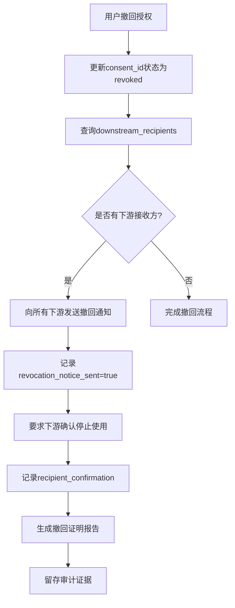
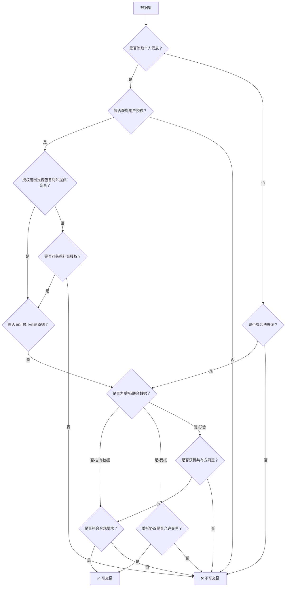
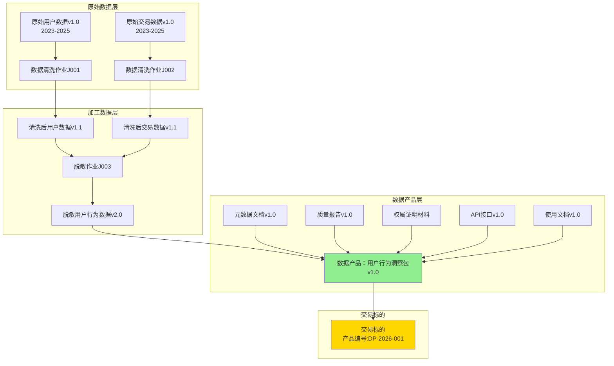

# 数据权属与证据链：从来源合法到加工可追溯

## 引言

数据权属是数据资产化的法律基础，也是数据交易所登记的前置门槛。清晰的权属证明和完整的证据链是数据资产合法交易的必要条件。本文系统阐述数据权属与证据链构建的方法论。

**重要性**：⭐⭐⭐⭐⭐ 交易所登记前置门槛

**适用场景**：
- 数据资产化项目中的权属证明阶段
- 数据交易前的权属审查
- 数据资产的权属管理

---

### 边界声明与风险提示

> **重要提示**：本文档旨在提供数据权属证明与证据链构建的技术指导，但不构成法律意见。涉及重大权属争议、高价值交易、复杂法律问题时，请咨询专业律师。

#### 文档定位与边界

**本文档涵盖**：
- ✅ 数据权属的技术认定方法（权利束模型、可交易权能判定）
- ✅ 证据链的构建与管理（血缘追溯、存证策略、不可篡改日志）
- ✅ 交易所登记材料的准备指导（证据目录、权属矩阵、质量声明）
- ✅ 合规性自查清单与最佳实践

**本文档不涵盖**：
- ❌ 具体法律纠纷的判决依据（需以法院判决为准）
- ❌ 特定行业的专项法规解读（如金融、医疗等需参考专项法规）
- ❌ 跨境数据流动的详细合规指引（需参考《数据出境安全评估办法》等专项法规）
- ❌ 数据资产的财务会计处理（需参考会计准则）

---

#### 核心概念的边界说明

**1. "权属"≠ 传统民法意义的"所有权"**

- **边界**：本文所述"数据权属"指基于授权、合同、法律规定而享有的**数据处理与交易的合法权能**，并非传统民法意义的"所有权"。
- **原因**：我国现行法律未明确赋予数据本身的"所有权"属性，《民法典》仅规定了"数据权益"受法律保护（第127条）。
- **实践指导**：
  - 在对外宣传中，避免使用"拥有数据所有权"等表述
  - 使用"享有数据处理权""具备合法交易权能"等精准表述
  - 在法律文件中，优先引用具体法律依据（如《个人信息保护法》第13条授权）而非抽象的"所有权"

**2. 个人信息的特殊性**

- **边界**：涉及个人信息的数据，企业仅享有**有限的处理权与交易权**，受限于：
  - 用户授权范围（用途、期限、地域）
  - 最小必要原则
  - 用户撤回权
  - 法律法规的强制性规定
- **风险提示**：
  - ⚠️ 即使获得用户同意，也**不能**将个人信息用于原授权范围外的用途（需重新授权）
  - ⚠️ 用户有权随时撤回授权，企业需有撤回处理机制（见1.2节"下游传播链追踪"）
  - ⚠️ 敏感个人信息（如生物识别、医疗健康、金融账户）需**单独同意**，不能捆绑授权

**3. 受托数据与联合数据的限制**

- **边界**：
  - **受托数据**：通常**不具备**对外交易权，除非委托协议明确授权
  - **联合数据**：需**全体共有方同意**或按协议约定的表决机制通过
- **风险提示**：
  - ⚠️ 未经委托方/共有方同意擅自交易，可能构成**违约**或**侵权**
  - ⚠️ 建议在委托协议/联合协议中**事前明确**可交易/可转授权条款

**4. 证据链的有效性边界**

- **边界**：证据链构建（血缘追溯、Hash验证、区块链存证等）可提升证据的**可信度**与**抗辩力**，但：
  - 不保证在所有法律争议中被认定为唯一证据
  - 仍需配合其他证据材料（如合同原件、公证书等）
  - 技术手段（如Hash、区块链）的法律效力受司法实践影响，建议选择司法认可的平台（如最高院认可的区块链平台）

**5. 交易所登记 ≠ 权属确权**

- **边界**：通过交易所登记审核，仅表明登记材料符合交易所要求，**不代表**：
  - 法院或仲裁机构对权属的最终认定
  - 排除第三方权利主张的可能性
  - 免除企业的后续合规义务（如用户撤回授权的处理）
- **风险提示**：
  - ⚠️ 登记后仍需持续维护权属证据链（如保存撤回授权记录、更新存证凭证等）
  - ⚠️ 如发生权属争议，需依法通过协商、仲裁、诉讼等途径解决

---

#### 免责声明

1. **非法律意见**：本文档内容仅供技术指导与合规参考，不构成法律意见。涉及具体法律问题，请咨询专业律师。

2. **法规变更风险**：数据相关法律法规（如《个人信息保护法》《数据安全法》）仍在不断完善中，本文档基于2026年1月的法律环境编写，后续法规变更可能导致部分内容需调整。

3. **个案差异**：不同行业、不同数据类型、不同交易场景的权属认定可能存在差异，本文档提供的是通用框架，具体实施需结合实际情况调整。

4. **尽职调查建议**：
   - 对于高价值数据资产（交易金额 > 100万元），建议委托律师事务所出具《数据权属法律意见书》
   - 对于跨境数据交易，建议咨询专业机构进行数据出境安全评估
   - 对于涉及敏感行业（金融、医疗、政府等）的数据，建议额外咨询行业主管部门

---

#### 适用的法律法规（截至2026年1月）

本文档基于以下法律法规编写，如法规更新请以最新版本为准：

- 《中华人民共和国民法典》（2021年1月1日施行）
- 《中华人民共和国个人信息保护法》（2021年11月1日施行）
- 《中华人民共和国数据安全法》（2021年9月1日施行）
- 《中华人民共和国网络安全法》（2017年6月1日施行）
- 《数据出境安全评估办法》（2022年9月1日施行）
- 《个人信息出境标准合同办法》（2023年6月1日施行）
- 《互联网信息服务算法推荐管理规定》（2022年3月1日施行）

---

## 一、数据来源合法性

### 1.1 采集授权证明

#### 用户授权
**授权要素**：
- 明确的授权主体（用户）
- 明确的授权对象（数据处理者）
- 明确的授权范围（数据类型、用途）
- 明确的授权期限
- 用户的明示同意

**授权方式**：
- 用户协议（注册时同意）
- 隐私政策（明确告知）
- 单独授权（敏感信息）
- 动态授权（特定场景）

**证明材料**：
- 用户协议文本
- 隐私政策文本
- 授权记录（用户ID、授权时间、授权内容）
- 授权截图或日志

#### 第三方协议
**协议要素**：
- 数据来源方
- 数据接收方
- 数据范围和用途
- 授权期限
- 法律责任

**证明材料**：
- 数据采购协议
- 授权书
- 发票和付款凭证

### 1.2 隐私告知与同意记录

> **交易所审计重点**：同意记录是涉及个人信息的数据资产的核心合规证据，需具备完整性、可追溯性、可撤回性。本节新增**用途变更管理**、**字段级授权**、**下游传播链追踪**，满足《个人信息保护法》第14条、第15条的精细化管理要求。

#### 告知内容（基础要求）
- 数据处理者身份
- 数据处理目的（**需具体化**，避免"改善服务"等模糊表述）
- 数据处理方式
- 数据保存期限（**需明确**，如"3年"而非"合理期限"）
- 用户权利（查询、更正、删除、撤回、可携带）
- 投诉渠道

#### 同意记录（基础版）

**记录内容**：
```json
{
  "consent_id": "C-2026-001-U123456",
  "user_id": "U123456",
  "consent_time": "2026-01-24T10:00:00Z",
  "consent_type": "privacy_policy",
  "consent_version": "v2.1",
  "consent_method": "checkbox",
  "consent_scope": ["basic_info", "behavior_data"],
  "purpose": "user_profiling_and_recommendation",
  "ip_address": "192.168.1.1",
  "user_agent": "Mozilla/5.0...",
  "status": "active"
}
```

#### 字段级授权记录（Field-Level Consent）

> **适用场景**：高价值数据资产、敏感个人信息、跨境数据交易

**为什么需要字段级授权**：
- 粗粒度授权（如"同意收集全部用户信息"）易被监管质疑为"过度收集"
- 字段级授权可证明"最小必要原则"落地
- 便于数据交易时精准控制数据范围

**字段级授权记录结构**：
```json
{
  "consent_id": "C-2026-001-U123456",
  "user_id": "U123456",
  "consent_time": "2026-01-24T10:00:00Z",
  "field_level_consent": [
    {
      "field_name": "phone_number",
      "field_category": "sensitive_personal_info",
      "consent_status": "granted",
      "purpose": "account_verification",
      "retention_period": "3_years",
      "granted_time": "2026-01-24T10:00:00Z"
    },
    {
      "field_name": "browsing_history",
      "field_category": "behavior_data",
      "consent_status": "granted",
      "purpose": "personalized_recommendation",
      "retention_period": "1_year",
      "granted_time": "2026-01-24T10:00:00Z"
    },
    {
      "field_name": "geolocation",
      "field_category": "sensitive_personal_info",
      "consent_status": "denied",
      "denied_time": "2026-01-24T10:00:00Z"
    }
  ]
}
```

**登记材料要求**：
- 提供字段级授权统计表（如：80%用户授权手机号，60%用户授权位置信息）
- 证明未授权字段已脱敏或未采集

#### 用途变更记录（Purpose Change Management）

> **法律依据**：《个人信息保护法》第14条 - 处理目的变更需重新取得同意

**用途变更触发场景**：
1. 原授权用途："用户画像与推荐" → 新用途："对外数据交易"（**需重新授权**）
2. 原授权用途："内部分析" → 新用途："第三方广告投放"（**需重新授权**）
3. 原授权用途："账户安全" → 新用途："信用评分"（**需重新授权**）

**用途变更记录结构**：
```json
{
  "purpose_change_id": "PC-2026-001",
  "consent_id": "C-2026-001-U123456",
  "user_id": "U123456",
  "original_purpose": "user_profiling_and_recommendation",
  "new_purpose": "data_trading_for_market_research",
  "change_reason": "business_expansion",
  "change_time": "2026-02-01T10:00:00Z",
  "re_consent_required": true,
  "re_consent_status": "pending",
  "re_consent_method": "in_app_notification",
  "user_response": null,
  "user_response_time": null
}
```

**用途变更处理流程**：
1. **识别用途变更**：业务部门申请新用途 → 法务/合规部门判定是否属于用途变更
2. **评估是否需重新授权**：
   - 新用途在原授权范围内 → 无需重新授权
   - 新用途超出原授权范围 → **必须重新授权**
3. **重新征得同意**：
   - 通过App推送/邮件/短信通知用户
   - 用户明确同意后方可启用新用途
   - 用户拒绝或超时未响应 → 数据不得用于新用途
4. **记录留痕**：保存用途变更记录与用户响应

**登记材料要求**：
- 提供用途变更记录清单（变更时间、原用途、新用途、重新授权情况）
- 证明用途变更已履行重新告知与征得同意义务

#### 下游传播链追踪（Downstream Propagation Tracking）

> **核心价值**：解决"数据已对外提供后，用户撤回授权如何处理"的审计难题

**下游传播记录结构**：
```json
{
  "propagation_id": "P-2026-001",
  "source_consent_id": "C-2026-001-U123456",
  "user_id": "U123456",
  "data_scope": "user_behavior_data_2023_2025",
  "downstream_recipients": [
    {
      "recipient_id": "R-001",
      "recipient_name": "XX市场研究公司",
      "recipient_type": "third_party_processor",
      "transfer_time": "2026-01-25T10:00:00Z",
      "transfer_purpose": "market_research",
      "contract_id": "CONTRACT-2026-001",
      "data_scope": "anonymized_behavior_data",
      "retention_period": "1_year",
      "revocation_notice_sent": false,
      "revocation_notice_time": null,
      "recipient_confirmation": null
    },
    {
      "recipient_id": "R-002",
      "recipient_name": "YY数据平台",
      "recipient_type": "data_exchange",
      "transfer_time": "2026-01-26T10:00:00Z",
      "transfer_purpose": "data_trading",
      "contract_id": "CONTRACT-2026-002",
      "data_scope": "aggregated_statistics",
      "retention_period": "2_years",
      "revocation_notice_sent": false,
      "revocation_notice_time": null,
      "recipient_confirmation": null
    }
  ]
}
```

**撤回授权后的下游通知流程**：



**撤回通知记录示例**：
```json
{
  "revocation_notice_id": "RN-2026-001",
  "user_id": "U123456",
  "revocation_time": "2026-03-01T10:00:00Z",
  "affected_consents": ["C-2026-001-U123456"],
  "downstream_notifications": [
    {
      "recipient_id": "R-001",
      "recipient_name": "XX市场研究公司",
      "notice_sent_time": "2026-03-01T10:30:00Z",
      "notice_method": "API_callback",
      "recipient_acknowledged": true,
      "acknowledgment_time": "2026-03-01T11:00:00Z",
      "action_taken": "data_deleted",
      "deletion_certificate": "CERT-R001-20260301"
    },
    {
      "recipient_id": "R-002",
      "recipient_name": "YY数据平台",
      "notice_sent_time": "2026-03-01T10:30:00Z",
      "notice_method": "email",
      "recipient_acknowledged": false,
      "follow_up_required": true,
      "escalation_time": "2026-03-08T10:00:00Z"
    }
  ]
}
```

**下游传播链管理要求**：

1. **事前登记**：
   - 对外提供数据前，必须登记下游接收方信息
   - 在数据提供合同中约定"撤回授权通知义务"与"停止处理义务"

2. **实时追踪**：
   - 维护下游传播链数据库
   - 定期核对下游接收方是否仍在处理数据

3. **撤回响应**：
   - 用户撤回授权后24小时内通知所有下游
   - 要求下游在7个工作日内确认停止处理
   - 记录下游确认凭证（邮件回复、API确认、删除证明）

4. **审计证据**：
   - 保留撤回通知发送记录（邮件、API日志）
   - 保留下游确认凭证
   - 生成《撤回授权处理报告》作为合规证据

**登记材料要求**：
- 提供下游传播链清单（所有数据接收方、传播时间、传播范围）
- 提供撤回授权处理机制说明（如何通知下游、如何验证下游停止处理）
- 如有历史撤回案例，提供撤回处理记录与下游确认凭证

---

**本节新增内容总结**：

| 增强点 | 价值 | 登记材料体现 |
|--------|------|-------------|
| **字段级授权** | 证明最小必要原则落地 | 字段级授权统计表 |
| **用途变更记录** | 证明用途变更已重新授权 | 用途变更记录清单 |
| **下游传播链** | 证明撤回授权可追溯执行 | 下游传播链清单 + 撤回处理机制说明 |

### 1.3 来源合法性自查清单

**自查项目**：
- ✅ 是否获得用户明示同意？
- ✅ 是否明确告知数据用途？
- ✅ 是否超出授权范围使用？
- ✅ 是否有完整的授权记录？
- ✅ 第三方数据是否有合法授权？
- ✅ 是否涉及未成年人数据？（需监护人同意）
- ✅ 是否涉及敏感个人信息？（需单独同意）

---

## 二、权属类型与归属

### 2.1 自有数据

**定义**：企业通过自有系统采集、生成的数据

**权利构成**（权利束）：
- ✅ **来源控制权**：对采集系统和业务流程的控制权
- ✅ **合法处理权**：基于用户授权或法定事由的数据处理权
- ✅ **使用权/收益权**：在授权范围内的商业化使用权
- ⚠️ **转授权/再许可权**：需明确约定，受限于原始授权范围
- ⚠️ **衍生权**：加工生成物的权利归属需单独界定

**前提条件**：
- 已获得用户明示同意或符合法定事由
- 处理目的、方式、范围符合授权约定
- 涉及个人信息的需满足《个人信息保护法》要求

**证明要点**：
- 数据采集系统的所有权或运营控制权证明
- 用户授权记录（隐私政策、用户协议、单独同意）
- 数据生成过程记录（业务日志、系统日志）
- 合法处理依据（授权书、合同、法律依据说明）

**示例**：
- 企业自有平台的用户数据（前提：已获得用户同意）
- 企业生产过程中的设备数据（非个人信息）
- 企业运营过程中的业务数据（前提：符合业务目的）

**可交易权限**：在满足合规要求前提下，可对外提供或交易，但受限于：
- 原始授权范围（用途、期限、地域）
- 法律法规要求（个人信息保护、数据安全、跨境限制）
- 合同约定（如有第三方组件需审查许可协议）

### 2.2 受托数据

**定义**：受他人委托处理的数据

**权利构成**（权利束）：
- ✅ **处理权**：在委托范围内的数据处理权（清洗、分析、存储）
- ✅ **临时使用权**：委托期限内的使用权
- ❌ **转授权/再许可权**：通常**不具备**，除非委托协议明确授权
- ❌ **对外交易权**：通常**不具备**，数据归委托方所有
- ⚠️ **衍生权**：加工生成物权利归属需在委托协议中明确约定

**前提条件**：
- 与委托方签订明确的数据处理协议
- 处理目的、方式、范围符合委托协议约定
- 涉及个人信息的需满足《个人信息保护法》受托处理要求

**证明要点**：
- 数据处理委托协议（盖章版）
- 授权范围和限制条款（明确列出可做/不可做的事项）
- 使用期限（起止时间、续期条款）
- 责任划分与数据安全义务
- 委托终止后的数据处理方式（返还、删除、留存）

**示例**：
- 受托处理的客户数据（如云服务商为客户提供数据托管）
- 外包服务中的数据（如 BPO 服务中的业务数据）
- 合作项目中的共享数据（委托方保留所有权）

**可交易权限**：**通常不可对外交易**，除非：
- 委托协议明确授权可转授权或对外提供
- 获得委托方书面同意
- 符合法律法规要求

### 2.3 联合数据

**定义**：多方共同贡献形成的数据（如联邦学习、联合建模、产业链协同）

**权利构成**（权利束）：
- ✅ **共有处理权**：各方在约定范围内的共同处理权
- ⚠️ **使用权/收益权**：按贡献度或协议约定分配
- ⚠️ **转授权/再许可权**：需**全体共有方一致同意**，或按协议约定
- ⚠️ **对外交易权**：需**全体共有方同意**或按协议约定的表决机制
- ⚠️ **退出权**：某方退出时的数据处理与权利安排

**前提条件**：
- 各方签订联合数据协议，明确权利义务
- 明确各方贡献度评估方法（数据量、质量、算法、算力等）
- 明确收益分配机制与争议解决机制

**证明要点**：
- 联合数据协议（盖章版，明确各方权利边界）
- 贡献度评估报告（数据量、质量、技术贡献等）
- 收益分配机制（分配比例、计算方式、支付条款）
- 数据使用限制（各方可用范围、不可用范围）
- 退出机制（某方退出时的数据处理方式）

**示例**：
- 联合建模数据（多方联邦学习产生的模型）
- 联合营销数据（多平台联合推广的用户数据）
- 产业链协同数据（供应链上下游共享数据）

**可交易权限**：**受严格限制**，需满足：
- 全体共有方书面同意或按协议约定的表决机制通过
- 符合原始授权范围（不得超出各方获得的用户授权）
- 符合法律法规要求（尤其是个人信息保护要求）

### 2.4 衍生数据

**定义**：基于原始数据加工、分析产生的新数据（如用户画像、风险评分、预测模型）

**权利构成**（权利束）：
- ✅ **衍生物使用权**：加工方对衍生成果的使用权
- ⚠️ **转授权/再许可权**：受限于原始数据权利范围
- ⚠️ **对外交易权**：需确认原始数据权利是否允许商业化
- 📌 **增值贡献权**：加工方对增值部分的权益（需在协议中明确）

**前提条件**：
- 对原始数据具有合法处理权（自有、受托、联合、采购）
- 衍生用途符合原始授权范围或另行获得授权
- 衍生过程符合法律法规要求（如匿名化、脱敏）

**证明要点**：
- 原始数据权属证明（自有/受托/联合/采购协议）
- 加工过程记录（血缘追溯、规则版本、处理日志）
- 增值贡献度说明（技术方法、算法创新、业务价值）
- 衍生权利约定（如原始数据为受托，需在委托协议中明确衍生物归属）

**示例**：
- 用户画像（基于行为数据加工，需确认原始授权是否允许画像用途）
- 风险评分（基于交易数据加工，需确认是否可用于对外服务）
- 预测模型（基于历史数据训练，模型权属需在协议中明确）

**可交易权限**：**需逐案判断**，关键考量：
- 原始数据是否允许衍生与商业化（自有数据通常允许，受托数据需协议明确）
- 衍生过程是否达到"实质性转换"（如匿名化、去标识化、统计聚合）
- 是否符合法律法规要求（个人信息保护法第73条："经过加工无法识别特定个人且不能复原的，不属于个人信息"）

**重要提示**：
- 对于基于个人信息的衍生数据，即使经过加工，仍需评估"重识别风险"
- 如衍生数据仍可关联到特定个人，需视为个人信息，受同等保护要求
- 建议进行"匿名化评估"或获取法律意见书

### 2.5 权利束与可交易权能（登记材料核心）

> **设计理念**：交易所关心的不是"你是否拥有所有权"，而是"你是否有权交易/授权"。本节提供权利束拆分框架与权属矩阵，便于登记材料准备与评审核对。

#### 权利束拆分框架

数据权属不是简单的"有"或"无"，而是一组权利的集合（权利束），不同权利的强弱决定了可交易权能。

**五类核心权利**：

1. **来源控制权**
   - 对数据采集系统或业务流程的控制权
   - 证明方式：系统所有权证明、运营控制协议

2. **合法处理权**
   - 基于授权、合同或法定事由的数据处理权
   - 证明方式：用户授权记录、委托协议、法律依据说明

3. **使用权/收益权**
   - 在特定范围内的商业化使用与收益权
   - 证明方式：授权范围界定、收益分配协议

4. **转授权/再许可权**
   - 对外提供、转授权、再许可的权利
   - 证明方式：原始协议的转授权条款、委托方书面同意

5. **衍生权**
   - 加工生成物的权利归属
   - 证明方式：衍生权利约定、增值贡献度评估

#### 权属矩阵（登记材料必备）

以下矩阵用于快速核对各类数据的权利边界与可交易权能，建议作为登记材料附件：

| 数据类型 | 来源控制权 | 合法处理权 | 使用权/收益权 | 转授权权 | 衍生权 | 可交易权能 | 依据文件 | 限制条件 | 有效期 |
|---------|----------|----------|-------------|---------|--------|----------|---------|---------|--------|
| **自有数据**<br>（用户行为数据） | ✅ 完全控制 | ✅ 基于用户同意 | ✅ 授权范围内可用 | ⚠️ 需明确约定 | ⚠️ 需单独界定 | **可交易**<br>（受限于授权） | - 隐私政策 v2.1<br>- 用户协议 v1.5<br>- 授权记录库 | - 用途限定：画像、推荐<br>- 地域限定：中国境内<br>- 敏感信息需单独同意 | 用户撤回前<br>或5年 |
| **受托数据**<br>（客户委托处理） | ❌ 委托方控制 | ✅ 委托范围内 | ❌ 仅临时使用 | ❌ 通常不具备 | ⚠️ 需协议明确 | **不可交易**<br>（除非明确授权） | - 委托协议 No.2023-001<br>- 保密协议 | - 仅限委托目的<br>- 禁止转授权<br>- 期满返还或删除 | 2023-01-01<br>至2025-12-31 |
| **联合数据**<br>（联邦学习模型） | 🔀 各方共同控制 | ✅ 联合协议约定 | ⚠️ 按贡献度分配 | ❌ 需全体同意 | ⚠️ 需协议明确 | **受限交易**<br>（需共有方同意） | - 联合建模协议 v1.0<br>- 贡献度评估报告<br>- 分配机制 | - 需A/B/C三方一致同意<br>- 收益按40%/30%/30%分配 | 长期有效<br>（除非某方退出） |
| **衍生数据**<br>（用户画像） | ✅ 加工方控制 | ⚠️ 依赖原始权利 | ⚠️ 依赖原始权利 | ⚠️ 依赖原始权利 | ✅ 通常归加工方 | **需逐案判断**<br>（取决于原始数据） | - 原始数据权属证明<br>- 加工血缘记录<br>- 匿名化评估报告 | - 原始数据授权范围<br>- 匿名化程度<br>- 重识别风险<5% | 视原始数据<br>有效期而定 |

**使用说明**：
1. **登记材料准备**：将上述矩阵填写完整，作为权属证明报告的附件
2. **依据文件**：每个文件需提供编号、版本号、签署日期，便于核查
3. **限制条件**：清晰列出不可做的事项（用途限定、地域限定、禁止事项）
4. **有效期**：明确权利的有效期限或触发条件（如用户撤回、合同到期）

#### 可交易权能判定流程



**关键判定点**：
- ✅ **绿灯（可交易）**：自有数据 + 明确授权 + 符合合规 + 无转授权限制
- ⚠️ **黄灯（受限交易）**：联合数据 + 共有方同意 + 符合原始授权
- ❌ **红灯（不可交易）**：受托数据（无明确授权） / 无用户授权 / 超出授权范围

#### 风险边界提示

**本章节所述"权属"与"可交易权能"的边界声明**：

1. **权属≠所有权**：本文所述"权属"指可依法证明的处理与交易授权权利，不当然等同传统民法意义的"所有权"。数据权属是一组权利的集合（权利束），不同场景下权利范围不同。

2. **个人信息的特殊性**：涉及个人信息/敏感个人信息的数据，交易前需满足：
   - 合法事由（用户同意、法定事由）
   - 最小必要原则（不得超出授权范围）
   - 用途限定（明确告知并限定用途）
   - 可撤回与可追溯（用户有权撤回授权，需有撤回机制）

3. **受托/联合数据的限制**：
   - 受托数据：权利范围以委托协议为准，如无明示可交易/可转授权条款，应视为受限
   - 联合数据：需全体共有方书面同意或按协议约定的表决机制通过

4. **撤回授权的处理**：
   - 对已对外提供的数据，撤回授权通常体现为"停止处理/停止提供/下游告知与合规留痕"
   - 不保证物理意义的"全网删除"（技术上不可行）
   - 但需证明"已停止主动使用"与"已通知下游停止使用"

5. **法律意见建议**：
   - 对于权属复杂、涉及金额较大、涉及敏感数据的交易，建议获取专业法律意见书
   - 对于跨境数据流动，需额外遵守《数据出境安全评估办法》等跨境监管要求

---

## 三、证据链体系

### 3.1 数据血缘追溯

> **新增数据产品视角**：传统血缘追溯聚焦于"数据集"（Dataset）层面，但数据资产交易的标的是"数据产品"（Data Product），包含数据集、元数据、文档、API、质量报告等多个组成部分。本节新增**数据产品级血缘追溯**，满足交易所对"交易标的完整溯源"的要求。

#### 数据集血缘 vs. 数据产品血缘

| 维度 | 数据集血缘（Dataset Lineage） | 数据产品血缘（Data Product Lineage） |
|------|----------------------------|----------------------------------|
| **追溯对象** | 单个数据集 | 数据产品（数据集+元数据+文档+API+质量报告） |
| **粒度** | 表/文件级 | 产品级（可包含多个数据集） |
| **关注点** | 数据转换过程（ETL） | 产品组装过程（数据集+非数据资产） |
| **适用场景** | 技术开发、质量溯源 | 交易登记、权属证明、产品溯源 |
| **登记价值** | 辅助证据 | **核心证据**（证明交易标的完整性与合规性） |

---

#### 数据集血缘追溯（Dataset Lineage）

**血缘信息**：
- 作业ID：唯一标识每次数据处理
- 版本号：数据版本和规则版本
- 输入数据源：上游数据来源
- 输出数据集：下游数据产出
- 处理时间：开始和结束时间
- 处理规则：清洗、转换、聚合规则

**血缘图示例（数据集视角）**：
```
原始数据A (v1.0)
    ↓ [作业J001, 清洗规则R1.2]
清洗数据B (v1.1)
    ↓ [作业J002, 脱敏规则R2.1]
脱敏数据C (v1.2)
    ↓ [作业J003, 聚合规则R3.0]
聚合数据D (v2.0)
```

**血缘追溯工具**：
- Apache Atlas
- Datahub
- Amundsen
- 自研血缘系统

---

#### 数据产品血缘追溯（Data Product Lineage）

> **交易所审计重点**：交易标的是"数据产品"而非"原始数据集"。数据产品血缘需证明产品所有组成部分的来源、加工过程、质量保障措施，确保买方/监管机构可完整溯源。

**数据产品定义**：

一个可交易的数据产品通常包含：
1. **核心数据集**：经过清洗、脱敏、聚合的数据文件（Parquet、CSV、JSON等）
2. **元数据文档**：数据字典、Schema说明、采集说明
3. **质量报告**：数据质量评估报告、验证记录
4. **权属证明**：授权协议、法律意见书、存证凭证
5. **使用文档**：API文档、使用说明、示例代码
6. **技术组件**（可选）：API接口、SDK、查询工具

**数据产品血缘追溯模型**：



**数据产品血缘记录结构**：

```json
{
  "product_id": "DP-2026-001",
  "product_name": "用户行为洞察数据产品v1.0",
  "product_version": "v1.0",
  "product_create_time": "2026-01-25T10:00:00Z",
  "product_components": {
    "core_datasets": [
      {
        "dataset_id": "DS-001",
        "dataset_name": "脱敏用户行为数据",
        "dataset_version": "v2.0",
        "records": 10000000,
        "size_gb": 5.2,
        "hash": "SHA256:a1b2c3d4...",
        "lineage_chain": [
          {
            "stage": "原始采集",
            "dataset": "原始用户数据v1.0",
            "job_id": null,
            "timestamp": "2023-01-01 ~ 2025-12-31"
          },
          {
            "stage": "数据清洗",
            "dataset": "清洗后用户数据v1.1",
            "job_id": "J001",
            "rules": ["R1.2-缺失值填充", "R1.3-异常值处理"],
            "timestamp": "2026-01-20T10:00:00Z"
          },
          {
            "stage": "数据脱敏",
            "dataset": "脱敏用户数据v2.0",
            "job_id": "J003",
            "rules": ["R2.1-手机号脱敏", "R2.2-地址泛化"],
            "timestamp": "2026-01-22T10:00:00Z"
          }
        ],
        "authorization_chain": [
          {
            "consent_id": "C-2026-001",
            "consent_scope": "user_behavior_data",
            "consent_purpose": "data_trading_for_market_research",
            "consent_valid_until": "2029-01-20"
          }
        ]
      }
    ],
    "metadata_docs": [
      {
        "doc_id": "MD-001",
        "doc_name": "数据字典v1.0.xlsx",
        "doc_version": "v1.0",
        "create_time": "2026-01-23T10:00:00Z",
        "creator": "数据团队",
        "hash": "SHA256:x9y8z7..."
      },
      {
        "doc_id": "MD-002",
        "doc_name": "Schema说明v1.0.md",
        "doc_version": "v1.0",
        "create_time": "2026-01-23T11:00:00Z",
        "creator": "数据团队",
        "hash": "SHA256:m5n4b3..."
      }
    ],
    "quality_reports": [
      {
        "report_id": "QR-001",
        "report_name": "数据质量评估报告v1.0.pdf",
        "report_version": "v1.0",
        "assessment_time": "2026-01-24T10:00:00Z",
        "assessor": "质量团队",
        "quality_score": 92,
        "hash": "SHA256:q1w2e3..."
      }
    ],
    "authorization_proofs": [
      {
        "proof_id": "EV-2026-001",
        "proof_type": "authorization_agreement",
        "proof_name": "用户数据采集授权协议v2.1",
        "notarization": "blockchain_cert_BC-2026-001",
        "hash": "SHA256:t5y6u7..."
      },
      {
        "proof_id": "EV-2026-004",
        "proof_type": "legal_opinion",
        "proof_name": "数据权属法律意见书",
        "notarization": "TSA_timestamp_TSA-20260122-001",
        "hash": "SHA256:o9p0a1..."
      }
    ],
    "technical_components": [
      {
        "component_id": "API-001",
        "component_name": "数据查询API v1.0",
        "component_type": "REST_API",
        "endpoint": "https://api.example.com/v1/user-behavior",
        "documentation": "API文档v1.0.md",
        "sdk": "Python SDK v1.0",
        "hash": "SHA256:i8u7y6..."
      }
    ]
  },
  "product_lineage_summary": {
    "total_source_datasets": 2,
    "total_processing_jobs": 3,
    "total_transformations": 5,
    "earliest_data_timestamp": "2023-01-01",
    "latest_data_timestamp": "2025-12-31",
    "authorization_coverage": "100%",
    "quality_score": 92
  },
  "product_hash": "SHA256:f4g5h6j7k8...",
  "product_notarization": {
    "method": "blockchain",
    "cert_id": "BC-PRODUCT-2026-001",
    "timestamp": "2026-01-25T10:30:00Z",
    "verification_url": "https://blockchain.example.com/verify/BC-PRODUCT-2026-001"
  }
}
```

**产品血缘可视化（推荐工具）**：

| 工具 | 特点 | 适用场景 |
|------|------|---------|
| **自研产品血缘系统** | 完全定制化，支持产品级血缘 | 大型企业，高定制需求 |
| **Apache Atlas + 自定义扩展** | 开源，可扩展，需二次开发 | 中型企业，技术能力强 |
| **Datahub + Custom Metadata** | 支持自定义元数据，可扩展 | 中型企业，快速上线 |
| **表格+Mermaid图** | 简单直观，成本低 | 小型企业，手动维护 |

---

#### 数据产品血缘的登记价值

**1. 证明交易标的完整性**

- 问题：买方质疑"数据产品是否包含声称的所有组件？"
- 解决：通过产品血缘清单，逐项列出所有组成部分（数据集、文档、API等）及其Hash，可验证完整性

**2. 证明权属证明链条完整**

- 问题：监管机构质疑"数据产品的权属证明是否覆盖所有数据来源？"
- 解决：通过产品血缘追溯到所有原始数据集，并关联每个数据集的授权记录（consent_id），证明权属链完整

**3. 证明质量保障措施到位**

- 问题：交易所质疑"数据产品的质量是否经过验证？"
- 解决：通过产品血缘关联质量报告、清洗规则、验证记录，证明质量保障流程完整

**4. 支持产品版本演进追溯**

- 问题：产品升级到v2.0后，如何证明与v1.0的关系？
- 解决：通过产品血缘记录版本演进历史，关联v1.0与v2.0的差异（新增数据集、规则变更等）

---

#### 数据产品血缘的登记材料要求

**必须提供**：

1. **产品组成清单**（Product Component Manifest）：
   - 列出产品包含的所有组件（数据集、文档、API等）
   - 每个组件的Hash值与存证凭证
   - 组件间的关联关系

2. **数据集血缘图**：
   - 每个核心数据集的转换过程
   - ETL作业ID、规则版本、时间戳
   - 原始数据 → 清洗数据 → 脱敏数据 → 最终数据集的完整链路

3. **权属证明链**：
   - 每个数据集关联的授权记录（consent_id）
   - 授权范围是否覆盖当前用途（数据交易）
   - 如有用途变更，提供重新授权记录

4. **产品Hash与存证凭证**：
   - 产品整体Hash（基于所有组件Hash计算）
   - 区块链/TSA存证凭证
   - 验证URL或API接口

**推荐提供**：

5. **产品血缘可视化图**：
   - Mermaid图或架构图
   - 展示产品组装过程
   - 便于审核人员快速理解

6. **产品版本演进历史**（如适用）：
   - v1.0 → v2.0 的变更记录
   - 版本间的Diff对比
   - 版本升级原因说明

---

#### 数据产品血缘追溯示例

**场景**：某企业将"用户行为洞察数据产品v1.0"提交交易所登记

**产品组成**：
- 核心数据集：脱敏用户行为数据v2.0（10,000,000条记录，5.2GB）
- 元数据文档：数据字典v1.0、Schema说明v1.0
- 质量报告：数据质量评估报告v1.0（质量分92分）
- 权属证明：授权协议、法律意见书
- API组件：数据查询API v1.0 + Python SDK

**登记材料（产品血缘相关）**：

1. **产品组成清单**（Excel表格）：

| 组件类型 | 组件名称 | 版本 | Hash（前8位） | 存证方式 | 存证凭证 |
|---------|---------|------|-------------|---------|---------|
| 核心数据集 | 脱敏用户行为数据 | v2.0 | a1b2c3d4 | 区块链存证 | BC-2026-001 |
| 元数据文档 | 数据字典 | v1.0 | x9y8z7w6 | TSA时间戳 | TSA-20260123-001 |
| 元数据文档 | Schema说明 | v1.0 | m5n4b3v2 | TSA时间戳 | TSA-20260123-002 |
| 质量报告 | 数据质量评估报告 | v1.0 | q1w2e3r4 | 审计机构签章 | AUD-2026-001 |
| 权属证明 | 授权协议 | v2.1 | t5y6u7i8 | 区块链存证+公证 | BC-2026-001 |
| 权属证明 | 法律意见书 | v1.0 | o9p0a1s2 | 律所盖章+TSA | TSA-20260122-001 |
| API组件 | 数据查询API | v1.0 | i8u7y6t5 | TSA时间戳 | TSA-20260124-001 |

2. **数据集血缘图**（Mermaid图或架构图）：
   - 见上文"数据产品血缘追溯模型"的Mermaid示例

3. **权属证明链**（PDF文档）：
   - 原始数据采集：基于授权协议v2.1（consent_id: C-2026-001），授权用途包含"数据交易用于市场研究"
   - 用途变更记录：无（原始授权已覆盖）
   - 授权有效期：至2029-01-20

4. **产品Hash与存证凭证**：
   - 产品整体Hash: `SHA256:f4g5h6j7k8...`
   - 区块链存证凭证: `BC-PRODUCT-2026-001`
   - 验证URL: `https://blockchain.example.com/verify/BC-PRODUCT-2026-001`

**审核结果**：✅ 通过
- 产品组成完整，所有组件Hash可验证
- 数据集血缘清晰，转换过程可追溯
- 权属证明链完整，授权覆盖交易用途
- 质量报告完整，质量分92分（优秀）

### 3.2 加工记录

#### 操作日志
**记录内容**：
```json
{
  "job_id": "J001",
  "job_name": "user_data_cleaning",
  "operator": "张三",
  "start_time": "2026-01-24T10:00:00Z",
  "end_time": "2026-01-24T10:30:00Z",
  "input_data": {
    "source": "raw_user_data",
    "version": "v1.0",
    "records": 1000000,
    "hash": "a1b2c3d4e5f6"
  },
  "output_data": {
    "target": "cleaned_user_data",
    "version": "v1.1",
    "records": 980000,
    "hash": "x9y8z7w6v5u4"
  },
  "rules": [
    {"rule_id": "R001", "rule_version": "v1.2", "description": "缺失值填充"},
    {"rule_id": "R002", "rule_version": "v2.0", "description": "异常值处理"}
  ],
  "status": "success"
}
```

#### 规则版本
**版本管理**：
- Git式版本控制
- 规则变更记录
- 审批流程记录

### 3.3 版本管理

#### 数据版本
**版本号规则**：
- 主版本号：重大变更（如数据结构变化）
- 次版本号：功能变更（如新增字段）
- 修订号：bug修复（如数据修正）

**示例**：v2.1.3
- 2：第2个主版本
- 1：第1次功能变更
- 3：第3次修正

#### 规则版本
**版本信息**：
```json
{
  "rule_id": "R001",
  "rule_name": "缺失值填充规则",
  "version": "v1.2.0",
  "create_time": "2026-01-20T10:00:00Z",
  "author": "张三",
  "change_log": "优化中位数填充算法",
  "affected_fields": ["age", "income"],
  "approval_status": "approved",
  "approver": "李四"
}
```

### 3.4 存证策略与可审计要求

> **从"示例代码"升级为"落地要求"**：本节定义数据资产登记、交易、争议解决所需的最小存证集与可审计实施标准，确保证据链经得起交易所、监管机构、仲裁机构的验证。

#### 最小存证集（Minimum Notarization Set）

> **登记必备**：交易所登记时，至少需对以下材料进行存证，形成不可抵赖的证据链。

**必须存证的材料（P0级）**：

| 存证对象 | 存证方法 | 存证内容 | 验证方式 | 成本估算 |
|---------|---------|---------|---------|---------|
| **授权协议/合同** | 区块链存证 或 公证处公证 | 文件Hash + 签署时间 + 签署方 | 区块链验证 或 公证处查询 | 100-500元/份 |
| **隐私政策** | 区块链存证 + Web Archive | 文件Hash + 发布时间 + 发布URL | 区块链验证 + Web Archive快照 | 50-200元 |
| **关键操作日志**<br>（数据采集/清洗/交付） | 不可篡改日志系统<br>（Hash链 或 区块链日志链） | 日志Hash + 时间戳 + 操作人 | Hash链验证 或 区块链查询 | 自研成本<br>或0.01元/条 |
| **数据文件快照** | TSA时间戳 或 区块链存证 | 文件Hash + 时间戳 | TSA验证 或 区块链验证 | 1-10元/次 |
| **法律意见书**<br>（高价值资产） | 律所盖章 + TSA时间戳 | 文件Hash + 出具时间 + 律所信息 | 律所确认 + TSA验证 | 5万-20万元 |

**推荐存证的材料（P1级）**：

| 存证对象 | 存证方法 | 价值 |
|---------|---------|------|
| **数据血缘图** | 区块链存证 | 证明数据加工过程可追溯 |
| **权限审计报告** | 审计机构签章 + Hash | 证明权限管理规范 |
| **撤回授权处理记录** | 不可篡改日志 | 证明撤回授权已执行 |
| **下游传播记录** | 不可篡改日志 | 证明数据流向可追溯 |

**可选存证的材料（P2级）**：
- 邮件（企业邮箱 + DKIM验证）
- 会议纪要（审批签字 + Scan存档）
- 内部工单（工单系统导出 + Hash）

---

#### 存证方法选型指南

**方法1：区块链存证（推荐用于核心证据）**

**适用场景**：
- 授权协议、隐私政策、关键操作日志
- 需要不可篡改性 + 时间戳证明 + 公开可验证

**实施要求**：
1. **选择司法认可的区块链平台**：
   - 最高院认可：蚂蚁链司法存证、天平链、至信链
   - 国际认可：Ethereum（公链）、BSN（国家区块链服务网络）

2. **存证内容规范**：
```json
{
  "notarization_id": "BC-2026-001",
  "evidence_type": "authorization_agreement",
  "evidence_name": "《用户数据采集授权协议v2.1》",
  "file_hash": "SHA256:a1b2c3d4e5f6...",
  "file_size": 1024000,
  "creator": "企业法务部",
  "create_time": "2026-01-20T10:00:00Z",
  "related_data_scope": "user_behavior_data_2023_2025",
  "blockchain": "AntChain_Judicial",
  "tx_hash": "0x123abc...",
  "block_height": 12345678,
  "timestamp": "2026-01-20T10:05:32Z",
  "verification_url": "https://antchain.example.com/verify/BC-2026-001"
}
```

3. **验证机制**：
   - 提供验证URL或API接口
   - 第三方可独立验证Hash与时间戳
   - 保留区块链交易凭证

**成本**：
- 公链（Ethereum）：100-500元/次（Gas费波动）
- 联盟链（蚂蚁链）：50-200元/次
- 自建联盟链：自研成本 + 运维成本

---

**方法2：TSA时间戳服务（Time Stamping Authority）**

**适用场景**：
- 数据文件快照、法律意见书、审计报告
- 需要权威时间戳证明 + 成本可控

**实施要求**：
1. **选择合规TSA机构**：
   - 国内：CFCA（中国金融认证中心）、iTrusChina
   - 国际：DigiCert、GlobalSign

2. **时间戳请求**：
```python
import hashlib
import requests

def get_tsa_timestamp(file_path, tsa_url):
    """向TSA申请时间戳"""
    # 1. 计算文件Hash
    with open(file_path, 'rb') as f:
        file_hash = hashlib.sha256(f.read()).hexdigest()

    # 2. 构造TSA请求
    tsa_request = {
        "hash_algorithm": "SHA256",
        "hash_value": file_hash,
        "requester": "企业名称",
        "policy_oid": "1.2.3.4.5"
    }

    # 3. 提交TSA请求
    response = requests.post(tsa_url, json=tsa_request)

    # 4. 获取时间戳令牌
    tsa_token = response.json()
    return tsa_token
```

3. **时间戳验证**：
   - 保留TSA令牌（`.tsr`文件）
   - 可通过TSA官网验证
   - 时间戳有效期：通常10年

**成本**：1-10元/次

---

**方法3：公证处公证（传统方式，法律效力最强）**

**适用场景**：
- 高价值数据资产（> 500万元）
- 预期可能发生法律争议
- 需要最强法律效力

**实施要求**：
1. 携带材料前往公证处：
   - 授权协议原件
   - 企业资质证明
   - 经办人身份证明

2. 公证处出具公证书（纸质 + 电子）

3. 公证书编号可在全国公证书查询系统验证

**成本**：500-2000元/份

**劣势**：
- 流程较慢（1-2周）
- 无法批量处理
- 不适合高频操作（如每日日志存证）

---

#### 存证策略决策矩阵

| 证据类型 | 价值等级 | 推荐方法 | 理由 |
|---------|---------|---------|------|
| **授权协议** | 高 | 区块链存证 或 公证处公证 | 核心证据，需最强证明力 |
| **隐私政策** | 高 | 区块链存证 + Web Archive | 需公开可验证 |
| **法律意见书** | 高 | 律所盖章 + TSA时间戳 | 律所签章已具备法律效力，TSA补强时间戳 |
| **操作日志** | 中 | 不可篡改日志系统（Hash链） | 高频生成，需低成本方案 |
| **数据文件快照** | 中 | TSA时间戳 | 成本低，权威性足够 |
| **审计报告** | 中 | 审计机构签章 + TSA | 审计机构签章已具公信力 |
| **邮件** | 低 | DKIM验证 + 邮件归档 | 辅助证据，低成本保存 |

---

#### 存证实施的审计要求

**要求1：存证覆盖率**
- 核心证据材料存证覆盖率必须达到100%
- 辅助证据材料存证覆盖率建议≥80%

**要求2：存证时效性**
- 授权协议签署后24小时内完成存证
- 数据文件生成后7天内完成快照存证
- 操作日志实时或每日批量存证

**要求3：存证可验证性**
- 提供验证URL或API接口
- 第三方可独立验证Hash与时间戳（无需授权）
- 存证凭证永久保留（或≥10年）

**要求4：存证记录留痕**
- 建立存证台账（存证对象、存证时间、存证方法、凭证号）
- 存证台账纳入证据目录（见3.6节）
- 定期审计存证覆盖率与有效性

---

### 3.5 不可篡改日志系统实施要求

> **审计核心**：日志是证明数据处理合规性的关键证据，但普通日志可被篡改。本节定义不可篡改日志的技术实施标准，确保日志可作为法律证据。

#### 不可篡改日志的技术实现方案

**方案1：Hash链（适用于中小规模，成本低）**

**原理**：每条日志包含前一条日志的Hash，形成链式结构，任何篡改会导致后续Hash全部失效。

**实现示例**：
```python
import hashlib
import json
from datetime import datetime

class ImmutableLogChain:
    def __init__(self):
        self.chain = []
        self.previous_hash = "0" * 64  # Genesis hash

    def add_log(self, log_content):
        """添加日志到不可篡改链"""
        log_entry = {
            "log_id": len(self.chain) + 1,
            "timestamp": datetime.utcnow().isoformat(),
            "content": log_content,
            "previous_hash": self.previous_hash,
            "hash": None
        }

        # 计算当前日志Hash
        log_entry["hash"] = self._calculate_hash(log_entry)

        # 更新previous_hash为当前Hash
        self.previous_hash = log_entry["hash"]

        # 添加到链
        self.chain.append(log_entry)

        return log_entry["hash"]

    def _calculate_hash(self, log_entry):
        """计算日志Hash"""
        log_string = json.dumps({
            "log_id": log_entry["log_id"],
            "timestamp": log_entry["timestamp"],
            "content": log_entry["content"],
            "previous_hash": log_entry["previous_hash"]
        }, sort_keys=True)
        return hashlib.sha256(log_string.encode()).hexdigest()

    def verify_chain(self):
        """验证链完整性"""
        for i in range(len(self.chain)):
            log = self.chain[i]

            # 重新计算Hash
            calculated_hash = self._calculate_hash(log)

            # 验证Hash是否一致
            if calculated_hash != log["hash"]:
                return False, f"Log {log['log_id']} hash mismatch"

            # 验证链接是否正确
            if i > 0:
                if log["previous_hash"] != self.chain[i-1]["hash"]:
                    return False, f"Log {log['log_id']} chain broken"

        return True, "Chain is valid"

# 使用示例
log_chain = ImmutableLogChain()
log_chain.add_log({"action": "data_access", "user": "张三", "data": "user_data_v1.0"})
log_chain.add_log({"action": "data_export", "user": "李四", "data": "user_data_v1.0"})

# 验证
is_valid, message = log_chain.verify_chain()
print(f"Chain validation: {is_valid}, {message}")
```

**审计要点**：
- 定期（每日/每周）进行链完整性验证
- 验证结果记录并保留
- 对外提供验证接口（允许第三方验证）

**适用场景**：
- 数据操作日志（访问、修改、导出）
- 权限变更日志
- 授权撤回记录

**成本**：自研开发成本 + 存储成本（可忽略不计）

---

**方案2：WORM存储（Write Once Read Many）**

**原理**：使用WORM存储介质或云服务，日志写入后物理上不可修改。

**实施要求**：
1. **使用WORM存储**：
   - 硬件：WORM磁带、WORM光盘
   - 云服务：AWS S3 Object Lock、阿里云OSS合规保留策略、腾讯云COS WORM

2. **配置保留策略**：
```python
# AWS S3 Object Lock示例
import boto3

s3 = boto3.client('s3')

# 配置对象锁定
s3.put_object_lock_configuration(
    Bucket='audit-logs-bucket',
    ObjectLockConfiguration={
        'ObjectLockEnabled': 'Enabled',
        'Rule': {
            'DefaultRetention': {
                'Mode': 'COMPLIANCE',  # 合规模式，连管理员都无法删除
                'Years': 10
            }
        }
    }
)

# 上传日志到WORM存储
s3.put_object(
    Bucket='audit-logs-bucket',
    Key='logs/2026-01-25-access.log',
    Body=log_content,
    ObjectLockMode='COMPLIANCE',
    ObjectLockRetainUntilDate=datetime(2036, 1, 25)  # 保留10年
)
```

**审计要点**：
- 提供WORM配置截图或API验证证明
- 证明日志确实存储在WORM模式下
- 提供云服务商合规认证（如SOC2、ISO 27001）

**适用场景**：
- 高价值数据资产的审计日志
- 合规要求严格的行业（金融、医疗、政府）

**成本**：
- 云服务：存储费用 + WORM功能费（通常无额外费用或少量增费）
- 硬件WORM：设备成本较高（万元级）

---

**方案3：区块链日志链（适用于高价值资产，成本较高）**

**原理**：将日志Hash定期（如每小时/每日）提交到区块链，利用区块链不可篡改性。

**实施流程**：
1. 本地生成日志Hash链（方案1）
2. 每小时/每日将Hash链的根Hash提交到区块链
3. 区块链存证凭证作为日志未篡改的证明

**适用场景**：
- 高价值数据资产（> 500万元）
- 需要向第三方（交易所/仲裁机构）提供日志未篡改证明

**成本**：区块链存证费用（50-200元/次 × 每日一次 = 1.8-7.3万元/年）

---

#### 不可篡改日志的必备字段

**基础字段（所有日志必须包含）**：

```json
{
  "log_id": "LOG-2026-001-00001",
  "timestamp": "2026-01-25T10:00:00.123Z",
  "event_type": "data_access",
  "actor": {
    "user_id": "U123456",
    "user_name": "张三",
    "role": "数据分析师",
    "ip_address": "192.168.1.100",
    "session_id": "SESSION-20260125-001"
  },
  "target": {
    "data_asset_id": "DA-2026-001",
    "data_asset_name": "用户行为数据v1.0",
    "data_scope": "2023-01-01 ~ 2025-12-31",
    "record_count": 1000000
  },
  "action_detail": {
    "operation": "SELECT",
    "query": "SELECT * FROM user_behavior WHERE date >= '2023-01-01'",
    "result": "success",
    "records_affected": 1000000
  },
  "authorization": {
    "consent_id": "C-2026-001-U123456",
    "authorization_basis": "user_consent",
    "authorization_expiry": "2029-01-20"
  },
  "hash_chain": {
    "previous_log_hash": "a1b2c3d4...",
    "current_log_hash": "x9y8z7w6...",
    "hash_algorithm": "SHA256"
  },
  "metadata": {
    "log_source": "data_access_gateway",
    "log_version": "v2.0",
    "retention_period": "10_years"
  }
}
```

**审计要点**：
- 所有日志必须包含完整的5W1H信息（谁、何时、何地、什么、为什么、如何）
- 授权依据必须明确（consent_id或法定事由）
- Hash链信息完整（previous_hash + current_hash）

---

#### 不可篡改日志的验证机制

**验证1：Hash链完整性验证（每日自动执行）**

```python
def daily_log_chain_verification():
    """每日验证日志链完整性"""
    log_chain = load_log_chain("2026-01-25")
    is_valid, message = log_chain.verify_chain()

    # 记录验证结果
    verification_record = {
        "verification_date": "2026-01-26",
        "log_date": "2026-01-25",
        "total_logs": len(log_chain.chain),
        "is_valid": is_valid,
        "message": message,
        "verifier": "automated_script"
    }

    save_verification_record(verification_record)

    # 如验证失败，触发告警
    if not is_valid:
        send_alert("LOG_CHAIN_BROKEN", verification_record)
```

**验证2：抽样审计（每月/每季度）**

- 随机抽取10%日志进行人工审核
- 核对日志内容与业务记录是否一致
- 核对授权依据是否真实有效

**验证3：第三方验证接口（对外开放）**

```python
# 提供API接口供第三方验证
@app.route('/api/verify_log_chain', methods=['POST'])
def verify_log_chain_api():
    """
    允许交易所/审计机构验证日志链完整性
    输入：日期范围
    输出：验证结果 + Hash链根Hash + 区块链存证凭证（如有）
    """
    date_range = request.json['date_range']
    log_chain = load_log_chain(date_range)
    is_valid, message = log_chain.verify_chain()

    return {
        "is_valid": is_valid,
        "message": message,
        "root_hash": log_chain.chain[-1]["hash"] if log_chain.chain else None,
        "blockchain_cert": get_blockchain_cert(date_range)  # 如有区块链存证
    }
```

---

#### 不可篡改日志的登记材料要求

**必须提供**：
1. **日志系统架构说明**：
   - 采用的不可篡改方案（Hash链/WORM/区块链）
   - 技术实现细节（代码片段或配置截图）
   - 存储位置与访问控制

2. **日志完整性验证报告**：
   - 最近3个月的每日验证记录
   - 验证通过率（应为100%）
   - 如有验证失败，提供原因与处理记录

3. **日志样例**：
   - 提供3-5条典型日志样例（脱敏后）
   - 证明日志包含完整的审计信息

4. **第三方验证接口**：
   - 提供验证API文档
   - 演示验证流程

**加分项**：
- 日志系统通过第三方安全认证（如ISO 27001）
- 日志定期（每日/每周）提交区块链存证
- 提供日志查询与分析平台（便于审计）

### 3.6 证据目录（Evidence Index）

> **登记材料必备**：证据目录是数据资产登记、交易、审计的核心附件，用于系统化呈现所有证明材料，便于交易所/监管机构/买方快速定位与验证证据有效性。

#### 证据目录结构

**字段定义**：

| 字段 | 说明 | 示例 | 必填 |
|------|------|------|------|
| `evidence_id` | 证据唯一标识 | `EV-2026-001` | ✅ |
| `evidence_type` | 证据类型 | 授权协议、隐私政策、操作日志、区块链存证等 | ✅ |
| `evidence_name` | 证据名称 | 《用户数据采集授权协议v2.1》 | ✅ |
| `related_data_scope` | 关联数据范围 | 用户行为数据2023-2025年 | ✅ |
| `creator` | 证据生成方 | 企业法务部、技术部 | ✅ |
| `create_time` | 生成时间 | 2026-01-20T10:00:00Z | ✅ |
| `storage_location` | 存储位置 | `/evidence/contracts/auth_v2.1.pdf` | ✅ |
| `hash` | 文件哈希 | `SHA256: a1b2c3d4...` | ✅ |
| `digital_signature` | 数字签名 | 企业数字证书签名、CA签名 | ⚠️ 推荐 |
| `notarization_method` | 公证/存证方式 | 区块链存证、TSA时间戳、公证处公证 | ⚠️ 推荐 |
| `notarization_cert` | 公证凭证号 | `BC-ETH-12345678`、`TSA-20260120-001` | ⚠️ 如有 |
| `validity_period` | 有效期 | 2026-01-20 ~ 2029-01-20 | ✅ |
| `evidence_strength` | 证据强度等级 | A级/B级/C级（见3.7节） | ✅ |
| `related_evidence` | 关联证据ID | `EV-2026-002`, `EV-2026-003` | ⚠️ 如有 |
| `remarks` | 备注 | 特殊说明、限制条件 | - |

**证据目录示例（表格形式）**：

| 证据ID | 证据类型 | 证据名称 | 关联数据范围 | 生成时间 | 哈希值（前8位） | 存证方式 | 强度等级 | 有效期 |
|--------|---------|---------|-------------|---------|---------------|---------|---------|--------|
| EV-2026-001 | 授权协议 | 《用户数据采集授权协议v2.1》 | 用户行为数据2023-2025 | 2026-01-20 | a1b2c3d4 | 区块链存证 + 公证处公证 | **A级** | 2026~2029 |
| EV-2026-002 | 隐私政策 | 《隐私政策v3.0》 | 全部用户数据 | 2025-06-01 | x9y8z7w6 | 区块链存证 | **A级** | 长期有效 |
| EV-2026-003 | 操作日志 | 数据清洗作业日志J001 | cleaned_user_data v1.1 | 2026-01-24 | m5n4b3v2 | 不可篡改日志系统 + Hash链 | **B级** | 永久保留 |
| EV-2026-004 | 法律意见书 | 《数据权属法律意见书》 | 交易标的数据全集 | 2026-01-22 | q1w2e3r4 | 律所盖章 + TSA时间戳 | **A级** | 2026~2028 |
| EV-2026-005 | 权限审计报告 | 2025年度权限审计报告 | 全部数据资产 | 2025-12-31 | t5y6u7i8 | 审计机构签章 | **B级** | 2025~2026 |
| EV-2026-006 | 邮件截图 | 用户咨询回复邮件 | 特定用户授权澄清 | 2026-01-18 | o9p0a1s2 | 普通存储 | **C级** | 辅助证据 |

#### 证据目录维护要求

1. **实时更新**：
   - 新增证据材料时，24小时内更新证据目录
   - 证据过期/失效时，及时标记状态

2. **版本管理**：
   - 证据目录本身需版本管理（如 `evidence_index_v1.2.xlsx`）
   - 重大变更时生成新版本并保留历史版本

3. **访问控制**：
   - 证据目录属于敏感材料，仅授权人员可访问
   - 对外提供时需脱敏处理（如隐藏内部存储路径）

4. **关联管理**：
   - 通过 `related_evidence` 字段建立证据间的逻辑关系
   - 形成证据链网络（如：授权协议 → 隐私政策 → 操作日志 → 存证凭证）

#### 证据目录的登记用途

**交易所登记材料**：
- 作为权属证明报告的核心附件
- 便于登记审核人员快速定位关键证据
- 提升登记材料专业度与可信度

**尽职调查支持**：
- 买方/投资方进行权属尽调时的索引文件
- 减少反复沟通成本

**审计与合规**：
- 监管机构审计时的证据索引
- 便于追溯特定数据的权属证明链

### 3.7 证据强度分级（Evidence Strength Grading）

> **核心价值**：并非所有证据材料的法律效力相同。证据强度分级用于量化评估证据的可信度与抗辩力，帮助登记机构、交易对手、仲裁机构快速判断权属证明的稳健性。

#### A级证据（强证据 - Strong Evidence）

**定义**：具有**法律公信力**或**不可抵赖性**的证据，可独立支撑权属主张。

**典型证据类型**：

1. **盖章合同/协议**：
   - 双方盖章的授权协议、委托协议、采购合同
   - 具备完整签署流程（签字、盖章、骑缝章）
   - 示例：《数据采集授权协议》（甲乙双方公章 + 法定代表人签字）

2. **公证文件**：
   - 公证处出具的公证书（数据来源公证、授权公证）
   - 具有法定公信力
   - 示例：《数据权属公证书》（公证处编号XXXX）

3. **法律意见书**：
   - 律师事务所出具的专业法律意见
   - 明确权属归属、法律依据、风险提示
   - 示例：《XX数据资产权属法律意见书》（XX律师事务所）

4. **区块链存证 + 司法认可**：
   - 在司法认可的区块链平台进行存证（如最高院认可的平台）
   - 提供存证凭证与可验证链接
   - 示例：司法存证平台（如蚂蚁链司法存证、天平链）

5. **政府/监管机构出具的证明文件**：
   - 行业主管部门的批复、备案证明
   - 示例：《数据出境安全评估结论》

**证据强度**：⭐⭐⭐⭐⭐ (5星)

**适用场景**：
- 高价值数据资产交易（> 100万元）
- 涉及敏感数据/个人信息的交易
- 交易所登记的核心证据材料
- 预期可能发生争议的场景

**获取成本**：较高（律师费、公证费、区块链存证费用）

---

#### B级证据（中等证据 - Moderate Evidence）

**定义**：具有**技术可验证性**或**审计可追溯性**的证据，需与其他证据配合使用。

**典型证据类型**：

1. **不可篡改操作日志**：
   - 基于不可篡改日志系统（如WORM存储、区块链日志链）
   - 包含完整的操作记录（时间、操作人、操作内容）
   - 示例：数据清洗作业日志（Hash链验证）

2. **权限审计报告**：
   - 内部审计部门或第三方审计机构出具
   - 包含权限授予、变更、撤销的完整记录
   - 示例：《2025年度数据权限审计报告》

3. **哈希验证记录**：
   - 数据文件的SHA256哈希值
   - 配合时间戳服务（TSA）或区块链存证
   - 示例：数据文件Hash + TSA时间戳

4. **版本控制记录**：
   - Git/SVN等版本控制系统的提交记录
   - 清洗规则、脱敏规则的版本历史
   - 示例：数据清洗规则Git仓库（commit历史）

5. **隐私政策与用户协议（线上发布版）**：
   - 企业官网/App公开发布的隐私政策
   - 可通过Web Archive验证发布时间与内容
   - 示例：《隐私政策v3.0》（Web Archive快照）

6. **邮件（企业邮箱 + 存档）**：
   - 企业邮箱发送的授权确认邮件
   - 配合邮件归档系统保存原始邮件
   - 示例：授权确认邮件（DKIM签名验证通过）

**证据强度**：⭐⭐⭐ (3星)

**适用场景**：
- 中等价值数据资产交易（10万-100万元）
- 内部合规审计
- 辅助A级证据形成完整证据链
- 技术流程验证

**获取成本**：中等（技术系统建设成本、审计费用）

---

#### C级证据（弱证据 - Weak Evidence）

**定义**：**辅助性证据**，不具备独立证明力，需与A级/B级证据配合使用。

**典型证据类型**：

1. **普通邮件（个人邮箱）**：
   - 个人邮箱发送的沟通邮件
   - 缺少企业级签名验证
   - 示例：用户咨询回复邮件（QQ邮箱）

2. **截图**：
   - 系统界面截图、聊天记录截图
   - 易被质疑真实性
   - 示例：后台权限配置界面截图

3. **口头陈述/会议纪要**：
   - 会议记录、电话沟通记录
   - 缺少签字确认
   - 示例：项目启动会议纪要（仅Word文档）

4. **内部流程单（无审批签字）**：
   - 内部工单系统的工单记录
   - 未经审批人签字确认
   - 示例：数据申请工单（状态：已完成）

**证据强度**：⭐ (1星)

**适用场景**：
- **仅作为辅助证据**，不可单独使用
- 补充说明特定细节
- 紧急情况下的临时证明（需后续补强）

**获取成本**：低（几乎零成本）

**风险提示**：
- ⚠️ **不可作为核心证据**：交易所/仲裁机构通常不接受C级证据作为独立权属证明
- ⚠️ **易被质疑**：对方可轻易质疑真实性（如截图可PS）
- ⚠️ **建议补强**：如仅有C级证据，应尽快补充A级/B级证据

---

#### 证据强度分级应用示例

**场景1：自有数据权属证明**

| 证据材料 | 证据类型 | 强度等级 | 作用 |
|---------|---------|---------|------|
| 《用户数据采集授权协议v2.1》（盖章） | 授权协议 | **A级** | 核心证据 - 证明授权来源 |
| 《隐私政策v3.0》（官网公示 + Web Archive） | 隐私政策 | **B级** | 辅助证据 - 证明用户知情 |
| 数据采集系统操作日志（不可篡改） | 操作日志 | **B级** | 辅助证据 - 证明采集过程 |
| 区块链存证凭证 | 区块链存证 | **A级** | 补强证据 - 证明数据未篡改 |
| 《数据权属法律意见书》 | 法律意见书 | **A级** | 补强证据 - 法律专业背书 |

**证据链评级**：⭐⭐⭐⭐⭐ **优秀** - 多A级证据 + B级证据配合，权属清晰，抗辩力强

---

**场景2：受托数据权属证明（缺失A级证据）**

| 证据材料 | 证据类型 | 强度等级 | 作用 |
|---------|---------|---------|------|
| 委托方邮件（企业邮箱） | 邮件 | **B级** | 主要证据 - 证明委托关系 |
| 数据处理操作日志 | 操作日志 | **B级** | 辅助证据 - 证明处理过程 |
| 项目启动会议纪要（无签字） | 会议纪要 | **C级** | 补充证据 - 证明沟通过程 |

**证据链评级**：⭐⭐ **较弱** - 缺少A级证据（盖章合同、法律意见书），存在争议风险

**改进建议**：
- 补签《数据委托处理协议》（双方盖章） → 升级为A级证据
- 或获取律师事务所出具的《委托关系法律意见书》 → 升级为A级证据

---

#### 证据强度分级的实施建议

1. **新项目启动时**：
   - 优先建立A级证据（签署盖章协议）
   - 配套B级证据（不可篡改日志系统）
   - 避免仅依赖C级证据

2. **存量项目补强**：
   - 盘点现有证据材料并分级
   - 识别弱证据（C级）并制定补强计划
   - 优先补强高价值数据资产的证据链

3. **交易所登记准备**：
   - 确保核心证据链包含至少2个A级证据
   - B级证据作为辅助（操作日志、审计报告）
   - C级证据可选择性提供（作为补充说明）

4. **成本优化**：
   - 低价值数据：B级证据 + 少量A级证据即可
   - 中等价值数据：2-3个A级证据 + 完整B级证据链
   - 高价值数据：完整A级证据链 + 法律意见书 + 公证/区块链存证

---

## 四、权属争议处理

### 4.1 权属争议识别

**常见争议类型**：
1. **来源争议**：数据来源不明或有争议
2. **授权争议**：授权范围或期限有争议
3. **衍生争议**：衍生数据的权属归属有争议
4. **共有争议**：多方共有数据的权益分配有争议

**识别方法**：
- 权属尽职调查
- 第三方权利主张
- 法律风险评估

### 4.2 证据链举证

**举证材料**：
1. **来源证明**：
   - 采集授权文件
   - 用户协议和隐私政策
   - 授权记录和日志

2. **加工证明**：
   - 数据血缘图
   - 加工记录和日志
   - 规则版本记录

3. **权属证明**：
   - 权属协议
   - 付款凭证
   - 法律意见书

### 4.3 争议解决流程

**流程步骤**：
1. **争议通知**：收到权属争议通知
2. **证据收集**：收集相关证据材料
3. **法律咨询**：咨询法律专家意见
4. **协商解决**：与争议方协商
5. **仲裁/诉讼**：协商不成，提起仲裁或诉讼

### 4.4 撤回授权处理

#### 撤回流程
1. **接收撤回请求**：用户提出撤回授权
2. **身份验证**：验证用户身份
3. **停止处理**：停止处理该用户数据
4. **数据删除**：删除用户数据（如适用）
5. **确认通知**：通知用户处理完成

#### 撤回记录
```json
{
  "user_id": "U123456",
  "revoke_time": "2026-01-24T10:00:00Z",
  "revoke_reason": "用户主动撤回",
  "data_deleted": true,
  "delete_time": "2026-01-24T10:30:00Z",
  "confirmation_sent": true
}
```

### 4.5 数据退市/销毁证明

#### 退市触发条件
- 授权到期
- 用户撤回授权
- 数据质量下降
- 合规风险
- 商业决策

#### 销毁方式
- 物理销毁：销毁存储介质
- 逻辑销毁：覆盖数据
- 加密销毁：销毁密钥

#### 销毁证明
```markdown
# 数据销毁证明

**数据名称**：用户行为数据集v1.0
**销毁原因**：授权到期
**销毁时间**：2026-01-24 10:00:00
**销毁方式**：逻辑删除 + 备份销毁
**销毁范围**：
- 生产数据库：已删除
- 备份数据：已销毁
- 日志数据：已脱敏

**验证方式**：
- 数据库查询：无记录
- 备份验证：无备份文件
- 哈希验证：数据不存在

**操作人**：张三
**审核人**：李四
**证明时间**：2026-01-24 11:00:00
```

---

## 五、交付物与验收标准

### 5.1 交付物清单

#### 1. 权属证明报告
**内容**：
- 权属类型界定
- 来源合法性证明
- 授权文件清单
- 法律依据说明

#### 2. 授权链路图
**内容**：
- 授权链路图示
- 关键节点说明
- 证据文件索引

#### 3. 血缘追溯报告
**内容**：
- 数据血缘图
- 加工记录详情
- 版本历史记录

#### 4. 争议处理流程文档
**内容**：
- 争议识别机制
- 证据链举证流程
- 争议解决流程
- 撤回授权处理流程

#### 5. 证据目录（Evidence Index）

> **登记材料核心附件**：证据目录是数据资产登记的必备材料，系统化呈现所有权属证明材料，便于交易所/监管机构/买方快速定位与验证。

**内容**（详见3.6节）：
- **证据清单表格**：包含证据ID、证据类型、证据名称、关联数据范围、生成时间、哈希值、存证方式、强度等级、有效期等完整信息
- **证据强度分级**：每个证据材料标注A级/B级/C级强度等级（详见3.7节）
- **证据关联关系**：通过related_evidence字段建立证据链网络
- **存证凭证索引**：区块链存证凭证号、TSA时间戳编号、公证书编号等

**格式要求**：
- Excel表格（.xlsx）或PDF文档
- 包含所有必填字段（evidence_id, evidence_type, evidence_name等）
- 每个证据材料的哈希值可验证
- 提供存证凭证的验证URL或API接口

**示例**（见3.6节"证据目录示例"）：

| 证据ID | 证据类型 | 证据名称 | 关联数据范围 | 哈希值（前8位） | 存证方式 | 强度等级 | 有效期 |
|--------|---------|---------|-------------|---------------|---------|---------|--------|
| EV-2026-001 | 授权协议 | 《用户数据采集授权协议v2.1》 | 用户行为数据2023-2025 | a1b2c3d4 | 区块链存证+公证 | **A级** | 2026~2029 |
| EV-2026-004 | 法律意见书 | 《数据权属法律意见书》 | 交易标的数据全集 | q1w2e3r4 | 律所盖章+TSA | **A级** | 2026~2028 |

**价值**：
- 提升登记材料专业度与可信度
- 减少交易所审核人员的沟通成本
- 便于买方尽职调查时快速定位证据
- 支持监管机构审计与抽查

---

#### 6. 权属矩阵（Rights Matrix）

> **登记材料必备**：权属矩阵清晰呈现数据资产的权利束构成与可交易权能，是判定数据是否可交易的核心依据。

**内容**（详见2.5节）：
- **权利束分解**：将数据权属分解为5个核心权利（来源控制权、合法处理权、使用权/收益权、转授权权、衍生权）
- **权利归属标注**：每项权利标注✅（完全拥有）、⚠️（有限拥有/需明确约定）、❌（不拥有）
- **可交易权能判定**：基于权利束综合判定可交易/受限交易/不可交易
- **限制条件说明**：明确列出用途限定、地域限定、期限限定等约束条件
- **依据文件索引**：关联授权协议、法律意见书等证据材料

**格式要求**：
- Excel表格（.xlsx）或PDF文档
- 至少包含9列：数据类型、来源控制权、合法处理权、使用权/收益权、转授权权、衍生权、可交易权能、依据文件、限制条件、有效期
- 每种数据类型单独成行
- 使用符号标注权利归属（✅/⚠️/❌）

**示例**（见2.5节"权属矩阵表格"）：

| 数据类型 | 来源控制权 | 合法处理权 | 使用权/收益权 | 转授权权 | 衍生权 | 可交易权能 | 依据文件 | 限制条件 | 有效期 |
|---------|----------|----------|-------------|---------|--------|----------|---------|---------|--------|
| **自有数据**<br>（用户行为数据） | ✅ 完全控制 | ✅ 基于用户同意 | ✅ 授权范围内可用 | ⚠️ 需明确约定 | ⚠️ 需单独界定 | **可交易**<br>（受限于授权） | - 隐私政策v2.1<br>- 用户协议v1.5<br>- 授权记录库 | - 用途限定：画像、推荐<br>- 地域限定：中国境内<br>- 敏感信息需单独同意 | 用户撤回前<br>或5年 |
| **受托数据** | ❌ 委托方控制 | ✅ 委托范围内 | ⚠️ 临时使用权 | ❌ 通常不具备 | ⚠️ 需约定 | **不可交易**<br>（无明确授权） | - 委托协议v1.0 | - 仅限委托期限内<br>- 不得转授权 | 至2027-01-20 |

**价值**：
- 清晰呈现数据资产的权利构成，避免"完全所有权"等不准确表述
- 便于交易所审核人员快速判定可交易权能
- 证明企业对权属问题的深入理解与审慎态度
- 降低交易后权属争议风险

---

**交付物清单总结**：

| 序号 | 交付物名称 | 格式 | 重要性 | 对应章节 |
|------|----------|------|--------|---------|
| 1 | 权属证明报告 | PDF/Word | **P0必备** | 第二章 |
| 2 | 授权链路图 | PDF/图片 | **P0必备** | 第一章、第四章 |
| 3 | 血缘追溯报告 | PDF/Word + Mermaid图 | **P0必备** | 第三章3.1节 |
| 4 | 争议处理流程文档 | PDF/Word | P1推荐 | 第四章 |
| 5 | **证据目录** | **Excel/PDF** | **P0必备** | **第三章3.6节** |
| 6 | **权属矩阵** | **Excel/PDF** | **P0必备** | **第二章2.5节** |

**说明**：
- P0必备：交易所登记时必须提供，缺失将导致登记被拒
- P1推荐：强烈推荐提供，提升登记材料完整性与专业度

---

### 5.2 验收标准

> **新增抽样复核机制**：为确保登记材料的真实性与完整性，本节新增**抽样复核**验收方法，允许交易所/监管机构/买方对权属证明材料进行抽样验证，提升验收的可审计性。

#### 必达标准（Must-Meet Criteria）

- ✅ **权属链路完整**：授权链路无断裂，每个数据来源都有明确的授权依据
- ✅ **证据可追溯**：血缘清晰、记录完整，能够追溯到原始数据来源
- ✅ **法律依据充分**：符合《个人信息保护法》《数据安全法》等法律法规要求
- ✅ **交付物齐全**：6项核心交付物全部提供（权属证明报告、授权链路图、血缘追溯报告、争议处理流程文档、证据目录、权属矩阵）

---

#### 优秀标准（Excellence Criteria）

- ⭐ **区块链存证**：核心证据材料采用区块链存证，不可篡改
- ⭐ **自动化血缘追溯**：血缘追溯系统自动化，支持实时查询
- ⭐ **完善的争议处理机制**：建立撤回授权处理流程、下游传播链追踪机制
- ⭐ **法律意见书**：高价值数据资产（> 100万元）获取专业法律意见书
- ⭐ **A级证据占比≥80%**：证据目录中A级证据（强证据）占比达到80%以上

---

#### 抽样复核验收方法（Sampling Verification）

> **适用场景**：交易所登记审核、监管机构审计、买方尽职调查

**抽样复核原则**：

1. **分层抽样**：按证据强度等级分层抽取（A级/B级/C级各抽取）
2. **随机抽样**：使用随机数生成器确定抽样对象，避免选择性偏差
3. **代表性**：确保抽样覆盖不同数据类型、不同时间段、不同授权来源
4. **可重复性**：提供抽样方法说明，第三方可独立复现抽样过程

**抽样复核流程**：

**第一步：确定抽样比例**

| 证据材料总数 | 抽样比例 | 最小抽样数 |
|------------|---------|----------|
| < 10个 | 100% | 全部复核 |
| 10-50个 | 30% | 至少3个 |
| 51-100个 | 20% | 至少10个 |
| > 100个 | 10% | 至少20个 |

**第二步：分层抽样**

从证据目录（第5交付物）中，按证据强度等级分层抽取：

```python
def stratified_sampling(evidence_index, sampling_ratio):
    """
    分层抽样函数

    Args:
        evidence_index: 证据目录（DataFrame）
        sampling_ratio: 抽样比例（0.1-1.0）

    Returns:
        sampled_evidence: 抽样结果（DataFrame）
    """
    import pandas as pd
    import numpy as np

    # 按证据强度等级分层
    sampled_list = []
    for grade in ['A级', 'B级', 'C级']:
        grade_evidence = evidence_index[evidence_index['evidence_strength'] == grade]

        # 计算该层抽样数（至少1个）
        sample_size = max(1, int(len(grade_evidence) * sampling_ratio))

        # 随机抽样
        sampled = grade_evidence.sample(n=sample_size, random_state=42)
        sampled_list.append(sampled)

    # 合并抽样结果
    return pd.concat(sampled_list)

# 示例使用
evidence_df = pd.read_excel('证据目录.xlsx')
sampled = stratified_sampling(evidence_df, sampling_ratio=0.2)
print(f"抽样数量：{len(sampled)} / {len(evidence_df)}")
```

**第三步：抽样验证项目**

对每个抽样证据材料，执行以下验证：

| 验证项 | 验证方法 | 通过标准 | 不通过后果 |
|--------|---------|---------|----------|
| **1. Hash一致性** | 重新计算文件Hash，与证据目录中记录的Hash对比 | Hash完全一致 | 证据可能被篡改，标记为高风险 |
| **2. 存证凭证有效性** | 访问验证URL或API，查询存证凭证是否存在 | 存证凭证可验证且时间戳正确 | 存证无效，证据可信度降低 |
| **3. 内容真实性** | 人工审阅证据内容，核对是否与权属证明报告一致 | 内容一致，无明显伪造痕迹 | 内容不一致，标记为疑点 |
| **4. 时间逻辑性** | 验证证据生成时间是否符合逻辑（如授权协议应早于数据采集） | 时间逻辑正确 | 时间倒挂，逻辑异常 |
| **5. 关联证据完整性** | 核对related_evidence字段，验证关联证据是否存在 | 关联证据全部存在 | 关联证据缺失，证据链断裂 |

**第四步：验证结果判定**

抽样复核通过标准：

- ✅ **全部通过**：所有抽样证据的5项验证全部通过 → **验收通过**
- ⚠️ **部分通过**：90%以上抽样证据通过，少数证据存在轻微瑕疵（如C级证据内容细节不一致） → **要求整改后通过**
- ❌ **未通过**：存在以下任一情况 → **验收不通过，要求全面整改**：
  - 任一A级证据Hash不一致或存证无效
  - 超过10%的抽样证据存在内容真实性问题
  - 存在明显的时间逻辑错误或证据链断裂

**第五步：生成抽样复核报告**

抽样复核报告应包含：

```markdown
# 抽样复核报告

**项目名称**：XX数据资产权属证明材料验收

**抽样时间**：2026-01-25 10:00:00

**抽样执行人**：李四（交易所审核员）

---

## 一、抽样基本信息

- **证据材料总数**：25个
- **抽样比例**：20%
- **抽样数量**：5个（A级2个，B级2个，C级1个）
- **抽样方法**：分层随机抽样

---

## 二、抽样清单

| 证据ID | 证据类型 | 证据强度 | 抽样时间 |
|--------|---------|---------|---------|
| EV-2026-001 | 授权协议 | A级 | 2026-01-25 10:05 |
| EV-2026-004 | 法律意见书 | A级 | 2026-01-25 10:10 |
| EV-2026-003 | 操作日志 | B级 | 2026-01-25 10:15 |
| EV-2026-005 | 权限审计报告 | B级 | 2026-01-25 10:20 |
| EV-2026-006 | 邮件截图 | C级 | 2026-01-25 10:25 |

---

## 三、验证结果

| 证据ID | Hash一致性 | 存证有效性 | 内容真实性 | 时间逻辑性 | 关联证据完整性 | 综合评价 |
|--------|----------|----------|----------|----------|---------------|---------|
| EV-2026-001 | ✅ 通过 | ✅ 通过 | ✅ 通过 | ✅ 通过 | ✅ 通过 | **通过** |
| EV-2026-004 | ✅ 通过 | ✅ 通过 | ✅ 通过 | ✅ 通过 | ✅ 通过 | **通过** |
| EV-2026-003 | ✅ 通过 | ✅ 通过 | ✅ 通过 | ✅ 通过 | ✅ 通过 | **通过** |
| EV-2026-005 | ✅ 通过 | ⚠️ 存证URL返回404 | ✅ 通过 | ✅ 通过 | ✅ 通过 | **轻微瑕疵** |
| EV-2026-006 | ✅ 通过 | N/A（C级无存证） | ⚠️ 邮件时间与报告不完全一致 | ✅ 通过 | ✅ 通过 | **轻微瑕疵** |

---

## 四、验收结论

**总体评价**：⚠️ **部分通过**（5个抽样证据中，3个完全通过，2个轻微瑕疵）

**主要问题**：
1. EV-2026-005（权限审计报告）的存证URL无法访问，需核实存证凭证是否有效
2. EV-2026-006（邮件截图）的时间与权属报告描述略有出入，建议核对

**整改要求**：
1. 修复EV-2026-005的存证URL或提供新的存证凭证
2. 核对EV-2026-006的时间信息，如有误请更正

**整改期限**：3个工作日

**复核决定**：整改完成后再次抽样复核，如无问题则**验收通过**

---

**复核人签字**：李四
**复核日期**：2026-01-25
```

---

#### 抽样复核的实施建议

**1. 交易所登记审核**：
   - 建议抽样比例：20-30%
   - 重点复核A级证据（核心证据）
   - 如发现问题，可扩大抽样范围至50%或全量复核

**2. 监管机构审计**：
   - 建议抽样比例：10-20%（常规审计）或100%（专项审计）
   - 重点复核用户授权记录、撤回授权处理记录
   - 可要求企业提供抽样证据的原始文件

**3. 买方尽职调查**：
   - 建议抽样比例：10-30%（根据交易金额确定）
   - 重点复核权属矩阵中的限制条件、有效期
   - 可委托第三方机构（律所、审计机构）执行抽样复核

**4. 企业内部验收**：
   - 建议抽样比例：30-50%（内部质量控制）
   - 定期（如每季度）执行抽样复核，发现问题及时整改
   - 建立抽样复核台账，记录每次抽样结果

---

**抽样复核的价值**：

- ✅ **降低验收成本**：相比全量复核，抽样复核成本降低60-90%，但仍能有效发现问题
- ✅ **提升验收效率**：抽样复核可在1-2个工作日内完成，全量复核可能需要1-2周
- ✅ **增强可审计性**：抽样方法公开透明，第三方可独立复现验证过程
- ✅ **威慑作用**：企业知道会被抽样复核，会更严格要求自己的材料质量

---

## 六、最佳实践

### 6.1 权属管理流程

**阶段1：权属尽调**
1. 梳理数据来源
2. 收集授权文件
3. 评估权属风险
4. 制定整改计划

**阶段2：证据链构建**
1. 建立血缘追溯系统
2. 记录加工过程
3. 版本化管理
4. 区块链存证（可选）

**阶段3：权属证明**
1. 准备证明材料
2. 编写权属报告
3. 法律审查
4. 获得确认

**阶段4：持续管理**
1. 监控授权状态
2. 处理撤回请求
3. 更新证据链
4. 应对争议

### 6.2 常见问题处理

#### 问题1：授权链断裂
**原因**：
- 历史数据缺乏授权记录
- 第三方授权文件缺失
- 授权到期未续期

**解决方案**：
- 补充授权文件
- 重新获取授权
- 停止使用无授权数据

#### 问题2：血缘追溯不完整
**原因**：
- 历史数据缺乏血缘记录
- 加工过程未记录
- 系统不支持血缘追溯

**解决方案**：
- 建立血缘追溯系统
- 补充历史记录
- 从现在开始完整记录

#### 问题3：权属争议
**原因**：
- 权属界定不清
- 多方权益冲突
- 法律理解偏差

**解决方案**：
- 咨询法律专家
- 协商解决
- 必要时仲裁/诉讼

---

## 总结

数据权属与证据链是数据资产化的法律基础，需要系统化的管理方法和完整的证据体系。

**核心要点**：
1. **来源合法**：确保数据来源合法，授权完整
2. **权属清晰**：明确权属类型和归属
3. **证据完整**：建立完整的证据链
4. **争议处理**：建立争议处理机制

**实施建议**：
1. 建立权属管理流程
2. 投资血缘追溯系统
3. 完善证据记录
4. 定期权属审查

**关键成功因素**：
- 法律专家深度参与
- 技术系统支撑
- 完整的记录体系
- 持续的监控和更新

---

## 版本历史

- **v1.0**（2026-01-24）：初始版本
- **v1.1**（2026-01-25）：权属认定升级 + 证据链增强 + 交易所友好度优化
  - 修正权属表述：从"所有权"升级为"权利束模型"
  - 新增可交易权能判定（2.5节）
  - 新增证据目录与证据强度分级（3.6、3.7节）
  - 完善同意记录机制（字段级授权、用途变更、传播链）
  - 升级存证策略与不可篡改日志系统
  - 血缘追溯增加数据产品视角
  - 引言增加边界声明与风险提示
  - 交付物增加证据目录和权属矩阵
  - 验收标准增加可抽样复核机制

---

**关键词**：数据权属、证据链、数据血缘、授权管理、争议处理

**相关文档**：
- [数据资产化方法论](./data-assetization-methodology.md)
- [数据合规与安全](./data-compliance-and-security.md)
- [数据估值与定价](./data-valuation-and-pricing.md)
