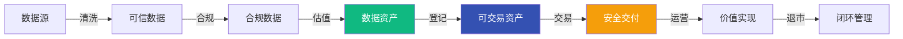

# 数据资产化系列

> **目标客户**：深圳数据产权交易所
> **核心价值**：提供从数据清洗到交易交付的完整数据资产化服务
> **服务特色**：可验收、可审计、可交付的专业服务体系

---

## 📖 系列概述

本系列文章展示我们在数据资产化领域的完整能力体系，从技术方法论到实施案例，为数据产权交易所提供专业的数据资产化服务。

### 核心能力

我们提供覆盖数据资产全生命周期的专业服务：



### 五大核心能力

<div style="display: grid; grid-template-columns: repeat(auto-fit, minmax(280px, 1fr)); gap: 20px; margin: 32px 0;">

<div style="padding: 20px; background: linear-gradient(135deg, rgba(16, 185, 129, 0.05) 0%, rgba(16, 185, 129, 0.02) 100%); border-radius: 12px; border-left: 4px solid #10b981;">
  <div style="font-size: 18px; font-weight: 600; color: #10b981; margin-bottom: 12px;">✓ 数据清洗与质量保障</div>
  <div style="color: var(--vp-c-text-2); line-height: 1.7; font-size: 14px;">
    六维质量模型 + 自动化清洗流水线<br/>
    质量提升 20%~60%（可量化、可审计）
  </div>
</div>

<div style="padding: 20px; background: linear-gradient(135deg, rgba(52, 81, 178, 0.05) 0%, rgba(52, 81, 178, 0.02) 100%); border-radius: 12px; border-left: 4px solid #3451b2;">
  <div style="font-size: 18px; font-weight: 600; color: #3451b2; margin-bottom: 12px;">✓ 数据合规与安全治理</div>
  <div style="color: var(--vp-c-text-2); line-height: 1.7; font-size: 14px;">
    分类分级 + 脱敏 + 授权链路<br/>
    满足《数据安全法》《个人信息保护法》
  </div>
</div>

<div style="padding: 20px; background: linear-gradient(135deg, rgba(245, 158, 11, 0.05) 0%, rgba(245, 158, 11, 0.02) 100%); border-radius: 12px; border-left: 4px solid #f59e0b;">
  <div style="font-size: 18px; font-weight: 600; color: #f59e0b; margin-bottom: 12px;">✓ 数据估值与定价模型</div>
  <div style="color: var(--vp-c-text-2); line-height: 1.7; font-size: 14px;">
    成本法 + 收益法 + 市场法<br/>
    科学量化数据价值，提供定价依据
  </div>
</div>

<div style="padding: 20px; background: linear-gradient(135deg, rgba(239, 68, 68, 0.05) 0%, rgba(239, 68, 68, 0.02) 100%); border-radius: 12px; border-left: 4px solid #ef4444;">
  <div style="font-size: 18px; font-weight: 600; color: #ef4444; margin-bottom: 12px;">✓ 数据权属与证据链</div>
  <div style="color: var(--vp-c-text-2); line-height: 1.7; font-size: 14px;">
    来源合法性 + 授权链路 + 血缘追溯<br/>
    满足交易所登记前置要求
  </div>
</div>

<div style="padding: 20px; background: linear-gradient(135deg, rgba(107, 114, 128, 0.05) 0%, rgba(107, 114, 128, 0.02) 100%); border-radius: 12px; border-left: 4px solid #6b7280;">
  <div style="font-size: 18px; font-weight: 600; color: #6b7280; margin-bottom: 12px;">✓ 数据交易与安全交付</div>
  <div style="color: var(--vp-c-text-2); line-height: 1.7; font-size: 14px;">
    多种交付形态 + 使用控制 + 审计追溯<br/>
    支持数据产品/API/服务/联合计算
  </div>
</div>

</div>

---

## 🧭 交易所视角导航

根据您的角色，选择最适合的阅读路径：

<div style="padding: 24px; background: linear-gradient(135deg, rgba(52, 81, 178, 0.03) 0%, rgba(52, 81, 178, 0.01) 100%); border-radius: 12px; margin: 32px 0;">

### 🏛️ 我是交易所评审人员

**关注点**：合规性、权属证明、可审计性、风险控制

**推荐阅读路径**：
1. [方法论篇](./data-assetization-methodology) - 了解完整流程与交付物体系
2. [数据权属与证据链](./data-ownership-and-provenance) - 评估权属证明能力
3. [数据合规与安全](./data-compliance-and-security) - 评估合规保障能力
4. [统一材料包模板集](./data-assetization-audit-pack) - 查看审计材料模板

**核心关注指标**：
- ✅ 权属证明完整性（来源合法性、授权链路、血缘追溯）
- ✅ 合规风险等级（分类分级、脱敏、跨境）
- ✅ 质量可验证性（六维指标、抽样策略、复现实验）
- ✅ 交付可控性（使用监控、审计日志、存证证明）

---

### 📊 我是数据供给方（卖方）

**关注点**：如何提升数据价值、如何满足登记要求、如何定价

**推荐阅读路径**：
1. [理念篇](./why-data-assetization) - 了解数据资产化的价值
2. [数据清洗与质量保障](./data-cleaning-and-quality) - 提升数据质量
3. [数据估值与定价](./data-valuation-and-pricing) - 了解定价依据
4. [实施指南](./data-assetization-implementation) - 了解实施路径

**您将获得**：
- ✅ 数据质量提升方案（20%~60%提升空间）
- ✅ 合规性评估与整改建议
- ✅ 科学的估值报告与定价建议
- ✅ 完整的登记材料准备清单

---

### 🔍 我是数据需求方（买方）

**关注点**：数据质量保障、合规性、交付方式、使用限制

**推荐阅读路径**：
1. [数据清洗与质量保障](./data-cleaning-and-quality) - 了解质量保障机制
2. [数据合规与安全](./data-compliance-and-security) - 了解合规保障
3. [数据交易与安全交付](./data-trading-and-delivery) - 了解交付方式
4. [案例集](./data-assetization-cases) - 查看真实案例

**您将了解**：
- ✅ 数据质量如何验证（六维指标 + SLO/SLA）
- ✅ 合规风险如何控制（分类分级 + 脱敏 + 授权）
- ✅ 数据如何安全交付（4种交付形态 + 使用控制）
- ✅ 使用如何审计追溯（调用日志 + 水印 + 存证）

</div>

---

## 📦 交付物总览表

我们为每个环节提供完整的交付物和审计材料：

| 服务环节 | 核心交付物 | 对应文章 | 验收标准 |
|---------|-----------|---------|---------|
| **数据评估** | 数据源评估报告<br/>质量评估报告<br/>合规风险评估报告 | [方法论篇](./data-assetization-methodology) | 评估覆盖率 100%<br/>风险识别准确率 > 95% |
| **数据清洗** | 清洗规则文档<br/>质量提升报告<br/>质量认证报告 | [数据清洗篇](./data-cleaning-and-quality) | 六维质量提升 20%~60%<br/>质量 SLO 达标率 > 99% |
| **合规治理** | 分类分级报告<br/>脱敏方案与报告<br/>合规认证材料 | [数据合规篇](./data-compliance-and-security) | 合规风险降至可控级别<br/>满足监管要求 |
| **权属证明** | 权属证明报告<br/>授权链路图<br/>血缘追溯报告 | [数据权属篇](./data-ownership-and-provenance) | 权属链路完整<br/>证据可追溯 |
| **数据估值** | 估值报告<br/>定价建议<br/>价值因子分析 | [数据估值篇](./data-valuation-and-pricing) | 估值依据充分<br/>定价合理可解释 |
| **资产登记** | 元数据文档<br/>登记材料包<br/>资产入库证明 | [方法论篇](./data-assetization-methodology) | 材料完整性 100%<br/>符合交易所要求 |
| **交易交付** | 交付方案<br/>使用审计报告<br/>存证证明 | [数据交易篇](./data-trading-and-delivery) | 交付可控<br/>使用可审计 |
| **运营退市** | 价值复评报告<br/>退市/销毁证明 | [方法论篇](./data-assetization-methodology) | 生命周期闭环<br/>证明材料完整 |

**完整模板下载**：[统一材料包模板集](./data-assetization-audit-pack)

---

## 📚 系列文章

### 第一层：理念与方法论（P0）

#### 1. [为什么需要专业的数据资产化服务](./why-data-assetization)（理念篇）

**状态**：📝 规划中 | **难度**：⭐⭐⭐ 中级 | **阅读时间**：20分钟

**核心内容**：
- 数据交易的三大痛点：质量不��信、合规不透明、价值难量化
- 为什么需要专业的数据资产化服务
- 我们的差异化能力：技术+业务双轮驱动
- 真实效果数据与案例

**适合**：决策层、业务负责人

---

#### 2. [数据资产化方法论：全流程架构设计](./data-assetization-methodology)（方法论篇）

**状态**：📝 规划中 | **难度**：⭐⭐⭐⭐ 高级 | **阅读时间**：25分钟

**核心内容**：
- 数据资产化 7 阶段完整流程
- 每个阶段的输入/输出/验收/风险
- 技术架构与工具链
- 交付物模板体系

**适合**：技术负责人、项目经理

---

### 第二层：核心技术能力（P1）

#### 3. [数据清洗与质量保障：构建可信数据资产](./data-cleaning-and-quality)

**状态**：📝 规划中 | **难度**：⭐⭐⭐ 中级 | **阅读时间**：20分钟

**核心内容**：
- 六维质量模型（完整性、准确性、一致性、及时性、有效性、唯一性）
- 自动化清洗流水线
- 质量可审计设计
- 质量 SLO/SLA 承诺

**适合**：数据工程师、质量负责人

---

#### 4. [数据合规与安全：满足监管要求的数据治理](./data-compliance-and-security)

**状态**：📝 规划中 | **难度**：⭐⭐⭐⭐ 高级 | **阅读时间**：20分钟

**核心内容**：
- 法律法规框架（数据安全法、个人信息保护法）
- 分类分级与脱敏技术
- 交易所常见红线清单
- 合规认证与审计

**适合**：合规负责人、法务团队

---

#### 5. [数据估值与定价：科学量化数据价值](./data-valuation-and-pricing)

**状态**：📝 规划中 | **难度**：⭐⭐⭐⭐ 高级 | **阅读时间**：20分钟

**核心内容**：
- 三种估值方法（成本法、收益法、市场法）
- 估值因子体系（可配置权重）
- 定价策略与模型
- 估值报告模板

**适合**：估值分析师、业务负责人

---

#### 6. [数据权属与证据链：从来源合法到加工可追溯](./data-ownership-and-provenance)

**状态**：📝 规划中 | **难度**：⭐⭐⭐⭐ 高级 | **阅读时间**：20分钟

**核心内容**：
- 数据来源合法性证明
- 权属类型与归属界定
- 血缘追溯与证据链
- 权属争议处理机制

**适合**：法务团队、交易所评审人员

**重要性**：⭐⭐⭐⭐⭐ 交易所登记前置门槛

---

### 第三层：交易与实施（P2）

#### 7. [数据交易与安全交付：可控的数据流通](./data-trading-and-delivery)

**状态**：📝 规划中 | **难度**：⭐⭐⭐ 中级 | **阅读时间**：20分钟

**核心内容**：
- 四种交付形态（数据产品/API/服务/联合计算）
- 安全交付技术（沙箱、隐私计算、区块链存证）
- 使用控制与审计
- 计费模式

**适合**：技术负责人、产品经理

---

#### 8. [数据资产化实施指南：从评估到上线](./data-assetization-implementation)

**状态**：📝 规划中 | **难度**：⭐⭐⭐ 中级 | **阅读时间**：25分钟

**核心内容**：
- 实施路线图（WBS）
- 分阶段交付计划
- 风险清单与应对
- 交易所登记准备清单

**适合**：项目经理、实施团队

---

### 第四层：案例与背书（P3）

#### 9. [数据资产化案例集：真实项目经验](./data-assetization-cases)

**状态**：📝 规划中 | **难度**：⭐⭐ 初级 | **阅读时间**：30分钟

**核心内容**：
- 工业设备健康数据资产化案例
- 用户行为数据资产化案例
- 地理位置数据资产化案例
- 每个案例附材料包摘要

**适合**：所有角色

---

### 附录：横向能力组件

#### 10. [统一材料包模板集](./data-assetization-audit-pack)

**状态**：📝 规划中 | **类型**：模板集 | **阅读时间**：参考查询

**包含模板**：
1. 元数据模板
2. 血缘与加工记录模板
3. 质量报告模板
4. 合规报告模板
5. 权属与授权链模板
6. 估值报告模板
7. 交付与使用审计模板
8. 退市/销毁证明模板

**适合**：所有角色（作为工作模板使用）

---

## 🎯 我们的差异化优势

### 技术 + 业务双轮驱动

<div style="display: grid; grid-template-columns: 1fr 1fr; gap: 24px; margin: 32px 0;">

<div style="padding: 24px; background: linear-gradient(135deg, rgba(16, 185, 129, 0.05) 0%, rgba(16, 185, 129, 0.02) 100%); border-radius: 12px; border: 1px solid rgba(16, 185, 129, 0.2);">
  <div style="font-size: 18px; font-weight: 600; color: #10b981; margin-bottom: 16px;">✓ 技术能力</div>
  <div style="color: var(--vp-c-text-2); line-height: 1.8;">
    • 2年+ 数据治理经验<br/>
    • 20+ 项目实践<br/>
    • 工业级数据处理能力<br/>
    • 完整的技术工具链
  </div>
</div>

<div style="padding: 24px; background: linear-gradient(135deg, rgba(52, 81, 178, 0.05) 0%, rgba(52, 81, 178, 0.02) 100%); border-radius: 12px; border: 1px solid rgba(52, 81, 178, 0.2);">
  <div style="font-size: 18px; font-weight: 600; color: #3451b2; margin-bottom: 16px;">✓ 业务理解</div>
  <div style="color: var(--vp-c-text-2); line-height: 1.8;">
    • 深度理解数据交易业务<br/>
    • 熟悉交易所登记流程<br/>
    • 了解监管合规要求<br/>
    • 具备估值定价能力
  </div>
</div>

</div>

### 全流程闭环能力

我们不是单点工具提供商，而是提供从数据清洗到交易交付的完整链条服务：

```
评估 → 清洗 → 合规 → 估值 → 登记 → 交易 → 运营 → 退市
  ↑                                                    ↓
  └────────────────── 闭环管理 ──────────────────────┘
```

### 可验收、可审计、可交付

- ✅ **可验收**：每个环节有明确的交付物和验收标准
- ✅ **可审计**：完整的审计材料和证据链
- ✅ **可交付**：标准化的模板和工具链

---

## 🛠️ 技术栈

### 核心技术组件

| 类别 | 技术 | 用途 |
|------|------|------|
| **数据处理** | Apache Spark | 大规模数据清洗 |
| **质量验证** | Great Expectations | 数据质量验证 |
| **流程调度** | Apache Airflow | 清洗流程调度 |
| **权限管理** | Apache Ranger | 数据权限管理 |
| **密钥管理** | HashiCorp Vault | 敏感信息管理 |
| **隐私计算** | 联邦学习平台 | 数据不出域计算 |
| **区块链** | Hyperledger Fabric | 存证与追溯 |
| **元数据** | PostgreSQL | 元数据管理 |

---

## 📊 服务模式

### 三种交付模式

<div style="padding: 24px; background: linear-gradient(135deg, rgba(107, 114, 128, 0.03) 0%, rgba(107, 114, 128, 0.01) 100%); border-radius: 12px; margin: 32px 0;">

#### 1. 咨询服务模式

**适用场景**：需要专业评估和方案设计

**交付内容**：
- 数据资产评估报告
- 数据资产化方案设计
- 合规风险评估与整改建议
- 估值报告与定价建议

**周期**：2-4 周

---

#### 2. 项目实施模式

**适用场景**：需要完整的数据资产化实施

**交付内容**：
- 数据清洗与质量提升
- 合规治理与认证
- 权属证明与血缘追溯
- 资产登记材料准备
- 交易交付方案实施

**周期**：8-16 周

---

#### 3. 平台服务模式

**适用场景**：需要持续的数据资产化能力

**交付内容**：
- 数据资产化平台部署
- 工具链集成与配置
- 运营支持与培训
- 持续优化与升级

**周期**：长期合作

</div>

---

## 💼 成功案例

### 已完成项目

- ✅ **工业设备健康数据资产化**：数据质量提升 60%，完成登记准备
- ✅ **煤矿安全日志数据治理**：建立完整的数据治理体系
- ✅ **多源异构数据整合**：实现跨系统数据血缘追溯

**详细案例**：查看 [案例集](./data-assetization-cases)

---

## 📞 联系我们

### 商务合作

如需深入交流或 POC 演示，欢迎联系：

- 📧 **Email**: contact@ljwx.com
- 📱 **电话**: 138-xxxx-xxxx
- 🏢 **地址**: 深圳市南山区

### 技术交流

- 💬 **GitHub**: [ljwx-docs](https://github.com/BrunoGao/ljwx-docs)
- 📝 **技术博客**: [LJWX Docs](https://ljwx-docs.com)

---

## 📝 文档状态

**系列状态**：🚀 规划完成，开始创建
**已发布**：0/10 篇
**难度等级**：⭐⭐⭐ 中级到高级
**适合人群**：数据产权交易所、数据供给方、数据需求方、技术决策者

**最后更新**：2026-01-24

---

**下一步**：开始阅读 [理念篇：为什么需要专业的数据资产化服务](./why-data-assetization)
