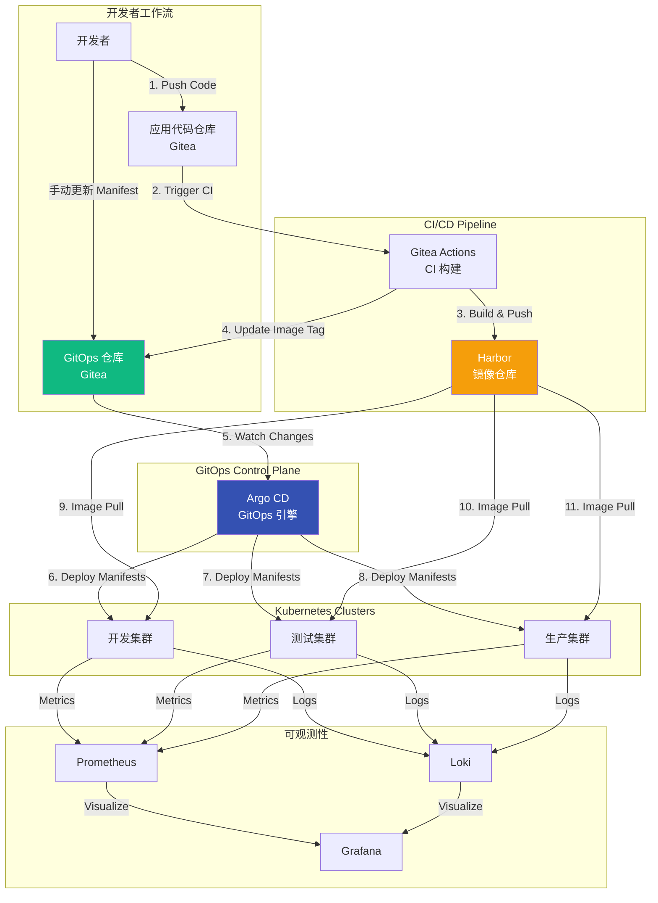
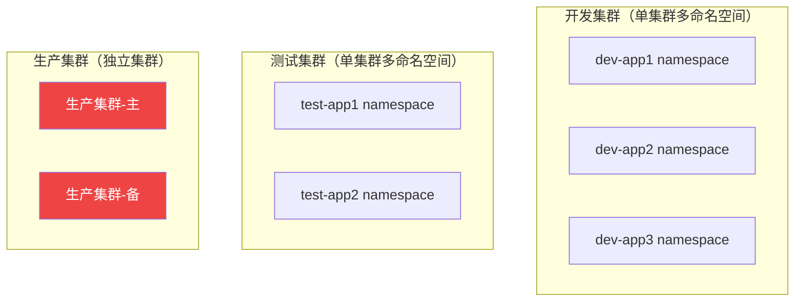
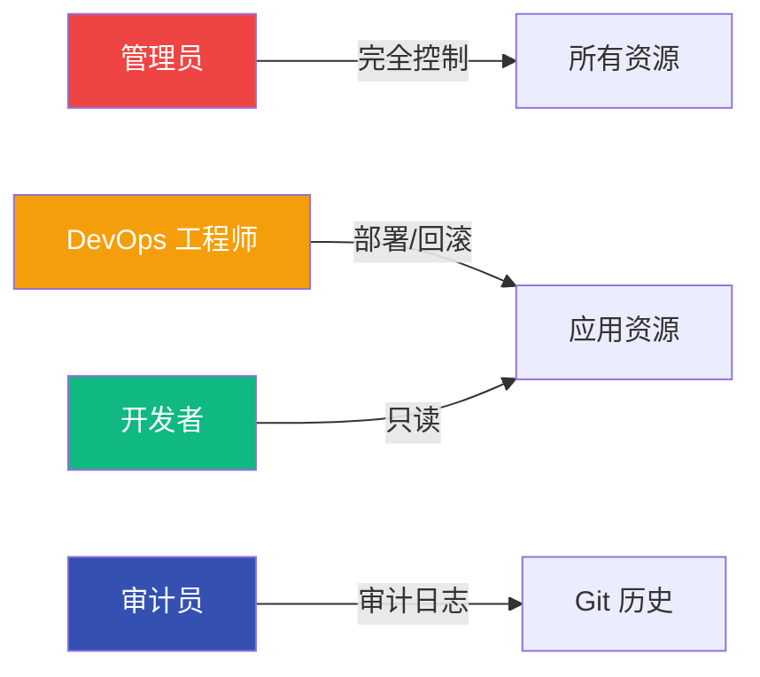
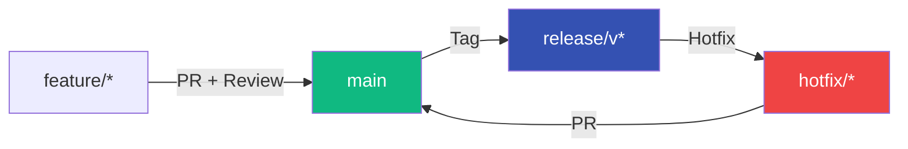
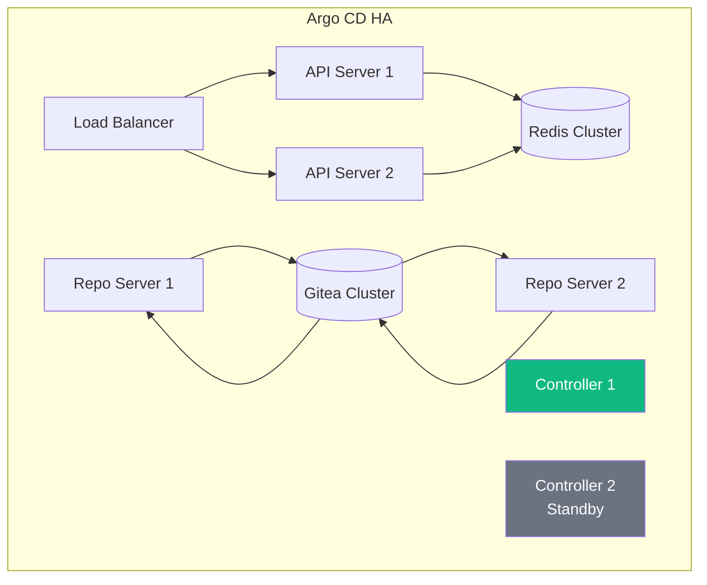
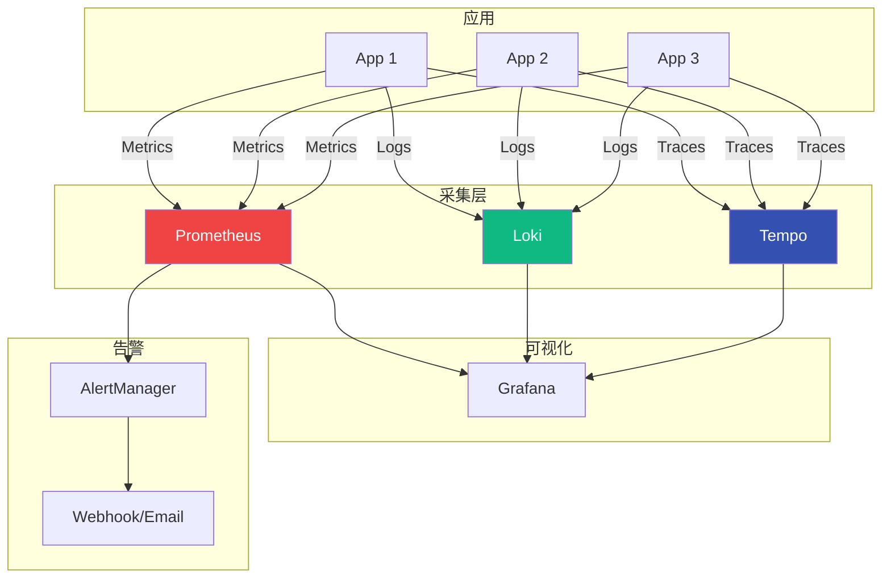
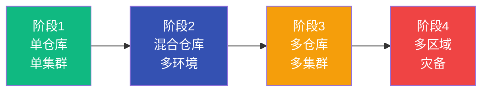
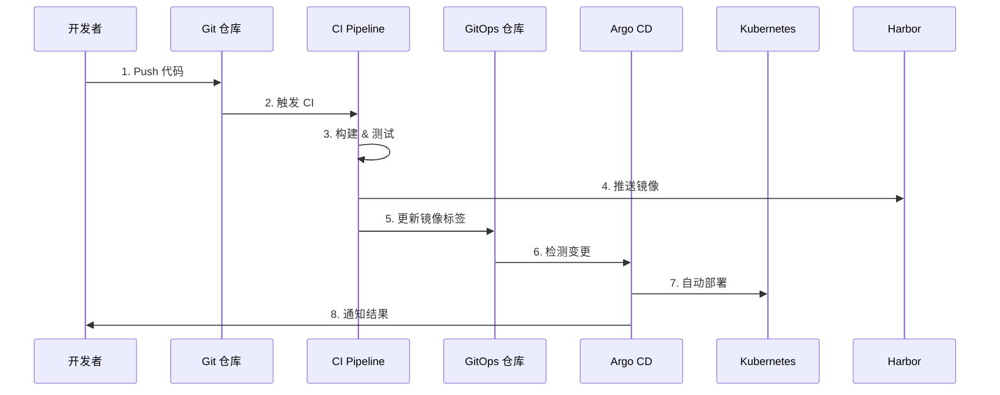

# GitOps 架构设计：从原则到落地

> 基于 Gitea / Harbor / Argo CD 的架构决策与实践（架构篇）

## 📌 写在前面

<div style="padding: 24px; border-left: 3px solid #6b7280; background: linear-gradient(135deg, rgba(107, 114, 128, 0.03) 0%, rgba(107, 114, 128, 0.01) 100%); border-radius: 8px; margin: 32px 0;">

### 方法论声明（必读）

这是一篇 **架构设计方法论** 文章，而不是配置手册或部署教程。

它不讲具体的 YAML 怎么写，而是总结我们在 **私有化项目** 中设计 GitOps 架构时，形成的一套「**可扩展、可演进、可落地**」的架构决策框架。

**适用场景**：
- 需要设计多环境、多集群的 GitOps 架构
- 面临技术选型决策（单仓库 vs 多仓库、Kustomize vs Helm）
- 需要考虑权限、安全、高可用等企业级需求

**不适用场景**：
- 只想快速上手 GitOps 工具
- 单环境、单应用的简单场景
- 寻找具体配置代码示例

</div>

---

## 🎯 你将从本文获得

<div style="max-width: 800px; margin: 32px auto;">

<div style="position: relative; padding-left: 40px;">

<!-- Why -->
<div style="position: relative; margin-bottom: 32px;">
  <div style="position: absolute; left: 0; top: 8px; width: 32px; height: 32px; background: #3451b2; border-radius: 50%; display: flex; align-items: center; justify-content: center; color: white; font-weight: 600; font-size: 14px;">1</div>
  <div style="padding: 20px 24px; border-left: 3px solid #3451b2; background: linear-gradient(135deg, rgba(52, 81, 178, 0.04) 0%, rgba(52, 81, 178, 0.01) 100%); border-radius: 0 8px 8px 0; margin-left: 16px;">
    <div style="font-size: 20px; font-weight: 600; color: #3451b2; margin-bottom: 8px;">架构原则（Why）</div>
    <div style="color: var(--vp-c-text-2); line-height: 1.7;">GitOps 四大核心原则如何在架构中体现</div>
  </div>
</div>

<!-- Arrow -->
<div style="margin-left: 16px; margin-bottom: 16px; color: #9ca3af; font-size: 20px;">↓</div>

<!-- What -->
<div style="position: relative; margin-bottom: 32px;">
  <div style="position: absolute; left: 0; top: 8px; width: 32px; height: 32px; background: #10b981; border-radius: 50%; display: flex; align-items: center; justify-content: center; color: white; font-weight: 600; font-size: 14px;">2</div>
  <div style="padding: 20px 24px; border-left: 3px solid #10b981; background: linear-gradient(135deg, rgba(16, 185, 129, 0.04) 0%, rgba(16, 185, 129, 0.01) 100%); border-radius: 0 8px 8px 0; margin-left: 16px;">
    <div style="font-size: 20px; font-weight: 600; color: #10b981; margin-bottom: 8px;">技术选型（What）</div>
    <div style="color: var(--vp-c-text-2); line-height: 1.7;">为什么选择 Gitea/Harbor/Argo CD 这套技术栈</div>
  </div>
</div>

<!-- Arrow -->
<div style="margin-left: 16px; margin-bottom: 16px; color: #9ca3af; font-size: 20px;">↓</div>

<!-- How -->
<div style="position: relative; margin-bottom: 32px;">
  <div style="position: absolute; left: 0; top: 8px; width: 32px; height: 32px; background: #f59e0b; border-radius: 50%; display: flex; align-items: center; justify-content: center; color: white; font-weight: 600; font-size: 14px;">3</div>
  <div style="padding: 20px 24px; border-left: 3px solid #f59e0b; background: linear-gradient(135deg, rgba(245, 158, 11, 0.04) 0%, rgba(245, 158, 11, 0.01) 100%); border-radius: 0 8px 8px 0; margin-left: 16px;">
    <div style="font-size: 20px; font-weight: 600; color: #f59e0b; margin-bottom: 8px;">架构设计（How）</div>
    <div style="color: var(--vp-c-text-2); line-height: 1.7;">仓库结构、环境隔离、权限安全的完整设计</div>
  </div>
</div>

<!-- Arrow -->
<div style="margin-left: 16px; margin-bottom: 16px; color: #9ca3af; font-size: 20px;">↓</div>

<!-- Lessons -->
<div style="position: relative;">
  <div style="position: absolute; left: 0; top: 8px; width: 32px; height: 32px; background: #ef4444; border-radius: 50%; display: flex; align-items: center; justify-content: center; color: white; font-weight: 600; font-size: 14px;">4</div>
  <div style="padding: 20px 24px; border-left: 3px solid #ef4444; background: linear-gradient(135deg, rgba(239, 68, 68, 0.04) 0%, rgba(239, 68, 68, 0.01) 100%); border-radius: 0 8px 8px 0; margin-left: 16px;">
    <div style="font-size: 20px; font-weight: 600; color: #ef4444; margin-bottom: 8px;">架构演进（Lessons）</div>
    <div style="color: var(--vp-c-text-2); line-height: 1.7;">架构决策中的坑和演进路径</div>
  </div>
</div>

</div>

</div>

---

## 🎯 这篇文章适合谁？

<div style="display: grid; grid-template-columns: 1fr 1fr; gap: 24px; margin: 32px 0; max-width: 900px;">

<div style="padding: 24px; background: linear-gradient(135deg, rgba(16, 185, 129, 0.05) 0%, rgba(16, 185, 129, 0.02) 100%); border-radius: 12px; border: 1px solid rgba(16, 185, 129, 0.2);">
  <div style="font-size: 18px; font-weight: 600; color: #10b981; margin-bottom: 16px;">✓ 适合阅读</div>
  <div style="color: var(--vp-c-text-2); line-height: 1.8;">
    • 正在设计或重构 GitOps 架构<br/>
    • 需要选择合适的仓库结构和工具<br/>
    • 管理多环境、多集群的复杂场景<br/>
    • 关注企业级安全、权限、高可用
  </div>
</div>

<div style="padding: 24px; background: linear-gradient(135deg, rgba(239, 68, 68, 0.05) 0%, rgba(239, 68, 68, 0.02) 100%); border-radius: 12px; border: 1px solid rgba(239, 68, 68, 0.2);">
  <div style="font-size: 18px; font-weight: 600; color: #ef4444; margin-bottom: 16px;">✗ 不适合阅读</div>
  <div style="color: var(--vp-c-text-2); line-height: 1.8;">
    • 只想快速上手 GitOps 工具<br/>
    • 单环境、单应用的简单场景<br/>
    • 寻找具体的 YAML 配置示例<br/>
    • 还没理解 GitOps 核心理念
  </div>
</div>

</div>

---

## 🧭 阅读导航｜根据你的情况选择路径

<div style="padding: 24px; background: linear-gradient(135deg, rgba(52, 81, 178, 0.03) 0%, rgba(52, 81, 178, 0.01) 100%); border-radius: 12px; margin: 32px 0;">

<div style="margin-bottom: 20px;">
  <div style="font-weight: 600; color: var(--vp-c-text-1); margin-bottom: 8px;">① 正在评估技术选型？</div>
  <div style="color: var(--vp-c-text-2); padding-left: 20px;">
    → 建议阅读：<a href="#💡-技术选型：为什么选择这套技术栈">技术选型</a> & <a href="#📊-技术选型对比">选型对比</a>
  </div>
</div>

<div style="margin-bottom: 20px;">
  <div style="font-weight: 600; color: var(--vp-c-text-1); margin-bottom: 8px;">② 需要设计仓库结构？</div>
  <div style="color: var(--vp-c-text-2); padding-left: 20px;">
    → 直接跳到：<a href="#🏗️-仓库结构设计">仓库结构设计</a> & <a href="#🔀-单仓库-vs-多仓库">单仓库 vs 多仓库</a>
  </div>
</div>

<div style="margin-bottom: 20px;">
  <div style="font-weight: 600; color: var(--vp-c-text-1); margin-bottom: 8px;">③ 关注安全和权限？</div>
  <div style="color: var(--vp-c-text-2); padding-left: 20px;">
    → 查看：<a href="#🔒-权限与安全架构">权限与安全架构</a> & <a href="#🛡️-安全最佳实践">安全最佳实践</a>
  </div>
</div>

<div>
  <div style="font-weight: 600; color: var(--vp-c-text-1); margin-bottom: 8px;">④ 想了解完整架构？</div>
  <div style="color: var(--vp-c-text-2); padding-left: 20px;">
    → 建议：<a href="#🏗️-完整架构概览">完整架构概览</a>（从头阅读）
  </div>
</div>

</div>

---

## 🏗️ 完整架构概览

在深入细节之前，先看我们的 GitOps 完整架构图：



### 架构分层

我们的 GitOps 架构分为 **5 个层次**：

1. **代码层** - 应用代码 + GitOps 配置仓库（Gitea）
2. **构建层** - CI/CD 流水线（Gitea Actions）+ 镜像仓库（Harbor）
3. **控制层** - GitOps 引擎（Argo CD）
4. **运行层** - Kubernetes 集群（多环境）
5. **观测层** - 监控、日志、追踪（Prometheus/Loki/Grafana）

每一层都有明确的职责边界和 SLA 要求。

**关键说明**：
- **Argo CD 职责**：将 GitOps 仓库中的声明式配置（Manifests）应用到集群，不直接参与镜像拉取
- **镜像拉取**：由 Kubernetes 集群节点的 kubelet/container runtime 从 Harbor 拉取镜像
- **Harbor 角色**：镜像存储、扫描、签名验证的供应链组件，而非 GitOps 控制面的一部分

---

## ✅ 架构决策总览（本篇核心结论）

在深入技术细节前，先看我们的**关键架构决策**：

### 核心决策摘要

| 决策维度 | 我们的选择 | 关键理由 |
|---------|-----------|---------|
| **工具栈** | Gitea + Harbor + Argo CD | 私有化友好、资源可控、成本低、企业级能力完整 |
| **仓库策略** | 混合模式 | 基础设施独立仓库 + 应用按业务线拆分（每仓库<10应用）|
| **环境隔离** | 分层策略 | Dev/Test 命名空间隔离；Prod 独立集群 + 主备 |
| **配置管理** | Kustomize + Helm | 自研应用用 Kustomize（透明）；三方应用用 Helm（复用）|
| **变更控制** | Git 唯一来源 | 禁止 kubectl apply；所有变更通过 PR + 审批 |
| **安全策略** | 四层防护 | RBAC + Secret 管理（ESO）+ 镜像准入 + 网络隔离 |
| **灾备策略** | 明确 RTO | Git/Argo 配置备份 + 定期演练（RTO < 2h）|
| **可观测性** | 核心指标 | 同步/健康/漂移/部署频率作为关键度量 |

### 为什么这些决策重要？

::: tip 决策逻辑
这套架构决策基于我们在 **5个项目、20+应用、8+集群** 上的实践经验，解决了三大核心问题：

1. **私有化约束** - 资源受限、内网环境、无法使用云服务
2. **合规要求** - 完整审计、变更可追溯、配置可回滚
3. **规模化挑战** - 多环境、多集群、多团队协作

这不是"最佳实践"，而是"在我们约束条件下的最优解"。
:::

### 决策适用边界

**适用场景**：
- ✅ 15-50人团队，10-50个应用
- ✅ 私有化部署，资源中等（非边缘计算场景）
- ✅ 多环境（至少 Dev/Test/Prod 三环境）
- ✅ 有合规审计要求

**不适用场景**：
- ❌ 单应用、单环境（过度设计）
- ❌ 极端资源受限（边缘计算、IoT）
- ❌ 云原生 SaaS（可直接用云服务）
- ❌ 超大规模（>100应用需要更复杂治理）

---

## 🎯 GitOps 四大核心原则的架构体现

在设计架构前，我们先明确 GitOps 的四大核心原则，以及它们如何在架构中体现：

### 原则 1：声明式配置（Declarative）

**定义**：系统期望状态通过声明式配置文件描述

**架构体现**：
- 所有 Kubernetes 资源使用 YAML 声明式定义
- 使用 Kustomize 或 Helm 管理配置
- 配置存储在 Git 仓库，而不是命令行或数据库

**反例**：
- ❌ 使用 `kubectl edit` 直接修改配置
- ❌ 使用脚本生成配置后直接 apply
- ❌ 配置存储在 ConfigMap 或数据库

### 原则 2：Git 作为单一事实来源（Git as Single Source of Truth）

**定义**：Git 仓库是系统状态的唯一权威来源

**架构体现**：
- 所有变更必须通过 Git 提交
- Argo CD 只从 Git 拉取配置，不接受手动变更
- 审计追踪完全依赖 Git 历史

**反例**：
- ❌ 允许直接 kubectl apply
- ❌ 配置存在多个来源（Git + ConfigMap）
- ❌ Argo CD 和手动部署混用

### 原则 3：自动化部署（Automated Deployment）

**定义**：Git 提交自动触发部署，无需人工干预

**架构体现**：
- Argo CD 自动检测 Git 变更（轮询或 Webhook）
- CI/CD 自动更新镜像标签到 GitOps 仓库
- 部署流程完全自动化，零人工介入

**反例**：
- ❌ 需要手动点击 Argo CD Sync 按钮
- ❌ CI 构建后需要手动更新 GitOps 仓库
- ❌ 需要 SSH 到服务器执行脚本

### 原则 4：持续对账（Continuous Reconciliation）

**定义**：系统持续比对实际状态与期望状态，自动修复偏差

**架构体现**：
- Argo CD 每 3 分钟对账一次（可配置）
- 检测到配置漂移自动告警或自动修复
- 支持 Self-Healing 自动回滚异常变更

**反例**：
- ❌ 只在部署时检查状态
- ❌ 允许手动修改后不自动恢复
- ❌ 配置漂移后需要人工介入

---

### 原则到架构设计的映射

下表总结了 GitOps 四大原则如何落地到我们的架构设计中：

| GitOps 原则 | 架构设计决策 | 实现机制/组件 | 常见反例（需避免）|
|------------|------------|--------------|-----------------|
| **Declarative<br/>声明式** | • 所有资源用 YAML 声明<br/>• Kustomize/Helm 管理配置<br/>• 禁止命令式操作 | • Kustomize overlays<br/>• Helm charts<br/>• Kubernetes API | ❌ kubectl edit 改配置<br/>❌ 脚本生成后直接 apply<br/>❌ 配置存 ConfigMap/DB |
| **SSoT<br/>Git 唯一来源** | • Git 是唯一权威来源<br/>• 所有变更通过 Git<br/>• 完整审计追踪 | • Gitea 仓库<br/>• PR + 审批流程<br/>• Git 历史 = 审计日志 | ❌ Git + kubectl 混用<br/>❌ 配置多个来源<br/>❌ 手动修改生产环境 |
| **Automated<br/>自动化** | • Git 提交自动触发部署<br/>• CI 自动更新镜像标签<br/>• 零人工点击 | • Argo CD auto-sync<br/>• Webhook 触发<br/>• CI 自动更新 GitOps 仓库 | ❌ 手动点 Sync 按钮<br/>❌ CI 后人工更新仓库<br/>❌ SSH 执行部署脚本 |
| **Reconcile<br/>持续对账** | • 每 3 分钟对账一次<br/>• 自动检测配置漂移<br/>• Self-Healing 修复 | • Argo CD reconciliation loop<br/>• Drift detection<br/>• Auto-healing policy | ❌ 只在部署时检查<br/>❌ 漂移后不自动修复<br/>❌ 依赖人工介入 |

**关键洞察**：
- **原则 ≠ 教条**：不同场景需要不同权衡（如紧急变更流程）
- **技术只是手段**：核心是建立"可审计、可回滚、可规模化"的治理模型
- **渐进式落地**：先保证 SSoT，再逐步完善自动化和对账

---

## 💡 技术选型：为什么选择这套技术栈

### 选型框架

在具体选型前，先明确我们的**输入约束**和**输出标准**：

#### 输入约束（我们的限制条件）

| 约束类型 | 具体要求 |
|---------|---------|
| **部署环境** | 私有化、内网隔离、无法访问公网 |
| **资源限制** | 中等规模集群（非边缘计算），成本敏感 |
| **合规要求** | 完整审计日志、变更可追溯、数据不出境 |
| **团队能力** | 15人团队，DevOps 能力中等，学习成本敏感 |
| **技术栈** | Kubernetes 1.28+、已有 PostgreSQL/Redis |
| **可选项** | 开源优先、避免厂商锁定、支持国产化适配 |

#### 输出标准（选型必须满足的目标）

| 标准类型 | 目标值 |
|---------|--------|
| **可用性（SLA）** | GitOps 控制面 > 99.9%（月度）|
| **审计完整性** | 100% 变更可追溯到 Git commit |
| **权限粒度** | 支持团队/角色/环境三维隔离 |
| **灾备能力** | RTO < 2h，RPO < 15min |
| **可观测性** | 核心指标（同步/健康/漂移）完整暴露 |
| **学习成本** | 新人上手 < 1 周，有 UI 降低门槛 |

### 我们的选择：Gitea + Harbor + Argo CD

基于上述约束和标准，我们选择了这套技术栈。

---

### 为什么选择 Gitea？

| 需求 | 传统方案 | Gitea | 说明 |
|------|---------|-------|------|
| 私有化部署 | GitLab（资源占用高）| ✅ 轻量级（低量级）| 单节点即可运行，典型<200MB（依赖DB/对象存储）|
| 多租户隔离 | GitHub Enterprise | ✅ 原生支持组织/团队 | 满足企业需求 |
| CI/CD 集成 | Jenkins + GitLab | ✅ Gitea Actions（内置）| 无需额外组件 |
| 审计日志 | 需要额外配置 | ✅ 完整 Git 历史 + Webhook | 满足合规要求 |
| 成本 | 高（License 费用）| ✅ 开源免费 | 降低 80% 成本 |

**关键决策**：
- 资源受限环境（边缘计算、私有化）选择 Gitea
- 已有 GitLab 环境可复用，无需迁移
- GitHub Enterprise 适合云端 SaaS 场景

### 为什么选择 Harbor？

| 需求 | 传统方案 | Harbor | 说明 |
|------|---------|--------|------|
| 镜像扫描 | Trivy（独立部署）| ✅ 内置 Trivy | 一体化方案 |
| 镜像签名 | Notary（复杂）| ✅ 内置 Cosign/Notary | 满足供应链安全 |
| 多租户 | Docker Registry（无）| ✅ 项目/用户隔离 | 企业级需求 |
| RBAC | 手动实现 | ✅ 细粒度权限 | 开发/运维分离 |
| 镜像复制 | 脚本实现 | ✅ 跨 Registry 复制 | 灾备需求 |

**关键决策**：
- Docker Registry 适合简单场景
- Harbor 适合企业级私有化（扫描、签名、RBAC）
- 云端可考虑 AWS ECR / Azure ACR

### 为什么选择 Argo CD？

| 需求 | 传统方案 | Argo CD | 说明 |
|------|---------|---------|------|
| GitOps 支持 | Flux CD | ✅ 功能对等 | 社区更活跃 |
| 多集群管理 | 每集群部署一套 | ✅ 单控制面管理多集群 | 降低运维成本 |
| Web UI | Flux（无）| ✅ 丰富的 Web UI | 降低上手门槛 |
| RBAC | 手动配置 | ✅ 原生 SSO/RBAC | 集成 LDAP/OIDC |
| 回滚 | 手动 Git revert | ✅ 一键回滚 | 提升效率 |

**关键决策**：
- Flux CD 适合纯代码派（GitOps Toolkit）
- Argo CD 适合需要 UI 和多集群管理
- 两者都符合 GitOps 标准

---

## 📊 技术选型对比

### Argo CD vs Flux CD

| 维度 | Argo CD | Flux CD |
|------|---------|---------|
| **架构** | 单体应用（API Server + Repo Server + Controller）| 微服务架构（Source/Kustomize/Helm Controller）|
| **UI** | ✅ 丰富的 Web UI | ❌ 无（依赖 Weave GitOps Enterprise）|
| **多集群** | ✅ 单控制面管理多集群 | ⚠️ 每集群部署一套 |
| **RBAC** | ✅ 原生 SSO/RBAC | ⚠️ 依赖 Kubernetes RBAC |
| **社区** | ✅ CNCF 毕业项目（2022）| ✅ CNCF 毕业项目（2022）|
| **学习曲线** | ⚠️ 中等（UI 降低门槛）| 🔴 陡峭（纯代码）|
| **资源占用** | ⚠️ 中等量级 | ✅ 低量级 |

**资源占用说明**：
- **Argo CD**：基础部署 ~300-500MB，启用 HA/Redis/Dex/多 Repo Server 后会显著上升至 1GB+
- **Flux CD**：基础部署 ~100-200MB，多 Controller 模式下也会增加

**我们的选择**：Argo CD
- 团队需要 UI 降低上手门槛
- 多集群管理需求（8+ 集群）
- 集成 LDAP 统一认证

### Kustomize vs Helm

| 维度 | Kustomize | Helm |
|------|-----------|------|
| **学习成本** | ✅ 低（纯 YAML）| ⚠️ 中等（模板语法）|
| **配置复用** | ⚠️ Overlay 方式 | ✅ Chart 仓库 |
| **版本管理** | ❌ 无内置版本 | ✅ Chart Version |
| **回滚** | ⚠️ 依赖 Git | ✅ Helm Rollback |
| **社区** | ✅ Kubernetes 原生 | ✅ CNCF 毕业项目 |
| **复杂度** | ✅ 简单透明 | ⚠️ 模板调试困难 |

**我们的选择**：Kustomize + Helm 混合
- **自研应用**：使用 Kustomize（简单透明）
- **第三方应用**：使用 Helm（复用社区 Chart）
- Argo CD 同时支持两者

---

## 🏗️ 仓库结构设计

### 核心问题：单仓库 vs 多仓库？

我们实践了三种模式，最终选择 **混合模式**：

#### 模式 1：单仓库（Monorepo）

```
gitops-repo/
├── apps/
│   ├── app1/
│   │   ├── base/
│   │   └── overlays/
│   │       ├── dev/
│   │       ├── test/
│   │       └── prod/
│   └── app2/
│       ├── base/
│       └── overlays/
└── infrastructure/
    ├── monitoring/
    └── logging/
```

**优点**：
- ✅ 统一版本管理
- ✅ 跨应用配置共享
- ✅ 审计追踪简单

**缺点**：
- ❌ 权限粒度粗（整个仓库）
- ❌ 仓库体积膨胀
- ❌ CI/CD 慢（全量检查）

**适用场景**：
- 单团队、少量应用（< 10 个）
- 应用间依赖紧密

#### 模式 2：多仓库（Polyrepo）

```
gitops-app1/
├── base/
└── overlays/

gitops-app2/
├── base/
└── overlays/

gitops-infrastructure/
├── monitoring/
└── logging/
```

**优点**：
- ✅ 权限隔离清晰
- ✅ 仓库体积小
- ✅ CI/CD 快（按需触发）

**缺点**：
- ❌ 跨应用配置难共享
- ❌ 版本管理复杂
- ❌ 审计追踪分散

**适用场景**：
- 多团队、大量应用（> 20 个）
- 应用间独立性强

#### 模式 3：混合模式（我们的选择）

```
# 基础设施仓库（运维团队）
gitops-infrastructure/
├── monitoring/
├── logging/
└── ingress/

# 应用仓库（开发团队，按业务线）
gitops-业务线A/
├── app1/
└── app2/

gitops-业务线B/
├── app3/
└── app4/
```

**设计原则**：
1. **基础设施独立仓库** - 运维团队管理
2. **应用按业务线分仓库** - 开发团队管理
3. **每个仓库 < 10 个应用** - 避免体积膨胀

**效果**：
- ✅ 权限隔离清晰（业务线 / 运维分离）
- ✅ 审计追踪适中（按业务线）
- ✅ CI/CD 效率高（按业务线触发）

---

### Kustomize 目录结构

我们的标准 Kustomize 目录结构：

```
myapp/
├── base/                       # 基础配置（环境无关）
│   ├── deployment.yaml
│   ├── service.yaml
│   ├── ingress.yaml
│   ├── configmap.yaml
│   └── kustomization.yaml
└── overlays/                   # 环境特定配置
    ├── dev/
    │   ├── kustomization.yaml
    │   ├── replicas.yaml       # 副本数：1
    │   ├── resources.yaml      # 资源限制：小
    │   └── ingress-patch.yaml  # 域名：dev.example.com
    ├── test/
    │   ├── kustomization.yaml
    │   ├── replicas.yaml       # 副本数：2
    │   ├── resources.yaml      # 资源限制：中
    │   └── ingress-patch.yaml  # 域名：test.example.com
    └── prod/
        ├── kustomization.yaml
        ├── replicas.yaml       # 副本数：3
        ├── resources.yaml      # 资源限制：大
        ├── hpa.yaml            # HPA 配置
        └── ingress-patch.yaml  # 域名：www.example.com
```

**关键设计**：
1. **base/** - 只包含环境无关的通用配置
2. **overlays/** - 使用 `patchesStrategicMerge` 或 `patchesJson6902` 覆盖
3. **环境差异最小化** - 只覆盖必要的字段（副本数、资源、域名）

---

## 🌍 环境隔离策略

### 三种环境隔离方式

| 方式 | 隔离级别 | 成本 | 适用场景 |
|------|---------|------|----------|
| **命名空间隔离** | 逻辑隔离 | 低 | 开发/测试环境 |
| **集群隔离** | 物理隔离 | 高 | 生产环境 |
| **混合隔离** | 逻辑+物理 | 中 | 我们的选择 |

### 我们的混合隔离策略



**设计原则**：
1. **开发/测试环境** - 命名空间隔离（成本低）
2. **生产环境** - 独立集群（安全性高）
3. **生产高可用** - 主备集群（灾备）

**环境配置差异**：

| 配置项 | 开发环境 | 测试环境 | 生产环境 |
|--------|---------|---------|---------|
| **副本数** | 1 | 2 | 3-5 |
| **资源限制** | CPU: 0.5, Mem: 512Mi | CPU: 1, Mem: 1Gi | CPU: 2, Mem: 4Gi |
| **HPA** | 禁用 | 启用（min: 2, max: 5）| 启用（min: 3, max: 10）|
| **镜像拉取** | Always | IfNotPresent | IfNotPresent |
| **日志级别** | DEBUG | INFO | WARN |
| **监控采集** | 30s | 15s | 15s |

---

## 🔒 权限与安全架构

### RBAC 权限模型

我们的权限分为 **4 个角色**：



#### 角色权限矩阵

| 角色 | Git 仓库 | Argo CD | Kubernetes | Harbor |
|------|---------|---------|------------|--------|
| **管理员** | 读写 | 完全控制 | cluster-admin | 管理员 |
| **DevOps** | 读写 | 应用同步/回滚 | namespace-admin | 推送镜像 |
| **开发者** | 只读 | 只读查看 | 只读 | 拉取镜像 |
| **审计员** | 只读 | 审计日志 | 审计日志 | 审计日志 |

### Argo CD RBAC 配置

```yaml
# argocd-rbac-cm ConfigMap
apiVersion: v1
kind: ConfigMap
metadata:
  name: argocd-rbac-cm
  namespace: argocd
data:
  policy.csv: |
    # 管理员：完全控制
    p, role:admin, *, *, */*, allow

    # DevOps：应用同步和回滚
    p, role:devops, applications, get, */*, allow
    p, role:devops, applications, sync, */*, allow
    p, role:devops, applications, override, */*, allow
    p, role:devops, applications, action/*, */*, allow

    # 开发者：只读
    p, role:developer, applications, get, */*, allow
    p, role:developer, logs, get, */*, allow

    # 审计员：审计日志
    p, role:auditor, applications, get, */*, allow
    p, role:auditor, logs, get, */*, allow

  policy.default: role:readonly

  scopes: '[groups, email]'
```

### Git 仓库权限

使用 Gitea 团队功能：

```
组织：LJWX
├── 团队：Admins
│   └── 权限：Owner（读写所有仓库）
├── 团队：DevOps
│   └── 权限：Write（gitops-* 仓库）
├── 团队：Developers
│   └── 权限：Read（gitops-* 仓库）
└── 团队：Auditors
    └── 权限：Read（只读审计）
```

---

### Argo CD AppProject 隔离（关键安全机制）

::: warning 关键安全层
AppProject 是 Argo CD 的核心安全边界，比 RBAC 更细粒度地控制应用部署范围。
:::

#### AppProject 配置示例

```yaml
# 生产环境 Project：严格限制
apiVersion: argoproj.io/v1alpha1
kind: AppProject
metadata:
  name: production
  namespace: argocd
spec:
  description: 生产环境应用

  # 限制源仓库
  sourceRepos:
    - http://gitea.ljwx.local/ops/gitops-prod.git

  # 限制目标集群和命名空间
  destinations:
    - namespace: 'prod-*'  # 只能部署到 prod- 开头的命名空间
      server: https://prod-cluster.ljwx.local:6443

  # 限制可部署的资源类型
  clusterResourceWhitelist:
    - group: ''
      kind: Namespace
  namespaceResourceWhitelist:
    - group: 'apps'
      kind: Deployment
    - group: ''
      kind: Service
    - group: ''
      kind: ConfigMap

  # 禁止的资源（额外黑名单）
  namespaceResourceBlacklist:
    - group: ''
      kind: ResourceQuota  # 禁止修改资源配额

  # 同步窗口：生产环境只在维护窗口允许同步
  syncWindows:
    - kind: allow
      schedule: '0 2 * * 0'  # 每周日凌晨 2 点
      duration: 2h
      applications:
        - '*'
    - kind: deny
      schedule: '* * * * *'  # 其他时间禁止
      duration: 24h
      applications:
        - '*'
```

#### AppProject 安全边界表

| 控制维度 | 开发环境 Project | 测试环境 Project | 生产环境 Project |
|---------|----------------|----------------|----------------|
| **源仓库** | gitops-dev.git | gitops-test.git | gitops-prod.git |
| **目标集群** | dev-cluster | test-cluster | prod-cluster（主+备）|
| **命名空间** | dev-* | test-* | prod-* |
| **资源白名单** | 所有资源 | 常用资源 | 严格白名单 |
| **同步窗口** | 7×24 | 工作时间 | 维护窗口 |
| **审批要求** | 无 | DevOps 审批 | 双人审批 |

---

### 变更治理：从提交到上线的完整流程

#### Git 分支策略

我们使用 **GitFlow 简化版**：



#### 变更流程

| 环境 | 分支 | 变更流程 | 审批要求 |
|------|------|---------|---------|
| **开发** | main | 直接提交 | 无 |
| **测试** | main | PR + CI | DevOps 审批 |
| **生产** | release/v* | PR + CI + 人工验证 | 双人审批 + CODEOWNERS |

#### CODEOWNERS 配置

```bash
# .github/CODEOWNERS
# 生产环境变更必须由 DevOps 团队审批
/gitops-prod/**  @ljwx/devops-team

# 基础设施变更必须由架构师审批
/gitops-infrastructure/**  @ljwx/architects

# 安全相关配置必须由安全团队审批
**/network-policy.yaml  @ljwx/security-team
**/rbac.yaml  @ljwx/security-team
```

#### 生产变更冻结窗口

```yaml
# Argo CD Sync Window：生产冻结
apiVersion: argoproj.io/v1alpha1
kind: AppProject
metadata:
  name: production
spec:
  syncWindows:
    # 冻结窗口：节假日/重大活动期间禁止变更
    - kind: deny
      schedule: '0 0 1 1 *'      # 元旦
      duration: 72h
    - kind: deny
      schedule: '0 0 1 10 *'     # 国庆
      duration: 168h             # 7天
    # 维护窗口：每周日凌晨
    - kind: allow
      schedule: '0 2 * * 0'
      duration: 2h
```

#### 紧急变更流程（Break-Glass）

当生产故障需要紧急修复时：

1. **申请临时权限**：通过工单系统申请
2. **临时开启 Sync**：手动调整 SyncWindow
3. **变更并记录**：Git commit 必须包含工单号
4. **事后审计**：24小时内补充完整 PR 和审批

```yaml
# 紧急变更标记（在 commit message 中）
fix: 紧急修复生产数据库连接问题

Emergency-Change: INC-2024-001
Approved-By: @架构师 @运维主管
Reason: 生产数据库连接池耗尽，影响 80% 用户
Rollback-Plan: Git revert + Argo sync
```

---

### 安全最佳实践

#### 1. 敏感信息管理

**问题**：GitOps 配置存储在 Git，如何保护敏感信息？

**方案对比**：

| 方案 | 存储方式 | 适用场景 | 风险 |
|------|---------|---------|------|
| **Sealed Secrets** | Git 中存加密密文 | 简单场景，小团队 | 密钥在集群内，控制面泄漏风险 |
| **External Secrets** | Git 中存引用 | 企业合规要求 | Secret 来自 Vault/云 KMS，更安全 |

**方案 1：Sealed Secrets**

适合：Git 中存放加密后的密文，密钥在集群内管理

```yaml
# 使用 Sealed Secrets
apiVersion: bitnami.com/v1alpha1
kind: SealedSecret
metadata:
  name: mysecret
  namespace: myapp
spec:
  encryptedData:
    password: AgB... # 加密后的密码
    api-key: AgC... # 加密后的 API Key
```

**工作流程**：
1. 开发者使用 `kubeseal` 加密 Secret
2. 加密后的 SealedSecret 提交到 Git
3. Argo CD 部署到集群
4. Sealed Secrets Controller 解密为 Secret

**方案 2：External Secrets Operator**

适合：企业合规场景，Secret 存储在外部系统（Vault/云 KMS）

```yaml
# Git 中只存引用
apiVersion: external-secrets.io/v1beta1
kind: ExternalSecret
metadata:
  name: mysecret
  namespace: myapp
spec:
  secretStoreRef:
    name: vault-backend
    kind: SecretStore
  target:
    name: mysecret
  data:
    - secretKey: password
      remoteRef:
        key: myapp/prod/db-password
```

**推荐**：企业级私有化场景选择 External Secrets Operator

#### 2. 镜像签名验证

**完整方案**：Harbor 产出签名 + Kubernetes 准入控制验证

**流程说明**：
1. **CI 阶段**：Harbor 使用 Cosign 对镜像签名
2. **准入控制**：Kubernetes 集群使用 Kyverno/Gatekeeper 验证镜像签名
3. **GitOps 部署**：Argo CD 只负责应用 Manifests，不直接做镜像验证

**方案 1：使用 Kyverno 策略验证**

```yaml
# Kyverno ClusterPolicy：拒绝未签名镜像
apiVersion: kyverno.io/v1
kind: ClusterPolicy
metadata:
  name: verify-image-signature
spec:
  validationFailureAction: enforce
  background: false
  rules:
    - name: verify-signature
      match:
        any:
          - resources:
              kinds:
                - Pod
      verifyImages:
        - imageReferences:
            - "harbor.ljwx.local/*"
          attestors:
            - count: 1
              entries:
                - keys:
                    publicKeys: |-
                      -----BEGIN PUBLIC KEY-----
                      <Cosign 公钥>
                      -----END PUBLIC KEY-----
```

**方案 2：使用 Gatekeeper + Ratify**

```yaml
# Gatekeeper ConstraintTemplate
apiVersion: templates.gatekeeper.sh/v1beta1
kind: ConstraintTemplate
metadata:
  name: verifyimagesignature
spec:
  crd:
    spec:
      names:
        kind: VerifyImageSignature
  targets:
    - target: admission.k8s.gatekeeper.sh
      rego: |
        package verifyimagesignature
        violation[{"msg": msg}] {
          # Ratify 验证逻辑
        }
```

**推荐**：私有化环境使用 Kyverno（配置更直观）

#### 3. 网络隔离

```yaml
# NetworkPolicy：禁止跨命名空间访问
apiVersion: networking.k8s.io/v1
kind: NetworkPolicy
metadata:
  name: deny-cross-namespace
  namespace: prod-app1
spec:
  podSelector: {}
  policyTypes:
    - Ingress
  ingress:
    - from:
        - podSelector: {} # 只允许同命名空间
```

---

## 🚀 高可用与灾难恢复

### Argo CD 高可用架构



**HA 配置要点**：
1. **API Server** - 多副本（2-3）+ Load Balancer
2. **Repo Server** - 多副本（2-3）+ 缓存
3. **Controller** - 主备模式（Leader Election）
4. **Redis** - 集群模式（持久化）

### 灾难恢复策略

#### 1. Git 仓库备份

```bash
# 定时备份 Git 仓库（每小时）
0 * * * * /backup/gitea-backup.sh

# 备份脚本
#!/bin/bash
BACKUP_DIR=/backup/gitea/$(date +%Y%m%d-%H%M%S)
mkdir -p $BACKUP_DIR

# 备份 Gitea 数据
gitea dump -c /etc/gitea/app.ini -f $BACKUP_DIR/gitea-dump.zip

# 上传到对象存储
rclone copy $BACKUP_DIR s3:backups/gitea/
```

#### 2. Argo CD 配置备份

```bash
# 备份 Argo CD 应用配置
kubectl get applications -n argocd -o yaml > argocd-apps-backup.yaml
kubectl get appprojects -n argocd -o yaml > argocd-projects-backup.yaml
kubectl get secrets -n argocd -o yaml > argocd-secrets-backup.yaml
```

#### 3. 灾难恢复演练

**场景 1：Git 仓库故障**

1. 从备份恢复 Git 仓库
2. 更新 Argo CD Git 仓库地址
3. 重新同步应用

**场景 2：Argo CD 故障**

1. 从备份恢复 Argo CD 配置
2. 重新部署 Argo CD
3. 验证应用同步状态

**场景 3：整个集群故障**

1. 在备用集群部署 Argo CD
2. 从 Git 仓库同步所有应用
3. 切换流量到备用集群

**恢复时间目标（RTO）**：
- Git 仓库故障：< 30 分钟
- Argo CD 故障：< 1 小时
- 集群故障：< 2 小时

---

## 📊 可观测性集成

### 三大支柱集成



### Argo CD 监控指标

关键指标：

| 指标 | 含义 | 告警阈值 |
|------|------|---------|
| `argocd_app_sync_total` | 同步次数 | 增长异常 |
| `argocd_app_sync_status` | 同步状态 | OutOfSync > 5 分钟 |
| `argocd_app_health_status` | 健康状态 | Degraded > 5 分钟 |
| `argocd_app_reconcile_duration` | 对账耗时 | > 60 秒 |
| `argocd_git_request_duration` | Git 请求耗时 | > 10 秒 |

### Grafana 仪表盘

我们的标准仪表盘：

1. **GitOps 总览** - 所有应用同步状态
2. **应用详情** - 单个应用的部署历史、健康状态
3. **性能分析** - Argo CD 组件性能指标
4. **审计追踪** - Git 提交历史 + 部署记录

---

## ⚠️ 架构演进中的坑

### 反模式 1：过早优化仓库结构

**问题描述**：
一开始就设计复杂的多仓库结构，但应用数量 < 5 个

**为什么会出现**：
- 过度设计，追求"完美架构"
- 没有根据实际规模选择

**正确做法**：
- 初期：单仓库 Monorepo（< 10 个应用）
- 中期：混合模式（10-50 个应用）
- 后期：多仓库 Polyrepo（> 50 个应用）

**经验教训**：
> "最佳架构是能演进的架构，而不是一步到位的架构"

---

### 反模式 2：忽略 Git 历史清理

**问题描述**：
GitOps 仓库体积膨胀到 10GB+，每次克隆需要 10 分钟

**为什么会出现**：
- 提交了大文件（镜像、二进制）
- 频繁更新大型 ConfigMap
- 没有定期清理历史

**正确做法**：
1. **预防**：使用 `.gitignore` 忽略大文件
2. **监控**：设置仓库大小告警（> 1GB）
3. **清理**：使用 `git filter-branch` 清理历史

```bash
# 清理大文件历史
git filter-branch --tree-filter 'rm -f path/to/large/file' HEAD
git push --force
```

---

### 反模式 3：所有环境共享一个集群

**问题描述**：
开发/测试/生产共享一个集群，导致生产故障

**为什么会出现**：
- 成本考虑（省钱）
- 资源利用率低

**正确做法**：
- **开发/测试** - 可以共享集群（命名空间隔离）
- **生产** - 必须独立集群
- **关键应用** - 独立集群 + 灾备

**经验教训**：
> "生产环境的稳定性比成本节约更重要"

---

### 反模式 4：手动修改 + GitOps 混用

**问题描述**：
允许 `kubectl apply` 和 Argo CD 同时操作集群

**为什么会出现**：
- 紧急情况下直接修改
- 开发者习惯手动操作
- 没有强制 GitOps 流程

**正确做法**：
1. **禁用手动操作** - RBAC 限制 kubectl 权限
2. **紧急流程** - 定义紧急变更流程（先改 Git，后同步）
3. **自动修复** - 启用 Argo CD Self-Healing

```yaml
# 启用 Self-Healing
apiVersion: argoproj.io/v1alpha1
kind: Application
spec:
  syncPolicy:
    automated:
      selfHeal: true  # 自动修复配置漂移
```

---

### 反模式 5：忽略镜像标签更新策略

**问题描述**：
使用 `latest` 标签，导致部署不确定性

**为什么会出现**：
- 图方便，不想频繁更新标签
- 不理解镜像标签的重要性

**正确做法**：
1. **禁用 latest** - 使用语义化版本（v1.2.3）或 Git SHA
2. **自动更新** - CI 自动更新 GitOps 仓库的镜像标签
3. **镜像策略** - 使用 Argo CD Image Updater

```yaml
# Argo CD Image Updater 注解
apiVersion: argoproj.io/v1alpha1
kind: Application
metadata:
  annotations:
    argocd-image-updater.argoproj.io/image-list: myapp=harbor.ljwx.local/myapp/myapp
    argocd-image-updater.argoproj.io/myapp.update-strategy: semver
```

---

## 🎓 架构设计最佳实践

### 实践 1：渐进式架构演进

**原则**：根据团队规模和应用数量，逐步演进架构

**演进路径**：



| 阶段 | 团队规模 | 应用数量 | 集群数量 | 架构复杂度 |
|------|---------|---------|---------|-----------|
| 阶段1 | < 5 人 | < 5 个 | 1 个 | 简单 |
| 阶段2 | 5-15 人 | 5-20 个 | 2-3 个 | 中等 |
| 阶段3 | 15-50 人 | 20-50 个 | 5-10 个 | 复杂 |
| 阶段4 | > 50 人 | > 50 个 | > 10 个 | 企业级 |

---

### 实践 2：基础设施即代码（IaC）

**原则**：所有基础设施配置存储在 Git 仓库

**覆盖范围**：
- Kubernetes 资源（Deployment/Service/Ingress）
- 监控配置（Prometheus Rules/Grafana Dashboards）
- 告警规则（AlertManager Rules）
- 网络策略（NetworkPolicy）
- RBAC 配置（Role/RoleBinding）

**目录结构**：

```
gitops-infrastructure/
├── monitoring/
│   ├── prometheus/
│   │   ├── rules/
│   │   └── kustomization.yaml
│   └── grafana/
│       ├── dashboards/
│       └── kustomization.yaml
├── logging/
│   ├── loki/
│   └── promtail/
├── ingress/
│   └── nginx-ingress/
└── security/
    ├── network-policies/
    └── rbac/
```

---

### 实践 3：多环境配置管理

**原则**：最小化环境差异，只覆盖必要字段

**推荐覆盖字段**：
- 副本数（replicas）
- 资源限制（resources）
- 域名（ingress.host）
- 环境变量（env）
- 镜像标签（image.tag）

**不推荐覆盖字段**：
- 容器端口（containerPort）
- 健康检查（livenessProbe/readinessProbe）
- 挂载路径（volumeMounts）
- ServiceAccount

**示例**：

```yaml
# overlays/prod/kustomization.yaml
apiVersion: kustomize.config.k8s.io/v1beta1
kind: Kustomization

resources:
  - ../../base

# 只覆盖必要字段
patchesStrategicMerge:
  - replicas.yaml       # 副本数
  - resources.yaml      # 资源限制
  - ingress-patch.yaml  # 域名

# 添加生产特有资源
resources:
  - hpa.yaml            # 自动扩缩容
  - pdb.yaml            # Pod 干扰预算
```

---

### 实践 4：GitOps 工作流规范

**标准工作流**：



**关键规则**：
1. **所有变更通过 Git** - 禁止直接修改集群
2. **CI 自动更新镜像标签** - 避免手动修改
3. **Argo CD 自动同步** - 无需人工点击
4. **部署结果通知** - Webhook 通知开发者

---

## 📈 架构度量指标

### 关键指标

| 指标类型 | 指标名称 | 目标值 | 说明 |
|---------|---------|--------|------|
| **可用性** | Argo CD 可用性 | > 99.9% | 月度统计 |
| **性能** | Git 同步延迟 | < 30 秒 | P95 |
| **性能** | 应用部署时长 | < 5 分钟 | P95 |
| **安全** | 镜像扫描覆盖率 | 100% | 所有镜像 |
| **安全** | 配置漂移修复时长 | < 3 分钟 | 自动修复 |
| **效率** | 部署频率 | 每天 10+ 次 | 单应用 |
| **质量** | 部署成功率 | > 95% | 首次部署成功 |
| **质量** | 回滚时长 | < 5 分钟 | 紧急回滚 |

### 监控仪表盘

推荐创建以下 Grafana 仪表盘：

1. **GitOps 健康度仪表盘**
   - 应用同步状态分布
   - 健康状态趋势
   - 配置漂移告警

2. **部署效率仪表盘**
   - 部署频率趋势
   - 部署时长分布
   - 成功率/失败率

3. **安全合规仪表盘**
   - 镜像扫描结果
   - 配置审计追踪
   - 权限变更历史

---

## 👥 关于我们

**团队规模**：15人团队（5名 DevOps + 10名开发）
**实践时长**：2年 GitOps 实践经验
**应用范围**：5个项目，20+应用，8+集群
**服务行业**：私有化部署、边缘计算、企业级应用

**技术栈演进**：
- 2023 Q1：从传统 CI/CD 迁移到 GitOps
- 2023 Q3：完成单仓库到混合仓库架构升级
- 2024 Q1：实现多集群管理和灾备
- 2024 Q3：集成可观测性和自动化告警

---

## 📝 总结

GitOps 架构设计的核心在于**平衡复杂度和实用性**。

**关键要点**：

1. **技术选型** - 选择适合私有化场景的轻量级工具（Gitea/Harbor/Argo CD）
2. **仓库结构** - 根据团队规模渐进式演进（单仓库 → 混合 → 多仓库）
3. **环境隔离** - 开发/测试共享集群，生产独立集群
4. **权限安全** - RBAC 细粒度控制 + Sealed Secrets + 镜像签名
5. **高可用** - Argo CD HA + Git 备份 + 灾备演练
6. **可观测性** - 监控指标 + 告警规则 + Grafana 仪表盘

**下一步行动**：
1. 评估当前架构成熟度
2. 制定架构演进路线图
3. 实施关键架构改进
4. 建立架构度量体系

---

## 💬 讨论与反馈

如果您在架构设计中遇到问题，欢迎：

- 📝 在 [GitHub Issues](https://github.com/BrunoGao/ljwx-docs/issues) 提问
- 💬 在 [GitHub Discussions](https://github.com/BrunoGao/ljwx-docs/discussions) 讨论
- 📧 联系作者：brunogao

---

**上一篇**：[为什么在私有化项目中坚持 GitOps（理念篇）](./why-gitops)
**下一篇**：[打造完整的私有 GitOps 工作流（实施篇）](./gitops-workflow)

**系列文章**：
- [GitOps 实践系列概览](./index)
- [为什么在私有化项目中坚持 GitOps（理念篇）](./why-gitops)
- **GitOps 架构设计：从原则到落地（架构篇）**（本文）
- [打造完整的私有 GitOps 工作流（实施篇）](./gitops-workflow)
