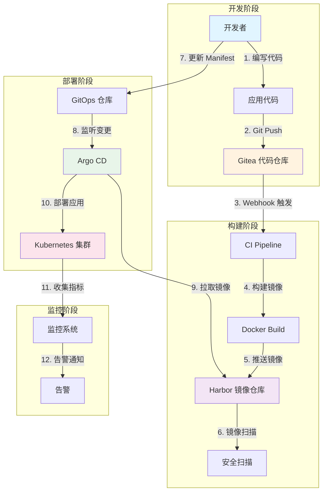
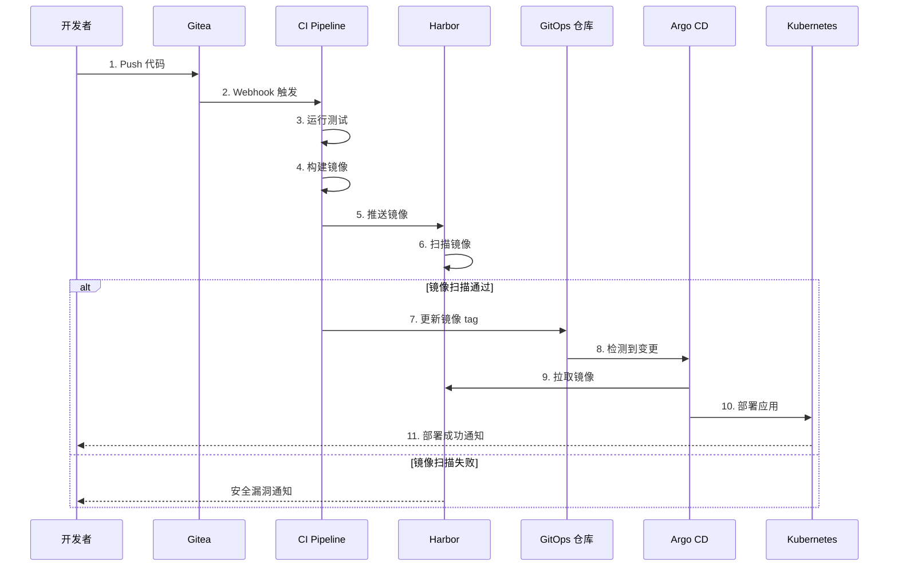

# 打造完整的私有 GitOps 工作流

## 📋 概述

本文将指导您构建一个完整的私有 GitOps 工作流，实现从代码提交到生产部署的全自动化流程。我们假设您已经部署好了以下组件：

- **Gitea** - 私有 Git 代码仓库
- **Harbor** - 容器镜像仓库
- **Argo CD** - GitOps 持续部署工具
- **Kubernetes** - 容器编排平台

## 🎯 工作流目标

构建一个满足以下要求的 GitOps 工作流：

✅ **自动化** - 代码提交自动触发构建和部署
✅ **可追溯** - 所有变更都有完整的 Git 历史
✅ **环境隔离** - 支持开发、测试、生产多环境
✅ **快速回滚** - 通过 Git revert 快速回滚
✅ **安全可控** - 镜像扫描、权限控制、审计日志

## 🏗️ 整体架构

### 架构图

> **注意**：以下架构图可以使用 draw.io 重新绘制以获得更专业的视觉效果。
>
> **Draw.io 绘制建议**：
> - 使用泳道图（Swimlane）展示不同角色和系统
> - 使用不同颜色区分不同阶段（开发、构建、部署）
> - 添加图标和阴影效果增强视觉效果
> - 导出为 SVG 格式以保持清晰度



### 仓库结构设计

GitOps 工作流需要两个独立的 Git 仓库：

#### 1. 应用代码仓库（Application Repository）

```
myapp/
├── src/                      # 应用源代码
│   ├── main.go
│   └── ...
├── Dockerfile                # 容器镜像构建文件
├── .gitea/                   # Gitea CI 配置
│   └── workflows/
│       └── build.yaml        # 构建流水线
├── go.mod
├── go.sum
└── README.md
```

#### 2. GitOps 配置仓库（GitOps Repository）

```
myapp-gitops/
├── base/                     # 基础配置
│   ├── deployment.yaml
│   ├── service.yaml
│   ├── ingress.yaml
│   └── kustomization.yaml
├── overlays/                 # 环境特定配置
│   ├── dev/                  # 开发环境
│   │   ├── kustomization.yaml
│   │   └── patch-replicas.yaml
│   ├── staging/              # 测试环境
│   │   ├── kustomization.yaml
│   │   └── patch-replicas.yaml
│   └── production/           # 生产环境
│       ├── kustomization.yaml
│       ├── patch-replicas.yaml
│       └── patch-resources.yaml
└── README.md
```

## 🔄 完整工作流程

### 流程图：从代码到部署

> **Draw.io 绘制建议**：
> - 使用 BPMN 2.0 流程图标准
> - 区分自动化步骤（绿色）和人工步骤（蓝色）
> - 添加决策节点（菱形）表示条件判断
> - 使用泳道区分不同系统和角色



### 详细步骤说明

#### 步骤 1-2：代码提交与触发

开发者完成代码开发后，提交到 Gitea：

```bash
# 开发者本地操作
git add .
git commit -m "feat: 添加用户认证功能"
git push origin main
```

Gitea 通过 Webhook 自动触发 CI Pipeline。

#### 步骤 3-6：CI/CD 构建流程

**Gitea Actions 配置示例**（`.gitea/workflows/build.yaml`）：

```yaml
name: Build and Push Image

on:
  push:
    branches:
      - main
      - develop

env:
  HARBOR_URL: harbor.ljwx.local
  IMAGE_NAME: myapp
  GITOPS_REPO: http://gitea.ljwx.local/ops/myapp-gitops.git

jobs:
  build:
    runs-on: ubuntu-latest
    steps:
      # 1. 检出代码
      - name: Checkout code
        uses: actions/checkout@v3

      # 2. 设置 Docker Buildx
      - name: Set up Docker Buildx
        uses: docker/setup-buildx-action@v2

      # 3. 登录 Harbor
      - name: Login to Harbor
        uses: docker/login-action@v2
        with:
          registry: ${{ env.HARBOR_URL }}
          username: ${{ secrets.HARBOR_USERNAME }}
          password: ${{ secrets.HARBOR_PASSWORD }}

      # 4. 生成镜像标签
      - name: Generate image tag
        id: tag
        run: |
          SHORT_SHA=$(echo ${{ github.sha }} | cut -c1-7)
          echo "IMAGE_TAG=${SHORT_SHA}" >> $GITHUB_OUTPUT
          echo "FULL_IMAGE=${{ env.HARBOR_URL }}/library/${{ env.IMAGE_NAME }}:${SHORT_SHA}" >> $GITHUB_OUTPUT

      # 5. 构建并推送镜像
      - name: Build and push
        uses: docker/build-push-action@v4
        with:
          context: .
          push: true
          tags: |
            ${{ steps.tag.outputs.FULL_IMAGE }}
            ${{ env.HARBOR_URL }}/library/${{ env.IMAGE_NAME }}:latest
          cache-from: type=registry,ref=${{ env.HARBOR_URL }}/library/${{ env.IMAGE_NAME }}:buildcache
          cache-to: type=registry,ref=${{ env.HARBOR_URL }}/library/${{ env.IMAGE_NAME }}:buildcache,mode=max

      # 6. 等待 Harbor 扫描完成
      - name: Wait for Harbor scan
        run: |
          echo "等待镜像安全扫描..."
          sleep 30
          # 这里可以添加脚本检查扫描结果

      # 7. 更新 GitOps 仓库
      - name: Update GitOps repository
        run: |
          git clone ${{ env.GITOPS_REPO }} gitops
          cd gitops

          # 更新开发环境镜像标签
          cd overlays/dev
          kustomize edit set image ${{ env.HARBOR_URL }}/library/${{ env.IMAGE_NAME }}:${{ steps.tag.outputs.IMAGE_TAG }}

          # 提交变更
          git config user.name "CI Bot"
          git config user.email "ci@ljwx.local"
          git add .
          git commit -m "chore: update dev image to ${{ steps.tag.outputs.IMAGE_TAG }}"
          git push
```

#### 步骤 7-10：GitOps 自动部署

Argo CD 监听 GitOps 仓库的变更，自动同步到 Kubernetes 集群。

**Argo CD Application 配置**：

```yaml
apiVersion: argoproj.io/v1alpha1
kind: Application
metadata:
  name: myapp-dev
  namespace: argocd
spec:
  project: default

  # 源配置：GitOps 仓库
  source:
    repoURL: http://gitea.ljwx.local/ops/myapp-gitops.git
    targetRevision: main
    path: overlays/dev

  # 目标配置：Kubernetes 集群
  destination:
    server: https://kubernetes.default.svc
    namespace: myapp-dev

  # 同步策略
  syncPolicy:
    automated:
      prune: true        # 自动删除不在 Git 中的资源
      selfHeal: true     # 自动修复配置漂移
      allowEmpty: false
    syncOptions:
      - CreateNamespace=true
    retry:
      limit: 5
      backoff:
        duration: 5s
        factor: 2
        maxDuration: 3m
```

## 🎯 多环境管理

### 环境策略

我们使用 Kustomize 管理多环境配置：

| 环境 | 分支 | 命名空间 | 副本数 | 资源限制 |
|------|------|----------|--------|----------|
| 开发环境 | develop | myapp-dev | 1 | 低 |
| 测试环境 | staging | myapp-staging | 2 | 中 |
| 生产环境 | main | myapp-prod | 3 | 高 |

### 环境配置示例

**基础配置**（`base/deployment.yaml`）：

```yaml
apiVersion: apps/v1
kind: Deployment
metadata:
  name: myapp
  labels:
    app: myapp
spec:
  replicas: 1  # 默认副本数，会被 overlay 覆盖
  selector:
    matchLabels:
      app: myapp
  template:
    metadata:
      labels:
        app: myapp
    spec:
      containers:
      - name: myapp
        image: harbor.ljwx.local/library/myapp:latest
        ports:
        - containerPort: 8080
        env:
        - name: ENV
          value: "dev"
        resources:
          requests:
            memory: "128Mi"
            cpu: "100m"
          limits:
            memory: "256Mi"
            cpu: "200m"
```

**生产环境覆盖**（`overlays/production/kustomization.yaml`）：

```yaml
apiVersion: kustomize.config.k8s.io/v1beta1
kind: Kustomization

namespace: myapp-prod

bases:
  - ../../base

# 镜像替换
images:
  - name: harbor.ljwx.local/library/myapp
    newTag: abc1234  # 由 CI 自动更新

# 副本数调整
replicas:
  - name: myapp
    count: 3

# 资源限制调整
patches:
  - path: patch-resources.yaml
  - path: patch-env.yaml

# 添加生产环境特定的资源
resources:
  - hpa.yaml
  - pdb.yaml
```

**生产环境资源补丁**（`overlays/production/patch-resources.yaml`）：

```yaml
apiVersion: apps/v1
kind: Deployment
metadata:
  name: myapp
spec:
  template:
    spec:
      containers:
      - name: myapp
        resources:
          requests:
            memory: "512Mi"
            cpu: "500m"
          limits:
            memory: "1Gi"
            cpu: "1000m"
```

## 🔐 安全最佳实践

### 1. 镜像安全扫描

在 Harbor 中启用自动扫描：

```yaml
# Harbor 项目配置
{
  "auto_scan": true,
  "severity": "high",
  "prevent_vul": true,
  "prevent_severity": "critical"
}
```

### 2. 密钥管理

使用 Kubernetes Secrets 和 Sealed Secrets：

```bash
# 创建 Sealed Secret
kubectl create secret generic myapp-secret \
  --from-literal=db-password=secret123 \
  --dry-run=client -o yaml | \
  kubeseal -o yaml > sealed-secret.yaml

# 提交到 GitOps 仓库
git add sealed-secret.yaml
git commit -m "chore: add sealed secret"
git push
```

### 3. RBAC 权限控制

**Argo CD RBAC 配置**：

```yaml
apiVersion: v1
kind: ConfigMap
metadata:
  name: argocd-rbac-cm
  namespace: argocd
data:
  policy.csv: |
    # 开发者：只能查看和同步开发环境
    p, role:developer, applications, get, */myapp-dev, allow
    p, role:developer, applications, sync, */myapp-dev, allow

    # 运维：可以管理所有环境
    p, role:ops, applications, *, */*, allow

    # 只读用户：只能查看
    p, role:readonly, applications, get, */*, allow

    g, dev-team, role:developer
    g, ops-team, role:ops
```

## 📊 监控与可观测性

### 集成监控系统

```yaml
# Deployment 添加 Prometheus 注解
apiVersion: apps/v1
kind: Deployment
metadata:
  name: myapp
spec:
  template:
    metadata:
      annotations:
        prometheus.io/scrape: "true"
        prometheus.io/port: "8080"
        prometheus.io/path: "/metrics"
```

### 关键指标监控

- **部署频率** - 每天部署次数
- **部署成功率** - 成功部署 / 总部署次数
- **平均恢复时间（MTTR）** - 从故障到恢复的平均时间
- **变更失败率** - 导致故障的部署比例

## 🔄 回滚策略

### 快速回滚

GitOps 的优势在于可以通过 Git 操作��速回滚：

```bash
# 方法 1：Git revert
cd myapp-gitops
git revert HEAD
git push

# 方法 2：回滚到指定版本
git reset --hard abc1234
git push -f

# 方法 3：使用 Argo CD CLI
argocd app rollback myapp-prod
```

### 金丝雀发布

```yaml
# Argo Rollouts 配置
apiVersion: argoproj.io/v1alpha1
kind: Rollout
metadata:
  name: myapp
spec:
  replicas: 5
  strategy:
    canary:
      steps:
      - setWeight: 20    # 20% 流量到新版本
      - pause: {duration: 5m}
      - setWeight: 40
      - pause: {duration: 5m}
      - setWeight: 60
      - pause: {duration: 5m}
      - setWeight: 80
      - pause: {duration: 5m}
```

## 🎓 工作流最佳实践

### 1. 分支策略

```
main (生产环境)
  ↑
staging (测试环境)
  ↑
develop (开发环境)
  ↑
feature/* (功能分支)
```

### 2. 提交规范

使用 Conventional Commits：

```bash
feat: 添加用户认证功能
fix: 修复登录超时问题
chore: 更新依赖版本
docs: 更新 API 文档
```

### 3. 镜像标签策略

```bash
# 推荐使用 Git commit SHA
harbor.ljwx.local/library/myapp:abc1234

# 避免使用 latest
# ❌ harbor.ljwx.local/library/myapp:latest

# 可以同时打多个标签
harbor.ljwx.local/library/myapp:abc1234
harbor.ljwx.local/library/myapp:v1.2.3
harbor.ljwx.local/library/myapp:main
```

### 4. 配置管理

```yaml
# 使用 ConfigMap 管理配置
apiVersion: v1
kind: ConfigMap
metadata:
  name: myapp-config
data:
  app.yaml: |
    server:
      port: 8080
    database:
      host: postgres.default.svc
      port: 5432
```

## 🚀 实施步骤

### 第一阶段：基础设施准备（已完成）

- ✅ Gitea 部署和配置
- ✅ Harbor 部署和配置
- ✅ Argo CD 部署和配置
- ✅ Kubernetes 集群就绪

### 第二阶段：仓库初始化

```bash
# 1. 创建应用代码仓库
cd myapp
git init
git remote add origin http://gitea.ljwx.local/dev/myapp.git
git add .
git commit -m "feat: initial commit"
git push -u origin main

# 2. 创建 GitOps 仓库
cd myapp-gitops
git init
git remote add origin http://gitea.ljwx.local/ops/myapp-gitops.git
git add .
git commit -m "chore: initial gitops config"
git push -u origin main
```

### 第三阶段：配置 CI/CD

1. 在 Gitea 中配置 Actions Runner
2. 添加 `.gitea/workflows/build.yaml`
3. 配置 Harbor 凭证（Secrets）
4. 测试构建流程

### 第四阶段：配置 Argo CD

```bash
# 创建 Argo CD Application
kubectl apply -f - <<EOF
apiVersion: argoproj.io/v1alpha1
kind: Application
metadata:
  name: myapp-dev
  namespace: argocd
spec:
  project: default
  source:
    repoURL: http://gitea.ljwx.local/ops/myapp-gitops.git
    targetRevision: main
    path: overlays/dev
  destination:
    server: https://kubernetes.default.svc
    namespace: myapp-dev
  syncPolicy:
    automated:
      prune: true
      selfHeal: true
EOF
```

### 第五阶段：验证工作流

```bash
# 1. 修改代码并提交
echo "// test change" >> main.go
git add .
git commit -m "test: verify gitops workflow"
git push

# 2. 观察 CI 构建
# 访问 Gitea Actions 页面查看构建状态

# 3. 观察 Argo CD 同步
argocd app get myapp-dev
argocd app sync myapp-dev --watch

# 4. 验证部署
kubectl get pods -n myapp-dev
kubectl logs -f deployment/myapp -n myapp-dev
```

## 📈 效果评估

实施 GitOps 工作流后，您应该能够实现：

| 指标 | 改进前 | 改进后 |
|------|--------|--------|
| 部署频率 | 每周 1-2 次 | 每天 10+ 次 |
| 部署时间 | 30-60 分钟 | 5-10 分钟 |
| 回滚时间 | 1-2 小时 | 5 分钟 |
| 变更失败率 | 15-20% | < 5% |
| 平均恢复时间 | 2-4 小时 | < 30 分钟 |

## ⚠️ 常见问题

### Q1: Argo CD 无法拉取私有镜像

**解决方案**：

```bash
# 创建 Harbor 凭证
kubectl create secret docker-registry harbor-secret \
  --docker-server=harbor.ljwx.local \
  --docker-username=admin \
  --docker-password=Harbor12345 \
  -n myapp-dev

# 在 Deployment 中引用
spec:
  template:
    spec:
      imagePullSecrets:
      - name: harbor-secret
```

### Q2: GitOps 仓库更新后 Argo CD 未同步

**检查步骤**：

```bash
# 1. 检查 Application 状态
argocd app get myapp-dev

# 2. 手动触发同步
argocd app sync myapp-dev

# 3. 检查 Argo CD 日志
kubectl logs -n argocd deployment/argocd-application-controller
```

### Q3: 如何处理配置漂移

**解决方案**：

启用 Argo CD 的 `selfHeal` 功能：

```yaml
syncPolicy:
  automated:
    selfHeal: true  # 自动修复配置漂移
```

## 🔗 相关资源

- [GitOps 工作组](https://opengitops.dev/)
- [Argo CD 官方文档](https://argo-cd.readthedocs.io/)
- [Kustomize 文档](https://kustomize.io/)
- [Harbor 文档](https://goharbor.io/docs/)
- [Gitea Actions 文档](https://docs.gitea.io/en-us/actions/)

## 📝 总结

通过本文，我们构建了一个完整的私有 GitOps 工作流，实现了：

✅ **自动化部署** - 代码提交自动触发构建和部署
✅ **多环境管理** - 开发、测试、生产环境隔离
✅ **安全可控** - 镜像扫描、权限控制、审计日志
✅ **快速回滚** - 通过 Git 操作快速回滚
✅ **可观测性** - 完整的监控和告警体系

这套工作流可以显著提升团队的开发效率和部署质量，是现代 DevOps 实践的最佳选择。

## 💬 讨论与反馈

如果您在实施过程中遇到问题，欢迎：

- 📝 在 [GitHub Issues](https://github.com/BrunoGao/ljwx-docs/issues) 提问
- 💬 在 [GitHub Discussions](https://github.com/BrunoGao/ljwx-docs/discussions) 讨论
- 📧 联系作者：brunogao

---

**下一篇预告**：《Kubernetes 生产环境最佳实践》

**相关文章**：
- [Gitea 私有化部署完整指南](./gitea-setup)（规划中）
- [Harbor 镜像仓库搭建与配置](./harbor-registry)（规划中）
- [Argo CD 实现 GitOps 持续部署](./argocd-deployment)（规划中）
