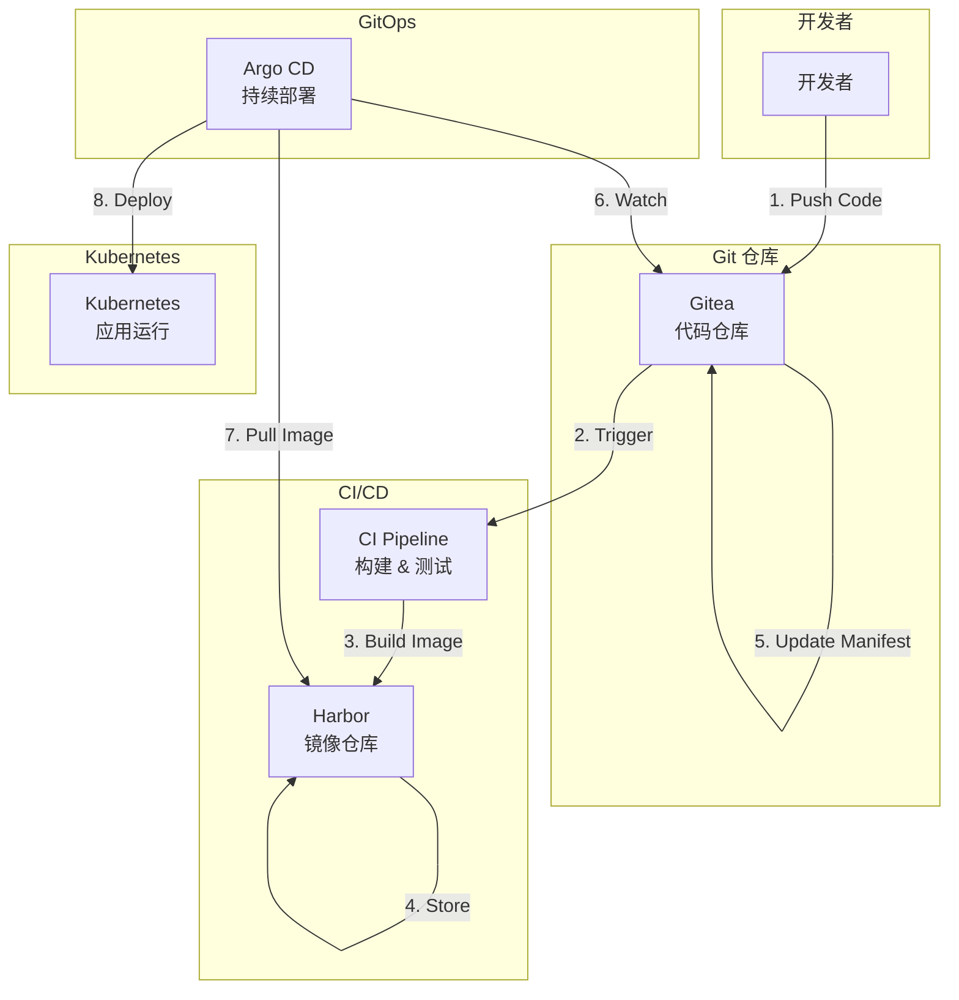

# GitOps 实践系列

## 📖 系列概述

本系列文章分享我们团队在私有化项目中实践 GitOps 的完整经验，从方法论到架构设计，再到具体实施。我们使用以下技术栈：

- **Gitea** - 轻量级私有 Git 服务
- **Harbor** - 企业级容器镜像仓库
- **Argo CD** - 声明式 GitOps 持续部署工具

**团队背景**：15人团队，2年实践，5个项目，20+应用，8+集群

## 📚 系列文章

### 第一篇：为什么在私有化项目中坚持 GitOps（理念篇）
**状态**：✅ 已发布 | **难度**：⭐⭐⭐ 中级 | **阅读时间**：20分钟

分享我们为什么选择 GitOps，以及在实践中的真实收益和踩过的坑。

**核心内容**：
- 我们遇到的真实问题（配置漂移、回滚困难、审计缺失）
- 为什么不选择传统 CI/CD、脚本化部署、配置管理工具
- 我们如何理解 GitOps（治理模型 vs 工具）
- 真实效果（部署频率提升5-10倍，回滚时间缩短12-24倍）
- 5个反模式和解决方案
- 最佳实践总结

[查看文章 →](./why-gitops)

---

### 第二篇：GitOps 架构设计：从原则到落地（架构篇）
**状态**：📝 规划中 | **难度**：⭐⭐⭐⭐ 高级 | **预计阅读时间**：25分钟

深入讲解 GitOps 架构设计的核心原则和技术选型。

**核心内容**：
- GitOps 四大核心原则的架构体现
- 技术选型决策（为什么选择 Gitea/Harbor/Argo CD）
- 仓库结构设计（单仓库 vs 多仓库）
- 环境隔离策略（Kustomize vs Helm）
- 权限和安全架构
- 高可用和灾难恢复设计
- 可观测性集成

[查看文章 →](./gitops-architecture)（即将发布）

---

### 第三篇：打造完整的私有 GitOps 工作流（实施篇）
**状态**：✅ 已发布 | **难度**：⭐⭐⭐ 中级 | **阅读时间**：25分钟

手把手指导如何实现从代码提交到生产部署的完整自动化流程。

**核心内容**：
- 完整工作流程（开发→构建→部署→监控）
- Gitea Actions CI/CD 配置
- Harbor 镜像扫描和安全策略
- Argo CD 多环境管理
- Kustomize 配置管理
- 回滚和金丝雀发布
- 监控告警集成
- 常见问题排查

[查看文章 →](./gitops-workflow)

## 🎯 学习路径

## 🏗️ 架构图

## 💡 为什么选择 GitOps？

### 我们的实践收益

基于 2 年实践经验，我们在 5 个项目中获得了显著收益：

✅ **部署效率提升 5-10 倍** - 从每周 1-2 次到每天 10+ 次部署
✅ **回滚时间缩短 12-24 倍** - 从 1-2 小时到 5 分钟内完成
✅ **变更失败率降低 70%** - 从 15-20% 降至 < 5%
✅ **审计追溯 100% 覆盖** - 所有变更都有完整 Git 历史
✅ **配置漂移自动修复** - Argo CD 自动检测并修复配置偏差

### 核心优势

- **声明式配置** - 所有配置存储在 Git 中，易于版本控制
- **自动化部署** - Git 提交自动触发部署，减少人为错误
- **可审计性** - 所有变更都有完整的 Git 历史记录
- **快速回滚** - 通过 Git revert 快速回滚到任意版本
- **一致性保证** - 确保集群状态与 Git 仓库保持一致

### 适用场景

- 🏢 企业私有云环境
- 🔒 对数据安全有严格要求
- 👥 多团队协作开发
- 🌍 多环境部署（开发/测试/生产）
- 📊 需要完整的审计追踪
- 🚀 追求高频率部署

## 🛠️ 技术栈

| 组件 | 版本 | 用途 |
|------|------|------|
| Gitea | 1.21+ | Git 代码托管 |
| Harbor | 2.10+ | 容器镜像仓库 |
| Argo CD | 2.10+ | GitOps 部署工具 |
| Kubernetes | 1.28+ | 容器编排平台 |
| PostgreSQL | 15+ | 数据库 |
| Redis | 7+ | 缓存 |

## 📋 前置要求

在开始本系列之前，您需要：

- ✅ 基本的 Linux 命令行知识
- ✅ 了解 Docker 和容器化概念
- ✅ 熟悉 Kubernetes 基础
- ✅ 了解 Git 基本操作
- ✅ 一个 Kubernetes 集群（可以是本地 Minikube 或云端集群）

## 🎓 学习目标

完成本系列后，您将能够：

- ✅ 理解 GitOps 的核心理念和适用场景
- ✅ 设计符合企业需求的 GitOps 架构
- ✅ 实现完整的 CI/CD 自动化流水线
- ✅ 管理多环境的应用部署和配置
- ✅ 处理常见的 GitOps 场景和问题
- ✅ 建立可观测性和监控体系

## 🔗 相关资源

- [Gitea 官方文档](https://docs.gitea.io/)
- [Harbor 官方文档](https://goharbor.io/docs/)
- [Argo CD 官方文档](https://argo-cd.readthedocs.io/)
- [GitOps 工作组](https://opengitops.dev/)

## 💬 讨论和反馈

如果您在学习过程中遇到问题，欢迎：

- 📝 在 [GitHub Issues](https://github.com/BrunoGao/ljwx-docs/issues) 提问
- 💬 在 [GitHub Discussions](https://github.com/BrunoGao/ljwx-docs/discussions) 讨论
- 📧 联系作者：brunogao

---

**系列状态**：🚀 连载中
**已发布**：2/3 篇
**难度等级**：⭐⭐⭐ 中级到高级
**适合人群**：DevOps 工程师、平台工程师、技术负责人
