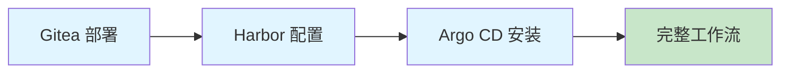
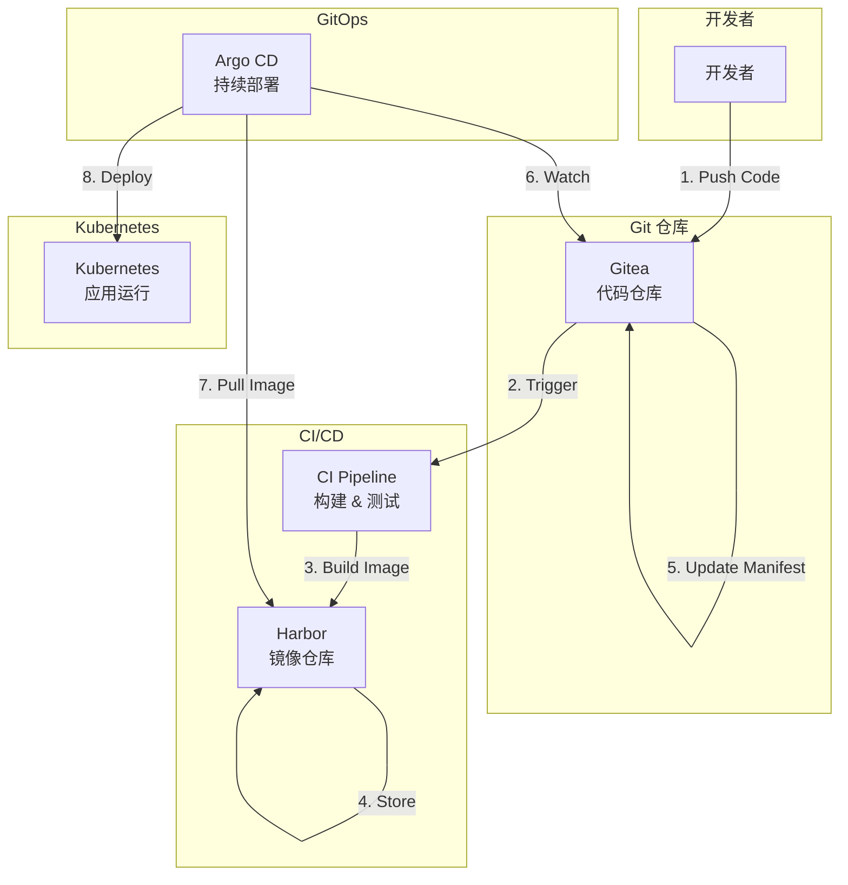

# GitOps 实践系列

## 📖 系列概述

本系列文章将指导您从零开始搭建完整的私有 GitOps 工作流，包括：

- **Gitea** - 轻量级私有 Git 服务
- **Harbor** - 企业级容器镜像仓库
- **Argo CD** - 声明式 GitOps 持续部署工具

## 📚 系列文章

### 1. Gitea 私有化部署完整指南
**状态**：📝 规划中

学习如何部署和配置 Gitea，打造私有的 Git 代码托管平台。

**内容包括**：
- Gitea 架构介绍
- Docker/Kubernetes 部署方式
- 数据库配置
- HTTPS 配置
- 用户和权限管理
- 备份和恢复

[查看文章 →](./gitea-setup)

---

### 2. Harbor 镜像仓库搭建与配置
**状态**：📝 规划中

搭建企业级容器镜像仓库，实现镜像的安全存储和分发。

**内容包括**：
- Harbor 架构和组件
- 高可用部署方案
- 镜像扫描和签名
- 镜像复制和同步
- 访问控制和审计
- 与 CI/CD 集成

[查看文章 →](./harbor-registry)

---

### 3. Argo CD 实现 GitOps 持续部署
**状态**：📝 规划中

使用 Argo CD 实现基于 Git 的声明式应用部署。

**内容包括**：
- Argo CD 核心概念
- 安装和配置
- Application 定义
- 多集群管理
- 自动同步策略
- Webhook 集成
- RBAC 权限控制

[查看文章 →](./argocd-deployment)

---

### 4. 打造完整的私有 GitOps 工作流
**状态**：📝 规划中

整合 Gitea、Harbor 和 Argo CD，构建端到端的 GitOps 工作流。

**内容包括**：
- 完整架构设计
- 代码提交到部署的完整流程
- CI/CD 流水线配置
- 环境管理（开发/测试/生产）
- 回滚和灾难恢复
- 监控和告警
- 最佳实践和常见问题

[查看文章 →](./gitops-workflow)

## 🎯 学习路径

## 🏗️ 架构图

## 💡 为什么选择 GitOps？

### 优势

✅ **声明式配置** - 所有配置存储在 Git 中，易于版本控制
✅ **自动化部署** - Git 提交自动触发部署，减少人为错误
✅ **可审计性** - 所有变更都有完整的 Git 历史记录
✅ **快速回滚** - 通过 Git revert 快速回滚到任意版本
✅ **一致性** - 确保集群状态与 Git 仓库保持一致

### 适用场景

- 🏢 企业私有云环境
- 🔒 对数据安全有严格要求
- 👥 多团队协作开发
- 🌍 多环境部署（开发/测试/生产）
- 📊 需要完整的审计追踪

## 🛠️ 技术栈

| 组件 | 版本 | 用途 |
|------|------|------|
| Gitea | 1.21+ | Git 代码托管 |
| Harbor | 2.10+ | 容器镜像仓库 |
| Argo CD | 2.10+ | GitOps 部署工具 |
| Kubernetes | 1.28+ | 容器编排平台 |
| PostgreSQL | 15+ | 数据库 |
| Redis | 7+ | 缓存 |

## 📋 前置要求

在开始本系列之前，您需要：

- ✅ 基本的 Linux 命令行知识
- ✅ 了解 Docker 和容器化概念
- ✅ 熟悉 Kubernetes 基础
- ✅ 了解 Git 基本操作
- ✅ 一个 Kubernetes 集群（可以是本地 Minikube 或云端集群）

## 🎓 学习目标

完成本系列后，您将能够：

- ✅ 独立部署和配置 Gitea、Harbor 和 Argo CD
- ✅ 设计和实现完整的 GitOps 工作流
- ✅ 实现自动化的 CI/CD 流水线
- ✅ 管理多环境的应用部署
- ✅ 处理常见的 GitOps 场景和问题

## 🔗 相关资源

- [Gitea 官方文档](https://docs.gitea.io/)
- [Harbor 官方文档](https://goharbor.io/docs/)
- [Argo CD 官方文档](https://argo-cd.readthedocs.io/)
- [GitOps 工作组](https://opengitops.dev/)

## 💬 讨论和反馈

如果您在学习过程中遇到问题，欢迎：

- 📝 在 [GitHub Issues](https://github.com/BrunoGao/ljwx-docs/issues) 提问
- 💬 在 [GitHub Discussions](https://github.com/BrunoGao/ljwx-docs/discussions) 讨论
- 📧 联系作者：brunogao

---

**系列状态**：📝 规划中
**预计完成时间**：2026年2月
**难度等级**：⭐⭐⭐ 中级
