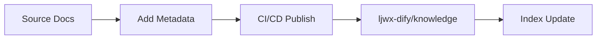
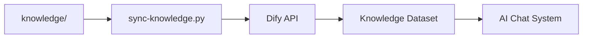

## Quick Overview

The Knowledge Asset System is a complete document management and knowledge base synchronization solution, consisting of three core components:

### 📝 Document Publishing Workflow



Automated publishing workflow from source project documentation to knowledge base, supporting selective publishing, version tracking, and multi-project management.

### 🔄 Knowledge Base Sync



Automatically synchronize documents to Dify knowledge base, providing knowledge support for AI conversation systems with incremental updates and multi-level management.

### 📊 Metadata System

Document metadata includes:
- **Asset Levels**: L0-L4, from temporary documents to public content
- **Visibility**: internal/public/mixed
- **Topic Tags**: spec-driven, ai-engineering, etc.
- **Version Info**: commit hash, update time, etc.

## Core Features

- ✅ **Automation First** - Git push triggers automatic publishing without manual intervention
- ✅ **Version Traceable** - Each publication records Git commit hash
- ✅ **Metadata Driven** - Control publishing strategy through YAML frontmatter
- ✅ **Multi-project Support** - Unified management of documentation from multiple projects
- ✅ **Incremental Sync** - Intelligent detection of document changes to avoid redundant operations
- ✅ **Multi-level Organization** - Organized by asset level, topic, project, and other dimensions

## Getting Started

### 1. Install Dependencies

```bash
# Clone repository
git clone https://github.com/ljwx/ljwx-docs.git
cd ljwx-docs

# Install dependencies
npm install
```

### 2. Local Development

```bash
# Start development server
npm run docs:dev

# Visit http://localhost:5173
```

### 3. Build and Deploy

```bash
# Build for production
npm run docs:build

# Preview build
npm run docs:preview

# Deploy with Node.js service
npm run docs:serve
```

## Documentation Resources

- [Quick Reference](/en/QUICK-REFERENCE) - Common commands and configuration quick reference
- [Architecture Design](/en/knowledge-asset-automation-design) - System architecture and design principles
- [Usage Guide](/en/knowledge-asset-usage-guide) - Detailed usage documentation
- [Dify Sync Guide](/en/dify-knowledge-sync-guide) - Knowledge base synchronization configuration

## Support and Feedback

- **Technical Support**: brunogao
- **Issue Reporting**: [GitHub Issues](https://github.com/ljwx/ljwx-docs/issues)
- **Documentation Contribution**: Pull Requests are welcome
