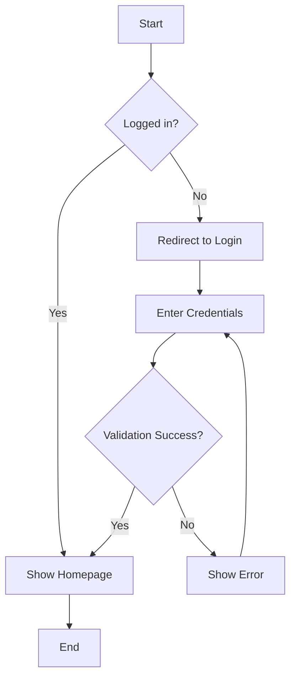
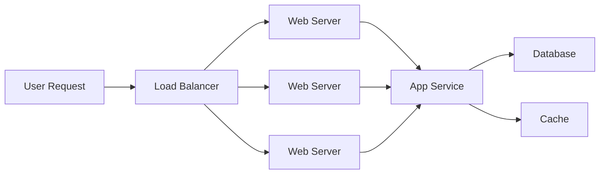
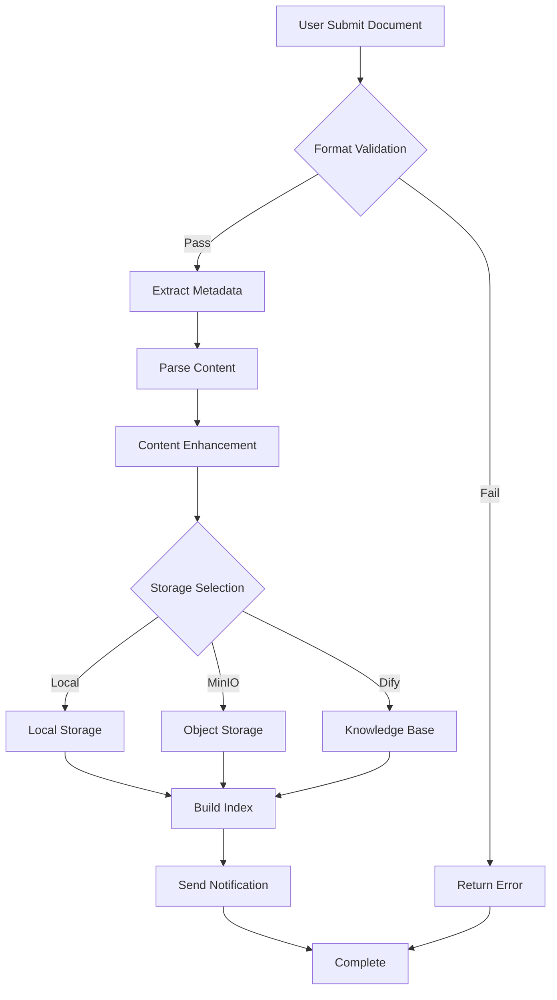
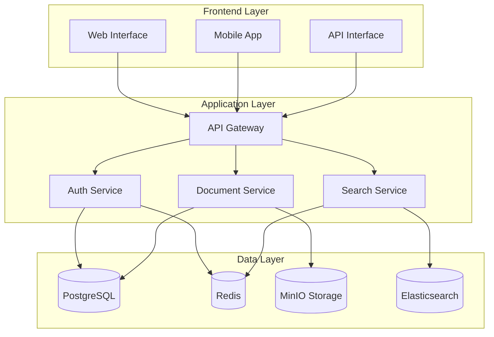
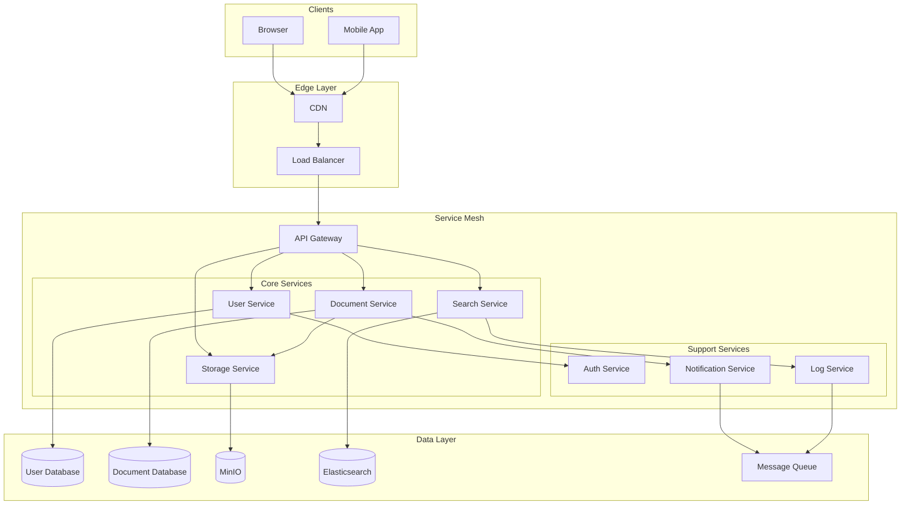
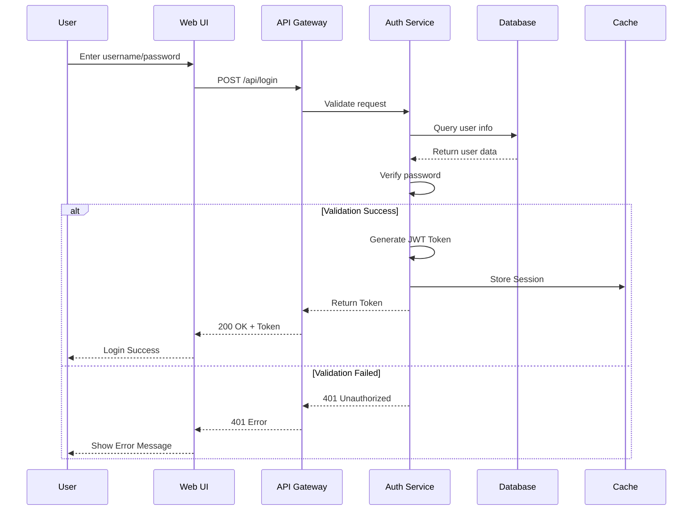

# Visual Effects Test Document

This document is used to test various visual effects of LJWX Docs, including flowcharts, architecture diagrams, video embedding, and more.

## 📊 Flowchart Tests

### 1. Basic Flowchart



### 2. Horizontal Flowchart



### 3. Complex Business Process



## 🏗️ Architecture Diagram Tests

### 1. System Architecture



### 2. Microservices Architecture



## 📈 Sequence Diagram Tests

### User Authentication Flow



## 🎬 Video Tests

### Method 1: HTML5 Video Player

::: tip Video Description
The following videos are stored in the internal MinIO service. MinIO address: http://192.168.1.83:32001
:::

<video width="100%" controls>
  <source src="http://192.168.1.83:32001/ljwx-docs/videos/demo.mp4" type="video/mp4">
  Your browser does not support video playback.
</video>

### Method 2: Styled Video Container

<div style="position: relative; padding-bottom: 56.25%; height: 0; overflow: hidden; max-width: 100%; background: #000; border-radius: 12px; box-shadow: 0 4px 16px rgba(0,0,0,0.1);">
  <video
    style="position: absolute; top: 0; left: 0; width: 100%; height: 100%;"
    controls
    poster="http://192.168.1.83:32001/ljwx-docs/images/video-poster.jpg">
    <source src="http://192.168.1.83:32001/ljwx-docs/videos/tutorial.mp4" type="video/mp4">
    Your browser does not support video playback.
  </video>
</div>

## 📋 MinIO Video Upload Guide

### 1. Access MinIO Console

```
URL: http://192.168.1.83:32001/browser/ljwx-docs
Username: minioadmin
Password: minioadmin123
```

### 2. Create Directory Structure

Recommended directory structure in `ljwx-docs` bucket:

```
ljwx-docs/
├── videos/          # Video files
│   ├── demo.mp4
│   ├── intro.mp4
│   └── tutorial.mp4
├── images/          # Image files
│   └── video-poster.jpg
└── documents/       # Document files
```

### 3. Upload Video Files

1. Login to MinIO console
2. Select `ljwx-docs` bucket
3. Create `videos` folder
4. Click **Upload** to upload video files
5. Set file to public access (if needed)

### 4. Get Video URL

After uploading, the video access URL format is:
```
http://192.168.1.83:32001/ljwx-docs/videos/filename.mp4
```

## 🎨 Code Block Tests

### TypeScript Code

```typescript
interface VideoConfig {
  src: string
  poster?: string
  width?: string | number
  height?: string | number
  controls?: boolean
  autoplay?: boolean
}

class VideoPlayer {
  private config: VideoConfig
  private element: HTMLVideoElement

  constructor(config: VideoConfig) {
    this.config = config
    this.element = this.createVideoElement()
  }

  private createVideoElement(): HTMLVideoElement {
    const video = document.createElement('video')
    video.src = this.config.src
    video.controls = this.config.controls ?? true

    if (this.config.poster) {
      video.poster = this.config.poster
    }

    return video
  }

  play(): void {
    this.element.play()
  }

  pause(): void {
    this.element.pause()
  }
}
```

## 📊 Table Tests

### MinIO Configuration Parameters

| Parameter | Value | Description |
|-----------|-------|-------------|
| Endpoint | 192.168.1.83:32001 | MinIO service address |
| Access Key | minioadmin | Access key |
| Secret Key | minioadmin123 | Secret key |
| Bucket | ljwx-docs | Bucket name |
| Region | us-east-1 | Region (default) |
| Secure | false | Use HTTPS |

### Supported Video Formats

| Format | MIME Type | Browser Support | Recommended |
|--------|-----------|----------------|-------------|
| MP4 | video/mp4 | ✅ All modern browsers | ⭐⭐⭐⭐⭐ |
| WebM | video/webm | ✅ Chrome, Firefox | ⭐⭐⭐⭐ |
| OGG | video/ogg | ✅ Firefox, Chrome | ⭐⭐⭐ |
| MOV | video/quicktime | ⚠️ Safari | ⭐⭐ |

## 💡 Custom Container Tests

::: tip Tip
Video files are recommended to use MP4 format with H.264 encoding for best compatibility.
:::

::: warning Warning
Large video files may require longer loading times. Recommendations:
- Keep video size under 50MB
- Use appropriate resolution (1080p or 720p)
- Consider using video compression tools
:::

::: danger Important
MinIO server access permissions are important:
- Ensure bucket policy allows public read
- Or use pre-signed URLs
- Pay attention to video copyright issues
:::

## 📝 Test Checklist

- [x] Basic flowchart rendering
- [x] Complex architecture diagram rendering
- [x] Sequence diagram rendering
- [x] Code block highlighting
- [x] Table styling
- [x] Custom containers
- [ ] Video playback test (requires uploading video files)

---

**Test Document Created**: 2026-01-23
**MinIO Service**: http://192.168.1.83:32001
**Document Path**: `/en/visual-test`
