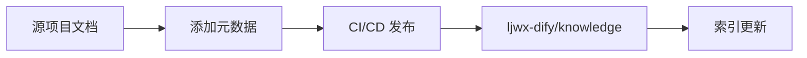
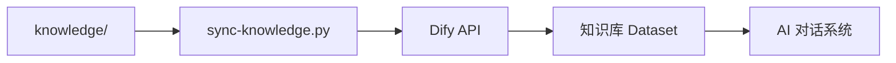

## 快速了解

知识资产化系统是一个完整的文档管理和知识库同步解决方案，包含三个核心部分：

### 📝 文档发布流程



从源项目文档到知识库的自动化发布流程，支持选择性发布、版本追踪和多项目管理。

### 🔄 知识库同步



自动将文档同步到 Dify 知识库，为 AI 对话系统提供知识支撑，支持增量更新和多层级管理。

### 📊 元数据系统

文档元数据包括：
- **资产层级**：L0-L4，从临时文档到对外内容
- **可见性**：internal/public/mixed
- **主题标签**：spec-driven、ai-engineering 等
- **版本信息**：commit hash、更新时间等

## 核心特性

- ✅ **自动化优先** - Git push 触发自动发布，无需人工干预
- ✅ **版本可追溯** - 每次发布记录 Git commit hash
- ✅ **元数据驱动** - 通过 YAML frontmatter 控制发布策略
- ✅ **多项目支持** - 统一管理多个项目的文档
- ✅ **增量同步** - 智能检测文档变更，避免重复操作
- ✅ **多层级组织** - 按资产层级、主题、项目等多维度组织

## 开始使用

### 1. 安装依赖

```bash
# 克隆仓库
git clone https://github.com/ljwx/ljwx-docs.git
cd ljwx-docs

# 安装依赖
npm install
```

### 2. 本地开发

```bash
# 启动开发服务器
npm run docs:dev

# 访问 http://localhost:5173
```

### 3. 构建部署

```bash
# 构建生产版本
npm run docs:build

# 预览构建结果
npm run docs:preview

# 使用 Node.js 服务部署
npm run docs:serve
```

## 文档资源

- [快速参考](/QUICK-REFERENCE) - 常用命令和配置速查
- [架构设计](/knowledge-asset-automation-design) - 系统架构和设计原则
- [使用指南](/knowledge-asset-usage-guide) - 详细的使用文档
- [Dify 同步指南](/dify-knowledge-sync-guide) - 知识库同步配置

## 支持与反馈

- **技术支持**：brunogao
- **问题反馈**：[GitHub Issues](https://github.com/ljwx/ljwx-docs/issues)
- **文档贡献**：欢迎提交 Pull Request
