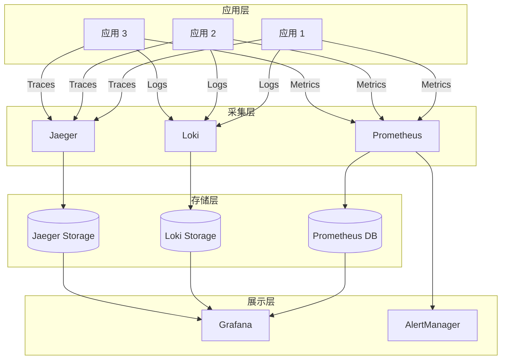

# 可观测性

构建完整的可观测性体系，包括日志聚合、分布式链路追踪和指标监控。

## 📚 系列文章

### 日志管理系列

集中式日志收集、存储和分析。

- [Loki 日志聚合系统搭建](./logging/loki-setup)
- [Elasticsearch 日志方案](./logging/elasticsearch-logging)
- [日志管理最佳实践](./logging/log-best-practices)

### 链路追踪系列

分布式系统的链路追踪和性能分析。

- [Jaeger 分布式链路追踪](./tracing/jaeger-tracing)
- [Tempo 链路追踪配置](./tracing/tempo-setup)
- [分布式追踪最佳实践](./tracing/distributed-tracing)

### 指标监控系列

系统和应用的指标采集与监控。

- [Prometheus 监控体系搭建](./metrics/prometheus-monitoring)
- [Grafana 仪表板设计](./metrics/grafana-dashboard)
- [告警规则配置指南](./metrics/alerting-rules)

## 🎯 快速导航

<div style="display: grid; grid-template-columns: repeat(auto-fit, minmax(250px, 1fr)); gap: 20px; margin: 30px 0;">
  <div style="padding: 20px; border: 1px solid var(--vp-c-divider); border-radius: 12px;">
    <h3>📝 日志管理</h3>
    <p>集中式日志收集、存储和分析</p>
    <a href="./logging/">查看文章 →</a>
  </div>

  <div style="padding: 20px; border: 1px solid var(--vp-c-divider); border-radius: 12px;">
    <h3>🔍 链路追踪</h3>
    <p>分布式系统的请求链路追踪</p>
    <a href="./tracing/">查看文章 →</a>
  </div>

  <div style="padding: 20px; border: 1px solid var(--vp-c-divider); border-radius: 12px;">
    <h3>📊 指标监控</h3>
    <p>系统和应用的实时监控告警</p>
    <a href="./metrics/">查看文章 →</a>
  </div>
</div>

## 🛠️ 核心工具

- **Prometheus** - 指标采集和存储
- **Grafana** - 可视化和仪表板
- **Loki** - 日志聚合系统
- **Jaeger** - 分布式链路追踪
- **Tempo** - 分布式追踪后端
- **AlertManager** - 告警管理

## 💡 三大支柱

可观测性的三大支柱：

::: tip Metrics（指标）
通过 Prometheus 采集系统和应用指标，实时监控性能和健康状态。
:::

::: tip Logs（日志）
使用 Loki 集中管理日志，快速定位和排查问题。
:::

::: tip Traces（链路）
通过 Jaeger 追踪分布式请求链路，分析性能瓶颈。
:::

## 🏗️ 完整架构



## 📖 最佳实践

### 1. 统一标签规范

使用一致的标签命名规范，便于关联不同维度的数据：

```yaml
labels:
  app: myapp
  env: production
  cluster: k8s-prod
  namespace: default
```

### 2. 合理的采集频率

- **高频指标**（CPU、内存）：15-30秒
- **中频指标**（请求量、错误率）：1分钟
- **低频指标**（磁盘使用）：5分钟

### 3. 告警分级

- **P0**：影响核心业务，需要立即处理
- **P1**：影响部分功能，1小时内处理
- **P2**：性能下降，工作时间处理
- **P3**：优化建议，计划处理

## 🎓 学习路径

1. **基础**：了解可观测性概念和三大支柱
2. **实践**：搭建 Prometheus + Grafana 监控系统
3. **进阶**：集成 Loki 日志和 Jaeger 链路追踪
4. **优化**：调优性能、配置告警、建立 SLO

## 🔗 相关资源

- [Prometheus 官方文档](https://prometheus.io/docs/)
- [Grafana 官方文档](https://grafana.com/docs/)
- [Loki 官方文档](https://grafana.com/docs/loki/)
- [Jaeger 官方文档](https://www.jaegertracing.io/docs/)
