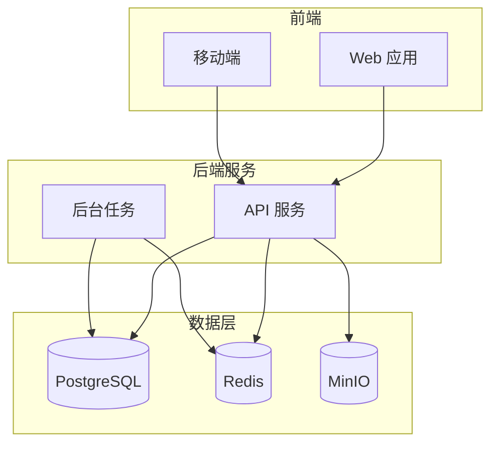

# 项目管理

探索现代项目管理工具和敏捷开发实践，提升团队协作效率。

## 📚 系列文章

### Plane 实践系列

使用 Plane 进行高效的项目管理。

- [Plane 私有化部署指南](./plane/plane-deployment)
- [Plane 在中小型项目中的最佳实践](./plane/plane-best-practices)
- [Plane 工作流配置](./plane/plane-workflow)
- [Plane 与 GitOps 集成](./plane/plane-integration)

### 敏捷开发系列

敏捷方法论和实践。

- Scrum 实践指南
- 看板方法应用
- 敏捷估算技巧

### 协作工具系列

团队协作和知识管理工具。

- Notion 工作空间搭建
- Confluence 知识库管理
- Miro 协作白板应用

## 🎯 快速导航

<div style="display: grid; grid-template-columns: repeat(auto-fit, minmax(250px, 1fr)); gap: 20px; margin: 30px 0;">
  <div style="padding: 20px; border: 1px solid var(--vp-c-divider); border-radius: 12px;">
    <h3>✈️ Plane</h3>
    <p>开源的项目管理和问题追踪工具</p>
    <a href="./plane/">查看文章 →</a>
  </div>

  <div style="padding: 20px; border: 1px solid var(--vp-c-divider); border-radius: 12px;">
    <h3>🏃 敏捷开发</h3>
    <p>Scrum、看板等敏捷方法论实践</p>
    <a href="./agile/">查看文章 →</a>
  </div>

  <div style="padding: 20px; border: 1px solid var(--vp-c-divider); border-radius: 12px;">
    <h3>🤝 协作工具</h3>
    <p>团队协作和知识管理工具</p>
    <a href="./collaboration/">查看文章 →</a>
  </div>
</div>

## 🛠️ 核心工具

- **Plane** - 开源项目管理平台
- **Jira** - 企业级项目管理
- **Linear** - 现代问题追踪工具
- **Notion** - 全能工作空间
- **Miro** - 在线协作白板

## 💡 为什么选择 Plane？

### 优势

✅ **开源免费** - 完全开源，可私有化部署
✅ **现代界面** - 简洁美观的用户界面
✅ **功能完整** - 项目、问题、迭代、路线图
✅ **高度可定制** - 灵活的工作流配置
✅ **API 友好** - 完善的 REST API

### 适用场景

- 🏢 中小型团队项目管理
- 💻 软件开发项目追踪
- 🎯 敏捷开发实践
- 🔒 需要私有化部署
- 💰 预算有限的团队

## 🏗️ Plane 架构



## 📖 最佳实践

### 1. 项目结构

```
项目
├── 迭代（Sprint）
│   ├── 用户故事
│   ├── 任务
│   └── Bug
├── 路线图
└── 文档
```

### 2. 工作流配置

```
待办 → 进行中 → 代码审查 → 测试 → 完成
```

### 3. 标签体系

- **优先级**：P0, P1, P2, P3
- **类型**：Feature, Bug, Task, Improvement
- **模块**：Frontend, Backend, DevOps, Design

## 🎓 学习路径

1. **入门**：了解 Plane 基本概念和功能
2. **部署**：私有化部署 Plane 实例
3. **配置**：设置项目、工作流和权限
4. **实践**：在实际项目中应用
5. **优化**：根据团队需求定制

## 🔗 相关资源

- [Plane 官方网站](https://plane.so/)
- [Plane GitHub](https://github.com/makeplane/plane)
- [Plane 文档](https://docs.plane.so/)
