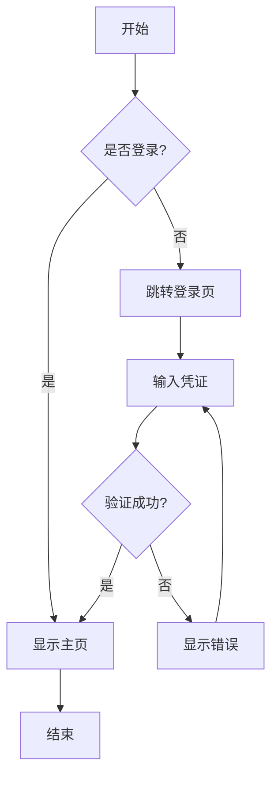
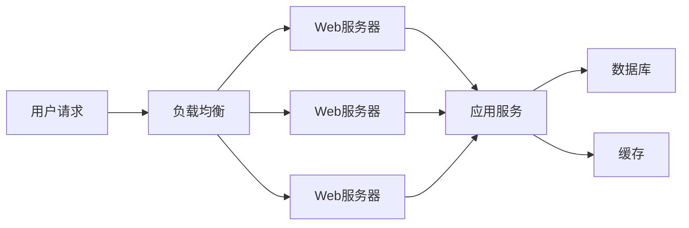
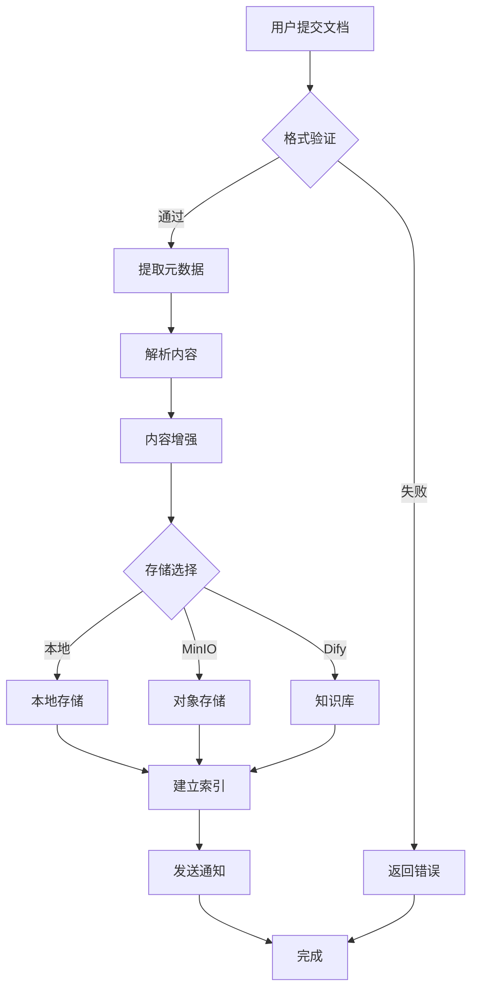
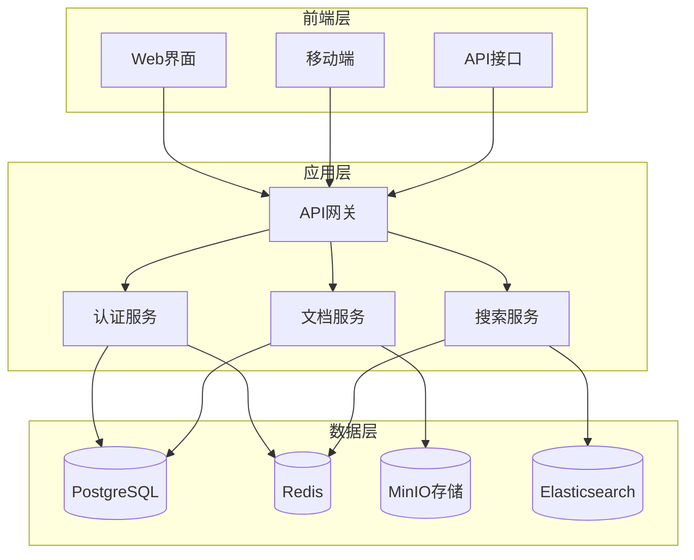
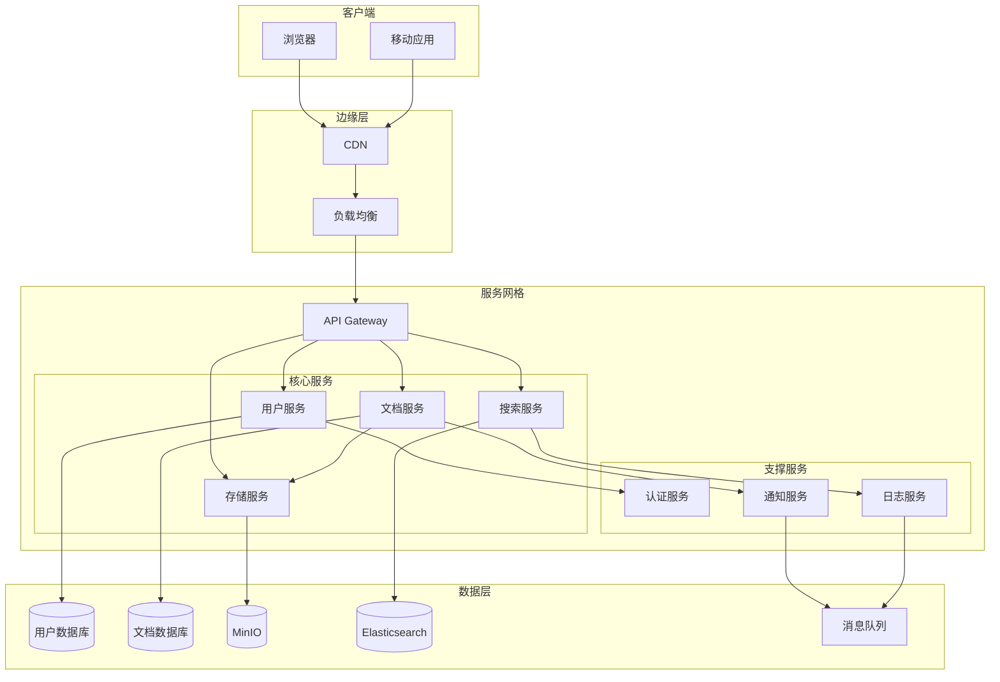
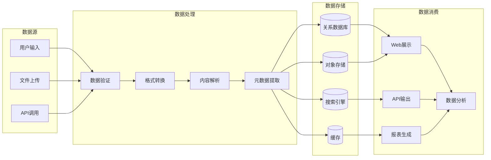
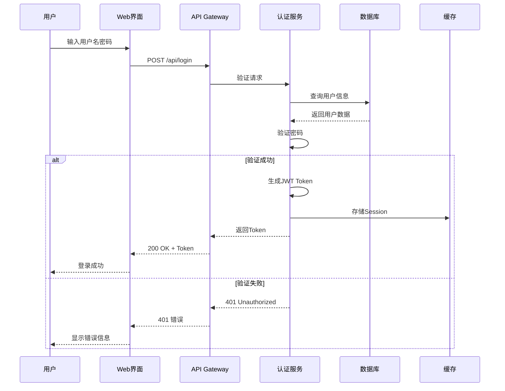
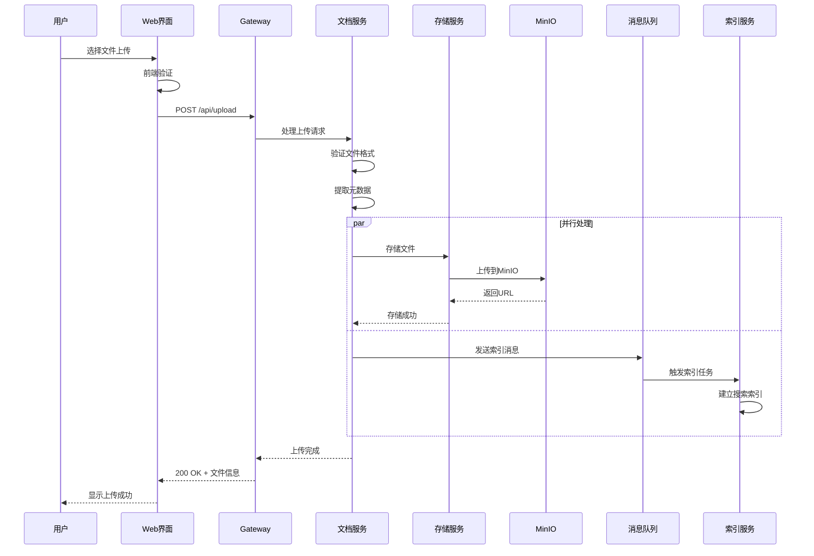
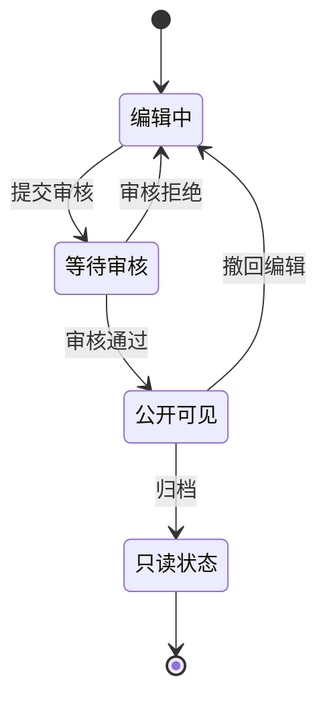
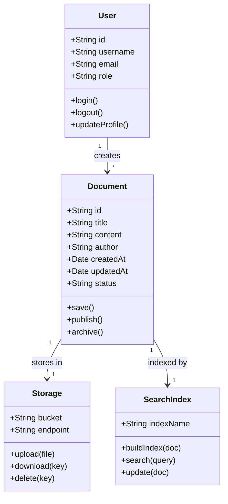

# 视觉效果测试文档

本文档用于测试 LJWX Docs 的各种视觉效果，包括流程图、架构图、视频嵌入等功能。

## 📊 流程图测试

### 1. 基础流程图



### 2. 横向流程图



### 3. 复杂业务流程



## 🏗️ 架构图测试

### 1. 系统架构图



### 2. 微服务架构



### 3. 数据流架构



## 📈 时序图测试

### 用户认证流程



### 文档上传流程



## 🎯 状态图测试

### 文档生命周期



## 🗂️ 类图测试

### 文档管理系统类图



## 🎬 视频测试

### 方式 1：HTML5 视频播放器

::: tip 视频说明
以下视频存储在内部 MinIO 服务中。MinIO 地址：http://192.168.1.83:32001
:::

<video width="100%" controls>
  <source src="http://192.168.1.83:32001/ljwx-docs/videos/demo.mp4" type="video/mp4">
  您的浏览器不支持视频播放。
</video>

### 方式 2：带样式的视频容器

<div style="position: relative; padding-bottom: 56.25%; height: 0; overflow: hidden; max-width: 100%; background: #000; border-radius: 12px; box-shadow: 0 4px 16px rgba(0,0,0,0.1);">
  <video
    style="position: absolute; top: 0; left: 0; width: 100%; height: 100%;"
    controls
    poster="http://192.168.1.83:32001/ljwx-docs/images/video-poster.jpg">
    <source src="http://192.168.1.83:32001/ljwx-docs/videos/tutorial.mp4" type="video/mp4">
    您的浏览器不支持视频播放。
  </video>
</div>

### 方式 3：多个视频示例

<div style="display: grid; grid-template-columns: repeat(auto-fit, minmax(300px, 1fr)); gap: 20px; margin: 20px 0;">
  <div style="border-radius: 12px; overflow: hidden; box-shadow: 0 2px 8px rgba(0,0,0,0.1);">
    <video width="100%" controls>
      <source src="http://192.168.1.83:32001/ljwx-docs/videos/intro.mp4" type="video/mp4">
    </video>
    <p style="padding: 10px; background: var(--vp-c-bg-soft); margin: 0;">系统介绍视频</p>
  </div>

  <div style="border-radius: 12px; overflow: hidden; box-shadow: 0 2px 8px rgba(0,0,0,0.1);">
    <video width="100%" controls>
      <source src="http://192.168.1.83:32001/ljwx-docs/videos/tutorial.mp4" type="video/mp4">
    </video>
    <p style="padding: 10px; background: var(--vp-c-bg-soft); margin: 0;">使用教程视频</p>
  </div>
</div>

## 📋 MinIO 视频上传指南

### 1. 访问 MinIO 控制台

```
URL: http://192.168.1.83:32001/browser/ljwx-docs
用户名: minioadmin
密码: minioadmin123
```

### 2. 创建目录结构

建议在 `ljwx-docs` bucket 中创建以下目录：

```
ljwx-docs/
├── videos/          # 视频文件
│   ├── demo.mp4
│   ├── intro.mp4
│   └── tutorial.mp4
├── images/          # 图片文件
│   └── video-poster.jpg
└── documents/       # 文档文件
```

### 3. 上传视频文件

1. 登录 MinIO 控制台
2. 选择 `ljwx-docs` bucket
3. 创建 `videos` 文件夹
4. 点击 **Upload** 上传视频文件
5. 设置文件为公开访问（如需要）

### 4. 获取视频 URL

上传后，视频的访问 URL 格式为：
```
http://192.168.1.83:32001/ljwx-docs/videos/文件名.mp4
```

### 5. 更新文档中的视频链接

将上面的 URL 替换到文档中的 `<source src="...">` 标签中。

## 🎨 代码块测试

### TypeScript 代码

```typescript
interface VideoConfig {
  src: string
  poster?: string
  width?: string | number
  height?: string | number
  controls?: boolean
  autoplay?: boolean
}

class VideoPlayer {
  private config: VideoConfig
  private element: HTMLVideoElement

  constructor(config: VideoConfig) {
    this.config = config
    this.element = this.createVideoElement()
  }

  private createVideoElement(): HTMLVideoElement {
    const video = document.createElement('video')
    video.src = this.config.src
    video.controls = this.config.controls ?? true

    if (this.config.poster) {
      video.poster = this.config.poster
    }

    return video
  }

  play(): void {
    this.element.play()
  }

  pause(): void {
    this.element.pause()
  }
}

// 使用示例
const player = new VideoPlayer({
  src: 'http://192.168.1.83:32001/ljwx-docs/videos/demo.mp4',
  poster: 'http://192.168.1.83:32001/ljwx-docs/images/poster.jpg',
  controls: true
})
```

### Python 代码

```python
from minio import Minio
from minio.error import S3Error

class MinIOClient:
    def __init__(self, endpoint: str, access_key: str, secret_key: str):
        self.client = Minio(
            endpoint,
            access_key=access_key,
            secret_key=secret_key,
            secure=False
        )

    def upload_video(self, bucket: str, object_name: str, file_path: str):
        """上传视频到 MinIO"""
        try:
            self.client.fput_object(
                bucket,
                object_name,
                file_path,
                content_type='video/mp4'
            )
            print(f"视频上传成功: {object_name}")
        except S3Error as e:
            print(f"上传失败: {e}")

    def get_video_url(self, bucket: str, object_name: str) -> str:
        """获取视频访问 URL"""
        return f"http://{self.client._base_url.netloc}/{bucket}/{object_name}"

# 使用示例
client = MinIOClient(
    endpoint='192.168.1.83:32001',
    access_key='minioadmin',
    secret_key='minioadmin123'
)

client.upload_video('ljwx-docs', 'videos/demo.mp4', '/path/to/demo.mp4')
url = client.get_video_url('ljwx-docs', 'videos/demo.mp4')
print(f"视频 URL: {url}")
```

## 📊 表格测试

### MinIO 配置参数

| 参数 | 值 | 说明 |
|------|-----|------|
| Endpoint | 192.168.1.83:32001 | MinIO 服务地址 |
| Access Key | minioadmin | 访问密钥 |
| Secret Key | minioadmin123 | 密钥 |
| Bucket | ljwx-docs | 存储桶名称 |
| Region | us-east-1 | 区域（默认） |
| Secure | false | 是否使用 HTTPS |

### 支持的视频格式

| 格式 | MIME Type | 浏览器支持 | 推荐 |
|------|-----------|-----------|------|
| MP4 | video/mp4 | ✅ 所有现代浏览器 | ⭐⭐⭐⭐⭐ |
| WebM | video/webm | ✅ Chrome, Firefox | ⭐⭐⭐⭐ |
| OGG | video/ogg | ✅ Firefox, Chrome | ⭐⭐⭐ |
| MOV | video/quicktime | ⚠️ Safari | ⭐⭐ |

## 💡 自定义容器测试

::: tip 提示
视频文件建议使用 MP4 格式，H.264 编码，以获得最佳兼容性。
:::

::: warning 注意
大视频文件可能需要较长的加载时间，建议：
- 视频大小控制在 50MB 以内
- 使用适当的分辨率（1080p 或 720p）
- 考虑使用视频压缩工具
:::

::: danger 重要
MinIO 服务器的访问权限设置很重要：
- 确保 bucket 策略允许公开读取
- 或者使用预签名 URL
- 注意视频文件的版权问题
:::

## 🔗 相关链接

- [MinIO 官方文档](https://min.io/docs/minio/linux/index.html)
- [HTML5 Video 规范](https://developer.mozilla.org/zh-CN/docs/Web/HTML/Element/video)
- [Mermaid 图表文档](https://mermaid.js.org/)
- [VitePress 文档](https://vitepress.dev/)

## 📝 测试清单

- [x] 基础流程图渲染
- [x] 复杂架构图渲染
- [x] 时序图渲染
- [x] 状态图渲染
- [x] 类图渲染
- [ ] 视频播放测试（需要上传视频文件）
- [x] 代码块高亮测试
- [x] 表格样式测试
- [x] 自定义容器测试

---

**测试文档创建时间**：2026-01-23
**MinIO 服务**：http://192.168.1.83:32001
**文档路径**：`/visual-test`
